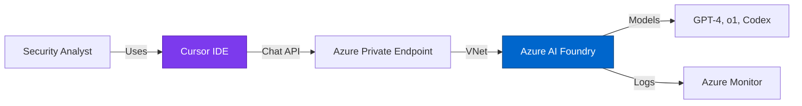

# Advanced: AI-Enhanced Assessment

## Optional Forward-Thinking Capability

The SecAI Framework **works completely without AI** using VSCode and scripts.

However, for organizations with security approval for AI-assisted development, the framework can be enhanced with:

**Cursor IDE + Azure AI Foundry Integration**

### Why This May Be Restricted

Many customer environments:
- Prohibit AI coding assistants (security policy)
- Restrict external API calls (network isolation)
- Require all analysis to be human-driven (compliance)

**If your environment restricts AI tools:** Use VSCode + scripts (Dimensions 1-3 fully functional)

**If your environment allows AI tools:** Consider Cursor + Azure AI Foundry for:
- AI-assisted script development
- Data analysis acceleration
- Insight generation from large datasets
- All chat stays in your Azure tenant (data sovereignty)

[Cursor Setup Guide](/advanced/cursor-setup)  
[Azure AI Foundry Integration](/advanced/azure-ai-foundry-integration)

---

## Data Sovereignty Architecture

When AI enhancement is approved and deployed:

All chat interactions remain within your Azure tenant. No data sent to Cursor servers or OpenAI public endpoints.

---

## Benefits of AI Enhancement

### Script Development
- AI-assisted PowerShell/Python code generation
- Error debugging and troubleshooting
- Documentation generation

### Data Analysis
- AI-powered analysis of 800+ JSON evidence files
- Pattern recognition across large datasets
- Insight generation from compliance scores

### Report Generation
- AI-assisted executive summary creation
- Remediation recommendation generation
- Risk prioritization assistance

---

## Security Considerations

### Data Sovereignty
✅ All AI processing stays within your Azure tenant  
✅ No data sent to Cursor's servers  
✅ No data sent to OpenAI public endpoints  
✅ Complete control over data residency

### Compliance
✅ All AI interactions logged via Azure Monitor  
✅ Audit trail for all API calls  
✅ RBAC controls on AI service access  
✅ Private endpoint network isolation

### Cost Management
✅ Predictable pricing based on token usage  
✅ Budget alerts and quota limits  
✅ Cost allocation by user/team  
✅ Model selection optimization

---

## Setup Process

If your organization approves AI-enhanced assessment:

1. **Deploy Azure AI Foundry**
   - Select appropriate Azure region
   - Deploy GPT-4 or o1 model
   - Configure private endpoints
   - Set up RBAC permissions

2. **Configure Cursor IDE**
   - Install Cursor Enterprise
   - Enable Privacy Mode
   - Configure Azure OpenAI endpoint
   - Test connectivity

3. **Validate Security**
   - Verify private endpoint routing
   - Check audit logs in Azure Monitor
   - Confirm no external API calls
   - Test RBAC restrictions

[Detailed Setup Guide](/advanced/cursor-setup)

---

## Alternative: Assessment Without AI

The SecAI Framework is **fully functional without AI enhancement**:

- ✅ All collection scripts work in VSCode
- ✅ All validation modules run standalone
- ✅ Python analysis scripts don't require AI
- ✅ Excel templates work with CSV imports
- ✅ Manual report generation is comprehensive

**AI is optional, not required.**

---

**Last Updated**: October 18, 2025  
**Status**: Optional Enhancement

