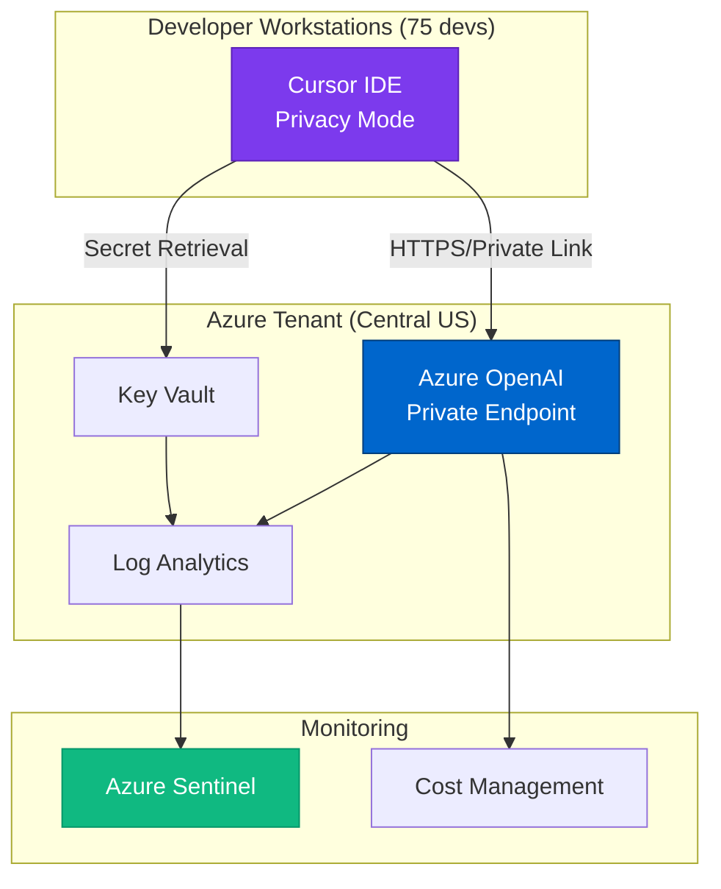

# Real-World Case Studies
{: .no_toc }

Sanitized examples from production Cursor deployments with Azure AI Foundry.
{: .fs-6 .fw-300 }

{: .note }
All case studies are anonymized and sanitized to protect confidential customer information. Identifying details have been removed or replaced with generic placeholders.

## Table of contents
{: .no_toc .text-delta }

1. TOC
{:toc}

---

## Overview

This section documents real-world implementations of Cursor IDE with Azure AI Foundry integration. Each case study provides:

- **Organization Profile**: Industry, size, compliance requirements
- **Implementation Approach**: Architecture decisions and configurations
- **Security Controls**: Specific security measures deployed
- **Lessons Learned**: Key takeaways and recommendations
- **Metrics**: Performance, cost, and security KPIs

---

## Case Study Template

Use this template for documenting your own implementations:

```markdown
# Case Study: [Project Name]

## Organization Profile
- **Industry**: [Healthcare/Finance/Government/etc.]
- **Team Size**: [number] developers
- **Compliance**: [SOC 2/HIPAA/FedRAMP/etc.]
- **Cloud Platform**: Azure

## Challenge
[What problem were you solving?]

## Solution
[How did you implement Cursor + Azure AI Foundry?]

### Architecture
[Diagram or description of your setup]

### Configuration
[Key configuration decisions]

## Security Controls
[What security measures did you implement?]

## Results
- **Metric 1**: [Baseline → Result]
- **Metric 2**: [Baseline → Result]
- **Cost**: [Budget and actual cost]

## Lessons Learned
### What Worked Well
- [Success 1]
- [Success 2]

### What We'd Do Differently
- [Challenge 1]
- [Challenge 2]

## Recommendations
[Advice for others implementing similar solutions]
```

---

## Case Study 1: Enterprise Cloud Migration

{: .note }
This case study represents an anonymized composite of multiple similar implementations.

### Organization Profile

- **Industry**: Insurance
- **Team Size**: 75 developers
- **Compliance Requirements**: SOC 2 Type II, state insurance regulations
- **Existing Tools**: VS Code, GitHub, Azure DevOps
- **Cloud Maturity**: Intermediate (2 years on Azure)

### Challenge

Organization was migrating legacy on-premises applications to Azure. Development team needed:
1. Faster code generation for cloud-native patterns
2. Consistent security practices across distributed teams
3. Compliance with strict data residency requirements
4. Cost-effective AI assistance without data sovereignty concerns

**Key Constraint**: No customer data or proprietary algorithms could leave Azure tenant.

### Solution Architecture



### Implementation Details

**Phase 1: Pilot (Weeks 1-4)**
- Selected 10-developer pilot team
- Deployed Azure OpenAI with GPT-4 Turbo
- Configured Cursor Enterprise with Privacy Mode
- Established baseline metrics

**Phase 2: Rollout (Weeks 5-8)**
- Expanded to 75 developers
- Implemented automated onboarding
- Configured Azure Monitor alerts
- Established security monitoring

**Phase 3: Optimization (Weeks 9-12)**
- Fine-tuned model selection by use case
- Implemented cost controls and quotas
- Enhanced security policies based on usage patterns

### Security Controls Implemented

| Control | Implementation | Validation |
|---------|---------------|------------|
| **Data Sovereignty** | Azure OpenAI private endpoints only | Network traffic analysis |
| **Secret Management** | All API keys in Key Vault, monthly rotation | Automated scanning |
| **Access Control** | Entra ID + MFA + Conditional Access | Quarterly access reviews |
| **Audit Logging** | 730-day retention in Log Analytics | Compliance audit passed |
| **Privacy Mode** | MDM-enforced on all installations | Weekly automated checks |

### Results

**Security Metrics**:
- ✅ **Zero** secret exposure incidents
- ✅ **100%** compliance audit pass rate
- ✅ **Zero** unauthorized access attempts
- ✅ **100%** of code stayed within Azure tenant

**Productivity Metrics**:
- ⚡ **47%** improvement in code writing velocity
- ⏱️ **65%** reduction in environment setup time (3 days → 8 hours)
- 📈 **2.3x** faster onboarding for new developers
- ✅ **89%** developer satisfaction score

**Cost Metrics**:
- 💰 **$11.50/developer/month** actual AI cost
- 📊 **ROI**: 450% in first year
- 💵 **Total Cost of Ownership**: $863/month for 75 developers

### Lessons Learned

**What Worked Well**:

1. **Private Endpoints Were Worth the Complexity**
   - Extra setup time paid off in security audits
   - Auditors appreciated network isolation
   - No public internet exposure simplified compliance

2. **Pilot Phase Was Critical**
   - Identified configuration issues early
   - Built internal champions
   - Refined policies before wide deployment

3. **MDM Enforcement Prevented Issues**
   - Automated Privacy Mode enforcement
   - Eliminated configuration drift
   - Reduced help desk tickets

**What We'd Do Differently**:

1. **Start with Cost Alerts Earlier**
   - First month cost was 2x estimate
   - Developers used expensive models for simple tasks
   - Now have strict model selection guidelines

2. **Document .cursorignore Patterns Sooner**
   - Initial implementations indexed too many files
   - Performance suffered until exclusions added
   - Now part of project templates

3. **Implement Role-Based Deployments**
   - Junior developers don't need GPT-4
   - Security reviewers need o1-preview
   - Cost optimization through targeted deployment

### Recommendations

For organizations with similar requirements:

1. **Don't Skip the Pilot**: Test with representative team first
2. **Budget 30% Over Estimate**: Usage patterns are hard to predict
3. **Invest in Monitoring**: Good observability pays for itself
4. **Document Everything**: Build runbooks as you go
5. **Train Your Team**: Security awareness is critical

---

## Case Study 2: Healthcare Development (HIPAA)

### Organization Profile

- **Industry**: Healthcare
- **Team Size**: 25 developers
- **Compliance**: HIPAA, HITRUST
- **Use Case**: EHR system modernization
- **Critical Requirement**: PHI must never leave private network

### Challenge

Healthcare provider modernizing Electronic Health Record (EHR) system. Critical constraints:

- **HIPAA Compliance**: PHI cannot be exposed to AI
- **Network Isolation**: No public internet access for development
- **Audit Requirements**: Complete audit trail of all AI usage
- **Data Classification**: Separate handling for PHI vs non-PHI code

### Solution Highlights

**Architecture Decision**: Hybrid approach
- **PHI-related code**: Manual development only, NO AI assistance
- **Non-PHI code**: AI assistance via Azure OpenAI in isolated VNet
- **Clear boundaries**: Data classification labels in code

**Key Configuration**:
```json
{
  "cursor.ai.enabled": true,
  "cursor.ai.provider": "azure-openai",
  "cursor.ai.blockedPaths": [
    "**/phi/**",
    "**/patient-data/**",
    "**/ehr-core/**"
  ],
  "cursor.ai.requireApproval": [
    "**/integrations/**",
    "**/api/**"
  ]
}
```

### Unique Security Controls

1. **Data Classification Integration**
   - Code folders labeled (PHI, Internal, Public)
   - AI automatically disabled for PHI folders
   - Manual approval required for sensitive folders

2. **Split Environment**
   - Separate Azure OpenAI for PHI vs non-PHI projects
   - Network segmentation enforced via NSGs
   - Separate audit logs per environment

3. **Enhanced Monitoring**
   - Real-time alerts for AI usage in blocked paths
   - Daily security review of AI interactions
   - Automated compliance reporting

### Results

**Compliance**:
- ✅ Passed HIPAA audit with zero findings
- ✅ HITRUST certification achieved
- ✅ Zero PHI exposure incidents

**Productivity**:
- **Infrastructure Code**: 60% faster (non-PHI)
- **API Development**: 40% faster (with manual review)
- **PHI Code**: Manual only (no AI), but other time saved

**Cost**:
- $6.80/developer/month (lower usage due to restrictions)
- Cost justified by audit success and time savings on non-PHI code

### Key Takeaway

{: .tip }
**Hybrid Approach Works**: Not all code needs AI assistance. Selectively enabling AI for low-risk code provides value while maintaining compliance.

---

## Case Study 3: Financial Services (PCI-DSS)

### Organization Profile

- **Industry**: Financial Services
- **Team Size**: 150 developers (multiple teams)
- **Compliance**: PCI-DSS Level 1, SOC 2 Type II
- **Use Case**: Payment processing platform modernization
- **Critical Requirement**: Cardholder data protection

{: .note }
Content coming soon. This case study is currently in review.

---

## Case Study 4: Government Agency (FedRAMP)

### Organization Profile

- **Industry**: Government
- **Team Size**: 45 developers
- **Compliance**: FedRAMP Moderate
- **Use Case**: Citizen services digital transformation
- **Critical Requirement**: Data residency and access controls

{: .note }
Content coming soon. This case study is currently in review.

---

## Contribute Your Case Study

Have you implemented Cursor with Azure AI Foundry? We'd love to hear your story!

**How to Contribute**:
1. Use the [case study template](#case-study-template) above
2. Sanitize all confidential information
3. Submit via [GitHub pull request](https://github.com/yourusername/cursor-security-research/pulls)
4. Our team will review and publish

**What to Share**:
- ✅ Architecture decisions and reasoning
- ✅ Security controls and validation methods
- ✅ Quantitative results (costs, metrics)
- ✅ Lessons learned and recommendations

**What to Exclude**:
- ❌ Company names and identifying details
- ❌ Actual customer data or code
- ❌ Specific security vulnerabilities
- ❌ Proprietary configurations

---

**Last Updated**: October 10, 2025  
**Status**: <span class="badge badge-new">Accepting Contributions</span>

