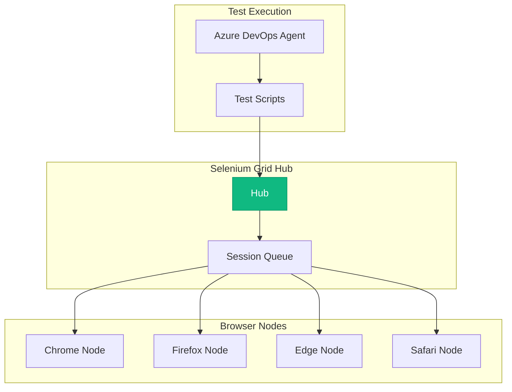

# Selenium - Industry Standard Browser Automation
{: .no_toc }

Overview of Selenium WebDriver and its role in legacy system testing.
{: .fs-6 .fw-300 }

## Table of contents
{: .no_toc .text-delta }

1. TOC
{:toc}

---

## Overview

**Selenium WebDriver** is the industry-standard open-source framework for browser automation and web application testing. First released in 2004, it remains widely used despite newer alternatives like Playwright.

### Framework Information

| | |
|---|---|
| **Framework** | Selenium WebDriver |
| **Maintainer** | Selenium Project (Open Source) |
| **First Release** | 2004 |
| **Current Version** | 4.x |
| **Website** | [https://www.selenium.dev](https://www.selenium.dev) |
| **License** | Apache 2.0 (Open Source) |
| **Notable** | Most widely adopted test automation framework |

---

## Why Still Use Selenium?

### Selenium vs. Playwright

| Factor | Selenium | Playwright |
|--------|----------|------------|
| **Maturity** | 20 years | 4 years |
| **Ecosystem** | Massive | Growing |
| **Language Support** | Java, Python, C#, Ruby, JS | TypeScript, Python, .NET, Java |
| **Performance** | Slower | Faster |
| **Auto-Wait** | Manual waits | Automatic |
| **Best Use Case** | Legacy systems, existing tests | New projects |

**Customer Uses Both**:
```
Selenium for:
├── Legacy insurance systems (20 years old)
├── Existing test suites (5,000+ tests)
├── Java-based applications
├── Grid infrastructure (already invested)
└── Team expertise (10+ years)

Playwright for:
├── New Cursor integrations
├── Modern web apps
├── Azure portal testing
├── API testing
└── Faster test development

Why Not Migrate?
- 5,000 Selenium tests = 6 months to rewrite
- Cost: $500K (labor)
- Benefit: Marginal (tests work fine)
- Decision: Keep Selenium, add Playwright for new tests
```

---

## Selenium Grid Architecture



---

## Security Testing Example

```java
// Test Key Vault access requires authentication
@Test
public void testKeyVaultRequiresMFA() {
    WebDriver driver = new ChromeDriver();
    
    // Navigate to Azure Portal
    driver.get("https://portal.azure.com");
    
    // Login with test account
    driver.findElement(By.id("i0116")).sendKeys(testUser);
    driver.findElement(By.id("idSIButton9")).click();
    
    // Enter password
    driver.findElement(By.id("i0118")).sendKeys(testPassword);
    driver.findElement(By.id("idSIButton9")).click();
    
    // MFA challenge should appear
    WebElement mfaPrompt = new WebDriverWait(driver, Duration.ofSeconds(10))
        .until(ExpectedConditions.presenceOfElementLocated(By.id("idDiv_SAOTCAS_Title")));
    
    assertTrue(mfaPrompt.isDisplayed(), "MFA prompt should be displayed");
    
    driver.quit();
}
```

---

## Resources

- **Website**: [https://www.selenium.dev](https://www.selenium.dev)
- **Documentation**: [https://www.selenium.dev/documentation](https://www.selenium.dev/documentation)
- **GitHub**: [https://github.com/SeleniumHQ/selenium](https://github.com/SeleniumHQ/selenium)

---

**Last Updated**: October 10, 2025

