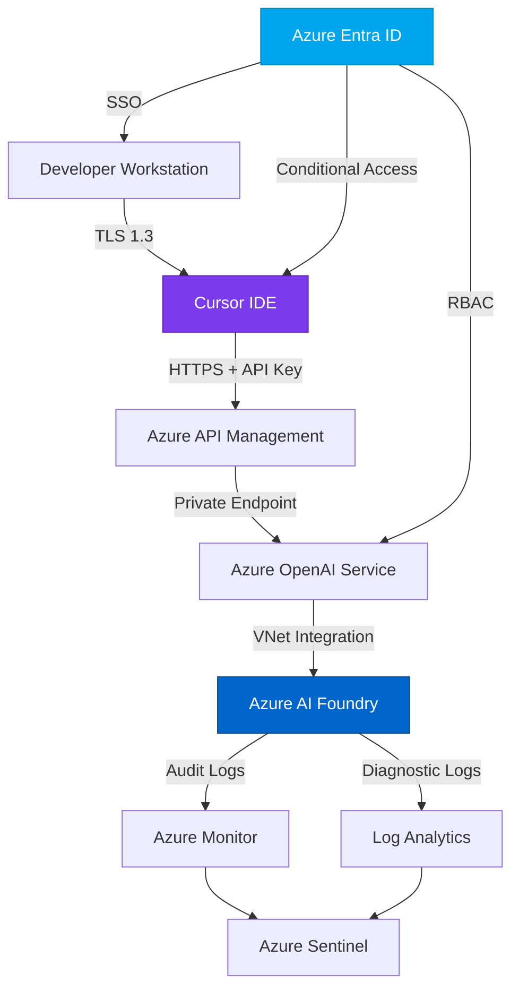

# Getting Started with Secure Cursor Administration
{: .no_toc }

This section guides you through setting up Cursor IDE with Azure AI Foundry integration for enterprise development teams.
{: .fs-6 .fw-300 }

## Table of contents
{: .no_toc .text-delta }

1. TOC
{:toc}

---

## Overview

Setting up Cursor IDE for enterprise use with Azure AI Foundry integration involves several key steps:

1. **Prerequisites** - Ensure you have the necessary Azure resources and permissions
2. **Cursor Installation** - Install and configure Cursor Enterprise with Privacy Mode
3. **Azure AI Foundry Setup** - Deploy Azure OpenAI resources and configure endpoints
4. **Integration Configuration** - Connect Cursor to your Azure AI Foundry endpoint
5. **Security Validation** - Verify data stays within your tenant and audit logs are flowing

## Quick Start Checklist

Before you begin, ensure you have:

- [ ] Azure subscription with Owner or Contributor access
- [ ] Azure Entra ID (Azure AD) tenant with administrative access
- [ ] Cursor Enterprise license (or evaluation license)
- [ ] Access to deploy Azure OpenAI services
- [ ] Network connectivity to Azure (or ability to configure private endpoints)

## Time Requirements

| Phase | Estimated Time |
|-------|---------------|
| Prerequisites setup | 30-60 minutes |
| Cursor installation | 15 minutes |
| Azure AI Foundry deployment | 30-45 minutes |
| Integration configuration | 30 minutes |
| Security validation & testing | 1-2 hours |
| **Total** | **3-4.5 hours** |

{: .note }
The times above assume you have appropriate permissions and approvals. Enterprise environments may require additional time for change management and security reviews.

---

## Architecture Overview



### Data Flow

1. **Developer Authentication** - SSO via Azure Entra ID to workstation and Cursor
2. **AI Request** - Cursor sends code completion request to Azure API Management
3. **Request Validation** - API Management validates API key and applies policies
4. **Model Inference** - Azure OpenAI processes request using deployed model
5. **Response** - Completion returned to Cursor via encrypted channel
6. **Audit Trail** - All API calls logged to Azure Monitor and Log Analytics

{: .security }
**Critical**: All data remains within your Azure tenant. No data is sent to Cursor's servers or any third-party AI providers.

---

## Security Principles

### Zero-Trust Architecture

This setup implements zero-trust principles:

- **Verify Explicitly** - Every request authenticated via API key or Entra ID
- **Least Privilege Access** - RBAC limits access to AI resources
- **Assume Breach** - Network segmentation and private endpoints limit blast radius

### Defense in Depth

Multiple security layers:

| Layer | Control | Implementation |
|-------|---------|---------------|
| **Identity** | MFA + Conditional Access | Azure Entra ID |
| **Network** | Private Endpoints | Azure VNet |
| **Application** | API Key Rotation | Azure Key Vault |
| **Data** | Encryption at Rest/Transit | TLS 1.3 + Azure Storage Encryption |
| **Monitoring** | Audit Logging | Azure Monitor + Sentinel |

---

## Prerequisites Deep Dive

### Azure Resources Required

```yaml
Resource Group:
  - Name: rg-cursor-ai-research
  - Location: East US 2 (or your preferred region)
  - Tags:
      Environment: Production
      Project: Cursor-Security-Research
      Owner: Security-Team

Azure OpenAI Service:
  - Name: aoai-cursor-prod
  - SKU: S0 (Standard)
  - Models:
      - gpt-4-turbo (recommended)
      - gpt-4o (optional, for testing)
  - Network: Private endpoint enabled
  - RBAC: Cognitive Services User role assigned

Azure Key Vault:
  - Name: kv-cursor-secrets
  - SKU: Premium (for HSM-backed keys)
  - Purpose: Store API keys and certificates
  - Network: Private endpoint enabled
  - Soft Delete: Enabled
  - Purge Protection: Enabled

Log Analytics Workspace:
  - Name: law-cursor-audit
  - Retention: 730 days (2 years minimum)
  - Purpose: Centralized audit logging

Azure Monitor:
  - Diagnostic Settings: Enabled on all resources
  - Alerts: Configured for unauthorized access attempts
```

### Permission Requirements

Minimum Azure RBAC roles:

- **Azure OpenAI Service**: Cognitive Services Contributor
- **Key Vault**: Key Vault Administrator
- **Resource Group**: Contributor
- **Subscription**: Reader (for cost monitoring)

### Network Requirements

| Source | Destination | Port | Protocol | Purpose |
|--------|-------------|------|----------|---------|
| Developer Workstation | Azure OpenAI | 443 | HTTPS | API requests |
| Azure OpenAI | Azure Monitor | 443 | HTTPS | Telemetry |
| Developer Workstation | Azure Entra ID | 443 | HTTPS | Authentication |

{: .tip }
For maximum security, use private endpoints and Azure Private Link. This keeps all traffic within the Azure backbone network.

---

## Next Steps

Now that you understand the architecture and prerequisites, proceed with:

1. [Prerequisites Setup](prerequisites.md) - Detailed guide for Azure resource deployment
2. [Cursor IDE Setup](cursor-setup.md) - Installing and configuring Cursor Enterprise
3. [Azure AI Foundry Integration](azure-ai-foundry-integration.md) - Connecting Cursor to Azure OpenAI

---

## Troubleshooting

Common issues during setup:

| Issue | Possible Cause | Resolution |
|-------|---------------|------------|
| Can't deploy Azure OpenAI | Region unavailable | Try different region (check [availability](https://learn.microsoft.com/azure/ai-services/openai/concepts/models#model-summary-table-and-region-availability)) |
| API key authentication fails | Key not in Key Vault | Verify secret name and RBAC permissions |
| Private endpoint not resolving | DNS not configured | Configure Azure Private DNS zone |
| Cursor can't connect | Firewall blocking | Check network security groups and firewall rules |

---

**Last Updated**: October 10, 2025  
**Research Phase**: Active Development  
**Status**: <span class="badge badge-research">In Progress</span>

