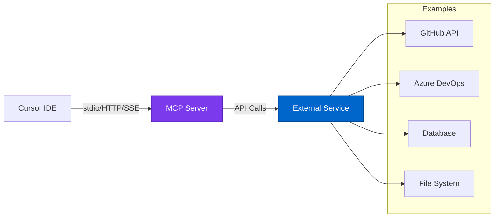

# MCP Server Security & Integration
{: .no_toc }

Security analysis and best practices for Model Context Protocol (MCP) servers with Cursor IDE.
{: .fs-6 .fw-300 }

## Table of contents
{: .no_toc .text-delta }

1. TOC
{:toc}

---

## What is MCP?

**Model Context Protocol (MCP)** is an open protocol that allows AI assistants like Cursor to connect to external tools and data sources. Think of it as a secure API for AI agents.

### MCP Architecture



### Why MCP Matters for Security

{: .security }
**Security Implication**: MCP servers can access external systems on behalf of the AI. Misconfigured servers can lead to data leakage, unauthorized access, or privilege escalation.

---

## Available MCP Servers for Cursor

### GitHub MCP Server

**Repository**: [avinashsvinu/mcp-for-github-using-cursor](https://github.com/avinashsvinu/mcp-for-github-using-cursor)

**Capabilities**:
- Create/update repositories
- Search issues and pull requests
- Manage branches
- Create/review pull requests

**Security Assessment**:

| Criteria | Rating | Notes |
|----------|--------|-------|
| **Authentication** | ⭐⭐⭐⭐ | Uses GitHub PAT (Personal Access Token) |
| **Authorization** | ⭐⭐⭐ | Limited by token scope, but no fine-grained control |
| **Audit Logging** | ⭐⭐⭐⭐ | GitHub audit log captures all actions |
| **Secret Management** | ⚠️ ⭐⭐ | PAT must be securely stored |
| **Network Security** | ⭐⭐⭐⭐⭐ | HTTPS only, public GitHub endpoints |

**Recommended Configuration**:
```json
{
  "mcpServers": {
    "github": {
      "command": "node",
      "args": ["/path/to/mcp-github-server.js"],
      "env": {
        "GITHUB_TOKEN": "${GITHUB_PAT}",  // From Key Vault
        "GITHUB_ORG": "your-org"
      },
      "transport": "stdio"
    }
  }
}
```

**Security Hardening**:
```bash
# Create fine-grained GitHub PAT with minimal scope
# Navigate to: GitHub → Settings → Developer settings → Personal access tokens → Fine-grained tokens

# Recommended scopes:
- repositories: read, write (specific repos only)
- metadata: read
- issues: read, write
- pull_requests: read, write

# Store in Key Vault
az keyvault secret set \
  --vault-name kv-cursor-secrets \
  --name github-mcp-token \
  --value "github_pat_..."

# Rotate token monthly
```

---

### Azure DevOps MCP Server

**Repository**: [maximtitovich/cursor-azure-devops-mcp](https://github.com/maximtitovich/cursor-azure-devops-mcp)

**Capabilities**:
- Query work items
- Create/update tasks
- Access build pipelines
- Manage repositories

**Security Assessment**:

| Criteria | Rating | Notes |
|----------|--------|-------|
| **Authentication** | ⭐⭐⭐⭐⭐ | Azure Entra ID or PAT |
| **Authorization** | ⭐⭐⭐⭐ | Azure RBAC integration |
| **Audit Logging** | ⭐⭐⭐⭐⭐ | Full Azure DevOps audit log |
| **Secret Management** | ⭐⭐⭐⭐ | Azure Key Vault integration |
| **Network Security** | ⭐⭐⭐⭐⭐ | Private endpoints supported |

**Recommended Configuration**:
```json
{
  "mcpServers": {
    "azure-devops": {
      "command": "node",
      "args": ["/path/to/azure-devops-mcp.js"],
      "env": {
        "AZURE_DEVOPS_ORG": "your-org",
        "AZURE_DEVOPS_PROJECT": "your-project",
        "AZURE_DEVOPS_PAT": "${AZURE_DEVOPS_PAT}"  // From Key Vault
      },
      "transport": "stdio"
    }
  }
}
```

**Why Azure DevOps MCP is More Secure**:
- Native Azure integration
- RBAC at resource level
- Private endpoint support
- Entra ID authentication option

---

### File System MCP Server

**Use Case**: Allow Cursor AI to read project documentation, analyze logs

**Security Assessment**:

| Criteria | Rating | Recommendation |
|----------|--------|---------------|
| **Access Control** | ⚠️ ⭐⭐ | Restrict to specific directories |
| **Secret Exposure Risk** | ⚠️ ⭐ | High risk if misconfigured |
| **Audit Logging** | ⭐⭐ | Limited native auditing |

**Secure Configuration Example**:
```json
{
  "mcpServers": {
    "filesystem": {
      "command": "node",
      "args": ["/path/to/fs-mcp-server.js"],
      "env": {
        "ALLOWED_PATHS": "/workspace/docs,/workspace/public",  // Whitelist only
        "BLOCKED_PATTERNS": "*.env,*.key,*.pem,secrets/*"     // Explicit blocks
      },
      "transport": "stdio"
    }
  }
}
```

{: .warning }
**Risk**: File system MCP servers can inadvertently expose secrets if not carefully configured. Always use explicit allowlists and blocklists.

---

### Database MCP Server

**Use Case**: Query databases for data analysis, schema understanding

**Security Assessment**:

| Criteria | Rating | Critical Concerns |
|----------|--------|-------------------|
| **Data Exposure** | ⚠️ ⭐ | Can expose sensitive customer data |
| **SQL Injection** | ⚠️ ⭐⭐ | Risk if queries not parameterized |
| **Audit Logging** | ⭐⭐⭐ | Depends on database audit capabilities |

**Recommended Approach**:
```json
{
  "mcpServers": {
    "database": {
      "command": "node",
      "args": ["/path/to/db-mcp-server.js"],
      "env": {
        "DB_TYPE": "read-replica",           // Read-only database
        "DB_CONNECTION_STRING": "${DB_RO}",  // From Key Vault
        "ALLOWED_SCHEMAS": "public,analytics",  // Limit schemas
        "MAX_ROWS": "100",                   // Limit result size
        "QUERY_TIMEOUT": "5000"              // 5 second timeout
      },
      "transport": "stdio"
    }
  }
}
```

{: .danger }
**NEVER** connect MCP servers to production write databases. Use read-only replicas in non-production environments only.

---

## MCP Transport Security

### Transport Options

| Transport | Security | Use Case |
|-----------|----------|----------|
| **stdio** | ⭐⭐⭐⭐ | Local process, no network exposure |
| **SSE (Server-Sent Events)** | ⭐⭐⭐ | HTTP-based, requires TLS |
| **HTTP** | ⭐⭐⭐ | Request/response, requires TLS + auth |

### Recommended: stdio Transport

**Why stdio is Most Secure**:
- No network exposure
- Process-level isolation
- OS-level permissions apply
- No authentication complexity

**Example**:
```json
{
  "mcpServers": {
    "github": {
      "command": "node",
      "args": ["/usr/local/lib/mcp-servers/github-server.js"],
      "transport": "stdio"  // Most secure option
    }
  }
}
```

### When to Use HTTP/SSE

Use HTTP/SSE only when:
- MCP server must run on different machine
- Need to share MCP server across team
- Require load balancing

**Secure HTTP Configuration**:
```json
{
  "mcpServers": {
    "shared-github": {
      "url": "https://mcp.yourcompany.com/github",
      "transport": "https",
      "authentication": {
        "type": "bearer",
        "token": "${MCP_AUTH_TOKEN}"  // From Key Vault
      },
      "tls": {
        "minVersion": "TLSv1.3",
        "certificate": "/path/to/client-cert.pem"
      }
    }
  }
}
```

---

## Custom MCP Server Development

### Security Checklist for Custom MCP Servers

When building your own MCP server:

- [ ] **Input Validation**: Validate all AI requests
- [ ] **Output Sanitization**: Remove sensitive data from responses
- [ ] **Authentication**: Require authentication for all operations
- [ ] **Authorization**: Implement least-privilege access
- [ ] **Rate Limiting**: Prevent abuse
- [ ] **Audit Logging**: Log all operations
- [ ] **Error Handling**: Don't leak sensitive info in errors
- [ ] **Secret Management**: Never hardcode credentials
- [ ] **Dependency Security**: Keep libraries updated

### Example: Secure MCP Server Template

```typescript
// secure-mcp-server.ts
import { MCPServer } from '@modelcontextprotocol/sdk';

const server = new MCPServer({
  name: 'secure-azure-mcp',
  version: '1.0.0'
});

// 1. Authentication middleware
server.use(async (req, res, next) => {
  const token = req.headers['authorization']?.replace('Bearer ', '');
  
  // Verify token with Azure Entra ID
  const isValid = await verifyEntraIDToken(token);
  if (!isValid) {
    return res.status(401).json({ error: 'Unauthorized' });
  }
  
  next();
});

// 2. Rate limiting
server.use(rateLimit({
  windowMs: 60 * 1000,  // 1 minute
  max: 100  // 100 requests per minute
}));

// 3. Audit logging
server.use(async (req, res, next) => {
  await logToAzureMonitor({
    operation: req.body.operation,
    user: req.user.id,
    timestamp: new Date().toISOString()
  });
  next();
});

// 4. Tool implementation with validation
server.addTool({
  name: 'query-database',
  description: 'Query read-only database',
  parameters: {
    query: { type: 'string', required: true }
  },
  handler: async (params) => {
    // Input validation
    if (!isValidSQL(params.query)) {
      throw new Error('Invalid SQL query');
    }
    
    // Execute with parameterization
    const result = await executeReadOnlyQuery(params.query);
    
    // Output sanitization
    return sanitizeOutput(result);
  }
});

server.listen(stdio());
```

---

## MCP Server Approval Process

### Evaluation Checklist

Before approving an MCP server for use:

```markdown
## MCP Server Security Review

**Server Name**: [name]
**Repository**: [URL]
**Version**: [version]
**Requested By**: [developer]
**Review Date**: [date]

### 1. Source Code Review
- [ ] Source code available and reviewed
- [ ] No obvious security vulnerabilities
- [ ] Dependencies scanned for CVEs
- [ ] Last updated within 6 months

### 2. Authentication & Authorization
- [ ] Requires authentication
- [ ] Supports least-privilege access
- [ ] Token/credential management documented
- [ ] No hardcoded secrets

### 3. Data Handling
- [ ] Input validation implemented
- [ ] Output sanitization implemented
- [ ] No sensitive data in logs
- [ ] Respects data classification

### 4. Network Security
- [ ] Transport encryption (TLS 1.3)
- [ ] No unnecessary network access
- [ ] Supports private endpoints (if applicable)
- [ ] Rate limiting implemented

### 5. Audit & Monitoring
- [ ] Operation logging implemented
- [ ] Logs sent to central SIEM
- [ ] Error handling doesn't leak info
- [ ] Supports Azure Monitor integration

### 6. Testing
- [ ] Tested in isolated environment
- [ ] Security testing performed
- [ ] No data leakage observed
- [ ] Performance acceptable

### Decision
- [ ] **APPROVED** - Deploy to pilot group
- [ ] **APPROVED WITH CONDITIONS** - [List conditions]
- [ ] **REJECTED** - [List reasons]

**Reviewer**: [name]
**Date**: [date]
```

---

## Monitoring MCP Server Usage

### Azure Monitor Integration

```bash
# Create Log Analytics queries for MCP monitoring

# Query 1: MCP server usage by operation
MCPServerLogs
| where TimeGenerated > ago(24h)
| summarize Count = count() by Operation, ServerName
| order by Count desc

# Query 2: Failed MCP operations
MCPServerLogs
| where TimeGenerated > ago(24h)
| where ResultType != "Success"
| project TimeGenerated, ServerName, Operation, ErrorMessage, User
| order by TimeGenerated desc

# Query 3: Unusual MCP activity
MCPServerLogs
| where TimeGenerated > ago(7d)
| summarize RequestCount = count() by User, bin(TimeGenerated, 1h)
| where RequestCount > 100  // Threshold for unusual activity
| order by TimeGenerated desc
```

### Alerting Rules

```bash
# Create alert for excessive MCP failures
az monitor scheduled-query create \
  --name alert-mcp-high-failure-rate \
  --resource-group rg-cursor-ai-research \
  --scopes /subscriptions/{sub-id}/resourceGroups/rg-cursor-ai-research/providers/Microsoft.OperationalInsights/workspaces/law-cursor-audit \
  --condition "count > 10" \
  --condition-query "MCPServerLogs | where ResultType != 'Success' | summarize count()" \
  --description "Alert when MCP server failure rate exceeds threshold" \
  --evaluation-frequency 5m \
  --window-size 15m \
  --severity 2 \
  --action-groups ag-cursor-security-team
```

---

## Best Practices Summary

### DO ✅

- Use stdio transport when possible
- Store MCP credentials in Key Vault
- Implement comprehensive audit logging
- Use read-only access where possible
- Rate limit MCP operations
- Regularly review MCP server access logs
- Keep MCP server dependencies updated

### DON'T ❌

- Connect to production write databases
- Hardcode credentials in MCP configurations
- Allow unrestricted file system access
- Use MCP servers from untrusted sources
- Skip security reviews for custom servers
- Expose MCP servers on public internet

---

## Next Steps

Explore detailed MCP documentation:

- [Available Servers](available-servers.md) - Catalog of vetted MCP servers
- [Security Considerations](security-considerations.md) - Detailed security analysis
- [Custom MCP Development](custom-development.md) - Build secure custom servers

---

**Last Updated**: October 10, 2025  
**Status**: <span class="badge badge-security">Security Reviewed</span>

