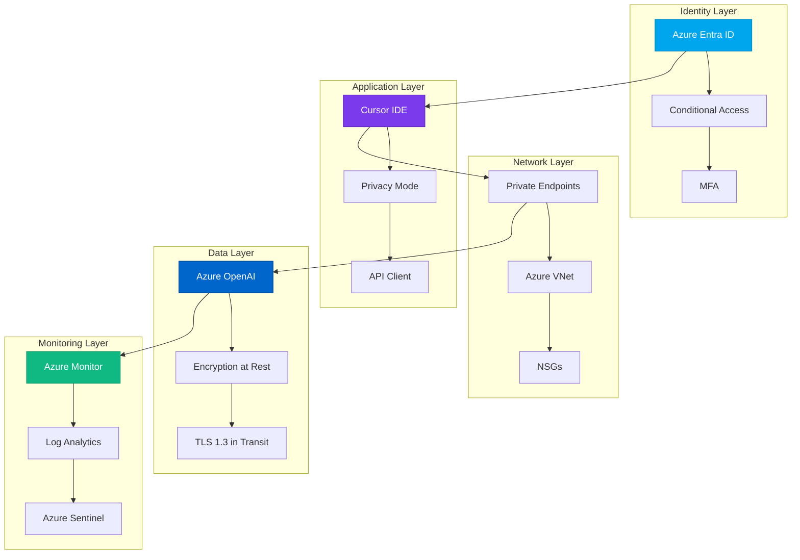
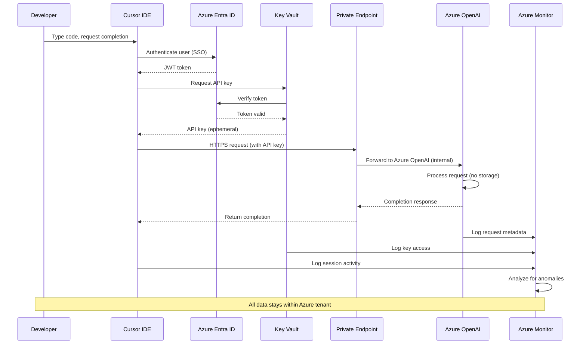

# Security Architecture
{: .no_toc }

Comprehensive security architecture for Cursor IDE with Azure AI Foundry integration.
{: .fs-6 .fw-300 }

## Table of contents
{: .no_toc .text-delta }

1. TOC
{:toc}

---

## Overview

This section documents the end-to-end security architecture for deploying Cursor IDE in enterprise environments with Azure AI Foundry integration. The architecture implements defense-in-depth principles and zero-trust security models.

### Security Principles

| Principle | Implementation |
|-----------|---------------|
| **Zero Trust** | Never trust, always verify - authenticate every request |
| **Least Privilege** | RBAC ensures minimum necessary access |
| **Defense in Depth** | Multiple security layers protect data |
| **Assume Breach** | Network segmentation limits blast radius |
| **Data Sovereignty** | All processing stays within Azure tenant |

---

## Architecture Layers



---

## Key Components

### 1. Identity & Access Management
- **Azure Entra ID**: Centralized identity provider
- **Conditional Access**: Policy-based access control
- **RBAC**: Role-based permissions on Azure resources
- **MFA**: Multi-factor authentication required

### 2. Network Security
- **Private Endpoints**: No public internet exposure
- **VNet Integration**: Traffic stays on Azure backbone
- **NSGs**: Network-level filtering
- **Azure Firewall**: Egress control

### 3. Data Protection
- **Encryption at Rest**: Azure Storage Service Encryption
- **Encryption in Transit**: TLS 1.3 mandatory
- **Key Management**: Azure Key Vault
- **Data Residency**: Regional deployment control

### 4. Application Security
- **Privacy Mode**: Zero data retention in Cursor
- **Secret Management**: No secrets in code or AI chat
- **Extension Control**: Allowlist-based extensions
- **Audit Logging**: Comprehensive activity tracking

### 5. Monitoring & Response
- **Azure Monitor**: Real-time metrics and logs
- **Log Analytics**: Centralized log storage (2+ years)
- **Azure Sentinel**: SIEM and threat detection
- **Automated Alerts**: Immediate incident notification

---

## Security Boundaries

### Trust Boundaries

```
┌─────────────────────────────────────────────────────────┐
│ Untrusted Zone: Public Internet                         │
│  - External attackers                                   │
│  - No direct access to Azure resources                  │
└─────────────────────────────────────────────────────────┘
                          ↕️ (Firewall)
┌─────────────────────────────────────────────────────────┐
│ Trusted Zone: Azure Tenant                               │
│  ┌──────────────────────────────────────────────────┐   │
│  │ Developer Workstations (Managed, MFA-enforced)   │   │
│  │  - Cursor IDE with Privacy Mode                  │   │
│  │  - Azure CLI authenticated                        │   │
│  └──────────────────────────────────────────────────┘   │
│                        ↕️ (Private Endpoints)            │
│  ┌──────────────────────────────────────────────────┐   │
│  │ Azure OpenAI Service (Private Network Only)      │   │
│  │  - Model inference                                │   │
│  │  - No data retention                              │   │
│  └──────────────────────────────────────────────────┘   │
│                        ↕️ (RBAC)                         │
│  ┌──────────────────────────────────────────────────┐   │
│  │ Azure Key Vault (Secrets Storage)                │   │
│  │  - API keys                                       │   │
│  │  - Certificates                                   │   │
│  └──────────────────────────────────────────────────┘   │
│                        ↕️ (Audit Stream)                 │
│  ┌──────────────────────────────────────────────────┐   │
│  │ Azure Monitor + Sentinel (SIEM)                  │   │
│  │  - 730-day retention                             │   │
│  │  - Real-time threat detection                    │   │
│  └──────────────────────────────────────────────────┘   │
└─────────────────────────────────────────────────────────┘
```

---

## Data Flow Diagram

Detailed data flow showing every step of an AI completion request:



### Data Flow Security Controls

| Step | Security Control | Purpose |
|------|------------------|---------|
| 1. Developer Authentication | Azure Entra ID MFA | Verify user identity |
| 2. Cursor to Entra ID | TLS 1.3 | Encrypt authentication |
| 3. Key Vault Access | RBAC + Conditional Access | Authorize secret access |
| 4. API Request | Private Endpoint | Keep traffic on Azure network |
| 5. Azure OpenAI Processing | No data retention | Prevent AI training on enterprise code |
| 6. Response | TLS 1.3 | Encrypt completion |
| 7. Audit Logging | Azure Monitor | Create immutable audit trail |

---

## Threat Model

### Identified Threats & Mitigations

| Threat | Risk Level | Mitigation |
|--------|-----------|------------|
| **API Key Exposure** | 🔴 Critical | Store in Key Vault, rotate monthly, audit access |
| **Code Leakage to AI Provider** | 🔴 Critical | Privacy Mode ON, Azure tenant only, no external AI |
| **Unauthorized Access** | 🟠 High | Entra ID + MFA + Conditional Access + RBAC |
| **Network Eavesdropping** | 🟠 High | TLS 1.3, private endpoints, no public internet |
| **Insider Threat** | 🟡 Medium | Comprehensive audit logs, least privilege RBAC |
| **Supply Chain Attack** | 🟡 Medium | Extension allowlist, dependency scanning |
| **Cost Overrun** | 🟢 Low | Budget alerts, rate limiting, quota management |

### Attack Scenarios & Defenses

**Scenario 1: Attacker Steals API Key**

Defense:
1. Key Vault access requires Entra ID auth (attacker can't access)
2. RBAC limits who can read secrets
3. Key rotation means stolen key expires quickly
4. Azure Monitor alerts on unauthorized Key Vault access
5. Conditional Access can block suspicious IPs

**Scenario 2: Malicious Extension Exfiltrates Code**

Defense:
1. Extension allowlist prevents unapproved extensions
2. Network egress monitoring detects unusual traffic
3. Cursor Privacy Mode blocks telemetry
4. File exclusions (.cursorignore) protect sensitive files

**Scenario 3: Compromised Developer Account**

Defense:
1. MFA prevents credential-only compromise
2. Conditional Access blocks risky sign-ins
3. Audit logs show unusual activity
4. Just-in-time access limits blast radius
5. Azure Sentinel detects anomalous behavior

---

## Compliance Mapping

### Framework Alignment

| Control | CIS Azure | NIST 800-53 | ISO 27001 | CSA CCM |
|---------|-----------|-------------|-----------|---------|
| Identity & Access | 1.1-1.23 | AC-2, IA-5 | A.9.1, A.9.2 | IAM-01 |
| Network Security | 6.1-6.6 | SC-7 | A.13.1 | IVS-01 |
| Data Protection | 3.1-3.10 | SC-28 | A.10.1 | EKM-02 |
| Audit Logging | 5.1-5.3 | AU-2, AU-12 | A.12.4 | LOG-01 |
| Incident Response | N/A | IR-4, IR-6 | A.16.1 | SEF-02 |

### Compliance Evidence Collection

| Evidence Type | Source | Retention |
|---------------|--------|-----------|
| Access Logs | Azure Entra ID Sign-ins | 2 years |
| API Logs | Azure OpenAI Diagnostics | 2 years |
| Secret Access | Key Vault Audit Logs | 7 years |
| Network Traffic | NSG Flow Logs | 90 days |
| Security Alerts | Azure Monitor/Sentinel | 2 years |

---

## Security Validation

### Automated Security Checks

```bash
#!/bin/bash
# security-validation.sh

echo "=== Cursor + Azure AI Security Validation ==="

# Check 1: Privacy Mode enabled
echo "1. Checking Cursor Privacy Mode..."
if grep -q '"cursor.privacyMode": true' ~/.cursor/settings.json; then
    echo "   ✅ Privacy Mode enabled"
else
    echo "   ❌ Privacy Mode NOT enabled"
fi

# Check 2: No hardcoded secrets
echo "2. Scanning for hardcoded secrets..."
if ! grep -r "api[_-]key.*=" ~/.cursor/ 2>/dev/null; then
    echo "   ✅ No hardcoded API keys found"
else
    echo "   ❌ Potential API keys found"
fi

# Check 3: Private endpoint connectivity
echo "3. Verifying private endpoint..."
AOAI_IP=$(nslookup aoai-cursor-prod.openai.azure.com | grep Address | tail -1 | awk '{print $2}')
if [[ $AOAI_IP == 10.* ]]; then
    echo "   ✅ Private endpoint resolving correctly"
else
    echo "   ⚠️  Using public endpoint: $AOAI_IP"
fi

# Check 4: Audit logging enabled
echo "4. Checking Azure Monitor configuration..."
az monitor diagnostic-settings list \
    --resource /subscriptions/{sub-id}/resourceGroups/rg-cursor-ai-research/providers/Microsoft.CognitiveServices/accounts/aoai-cursor-prod \
    --query 'value[].logs[?enabled].category' -o tsv \
    | grep -q "Audit" && echo "   ✅ Audit logging enabled" || echo "   ❌ Audit logging NOT enabled"

echo "=== Validation Complete ==="
```

---

## Next Steps

Explore detailed security documentation:

- [Data Flow Diagrams](data-flow-diagrams.md) - Visual architecture diagrams
- [Tenant Isolation](tenant-isolation.md) - Ensuring data sovereignty
- [Compliance Considerations](compliance-considerations.md) - Framework alignment details
- [Threat Model](threat-model.md) - Complete threat analysis

---

**Last Updated**: October 10, 2025  
**Status**: <span class="badge badge-security">Security Reviewed</span>

