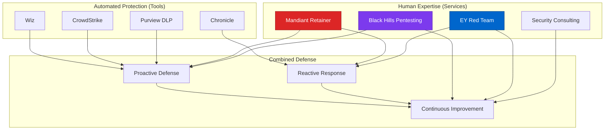

# Professional Security Services & Consultants
{: .no_toc }

Analysis of professional security services, retainers, and consulting firms used in enterprise Cursor deployments.
{: .fs-6 .fw-300 }

## Table of contents
{: .no_toc .text-delta }

1. TOC
{:toc}

---

## Overview

While security tools provide automated protection, professional security services offer human expertise for penetration testing, incident response, red team assessments, and security consulting. This section documents the professional services ecosystem used by enterprise organizations deploying Cursor.

### Service Categories

| Category | Purpose | Frequency | Examples |
|----------|---------|-----------|----------|
| **Incident Response Retainer** | 24/7 breach response | On-demand | Mandiant, CrowdStrike Services |
| **Penetration Testing** | Identify vulnerabilities | Quarterly/Annual | Mandiant, Black Hills InfoSec |
| **Red Team Assessments** | Adversarial simulation | Annual | Ernst & Young, Big 4 firms |
| **Security Consulting** | Architecture review, compliance | Project-based | Big 4, boutique firms |
| **Threat Intelligence** | Custom threat research | Ongoing | Mandiant, Recorded Future |

---

## Why Professional Services Matter

### Limitations of Automated Tools

**What Tools Can't Do**:
- ❌ Simulate sophisticated attackers
- ❌ Provide strategic security advice
- ❌ Conduct physical security testing
- ❌ Lead incident response coordination
- ❌ Offer expert testimony in breaches
- ❌ Provide industry-specific guidance

**What Humans Provide**:
- ✅ Creative attack scenarios
- ✅ Business context and risk prioritization
- ✅ Compliance expertise and audit support
- ✅ Incident response coordination
- ✅ Executive communication
- ✅ Custom threat intelligence

### Integrated Security Model



---

## Service Providers

### 1. Incident Response Retainers

**[Mandiant (Google Cloud)](mandiant.md)** - Elite incident response and threat intelligence
- **Purpose**: 24/7 breach response retainer
- **When**: Data breach, ransomware, nation-state attacks
- **Value**: World-class IR team, threat intelligence

### 2. Penetration Testing

**[Black Hills Information Security](black-hills.md)** - Offensive security specialists
- **Purpose**: Quarterly penetration testing
- **Focus**: Real-world attack simulation
- **Value**: Practical, business-focused findings

### 3. Red Team Assessments

**[Ernst & Young (EY) Cybersecurity](ernst-young.md)** - Big 4 security consulting
- **Purpose**: 5th year comprehensive red team assessment
- **Focus**: Multi-vector attack simulation
- **Value**: Executive reporting, regulatory credibility

### 4. Security Consulting

**Big 4 Firms** - Strategic security advisory
- Deloitte, PwC, KPMG, EY
- Compliance, architecture, risk management

---

## Service Timing Strategy

### Customer's Multi-Year Approach

```
Year 1-4: Internal + Mandiant Retainer
├── Quarterly: Internal security team pentests
├── Annual: Mandiant targeted assessment
└── On-demand: Mandiant IR retainer (if breach)

Year 5: Comprehensive Red Team
├── Q1-Q2: Ernst & Young red team engagement
├── Q3: Remediation of findings
└── Q4: Re-test and validation

Year 6+: Repeat cycle
├── Continue Mandiant retainer (always active)
├── Rotate red team providers
└── Annual pentesting

Why Year 5 for Major Red Team?
✅ Demonstrates due diligence to auditors
✅ Fresh perspective from external team
✅ Comprehensive multi-vector testing
✅ Executive-level reporting
✅ Regulatory expectation (especially insurance sector)
```

---

## Retainer vs. On-Demand Services

### Incident Response Retainer Benefits

**Mandiant Retainer Model**:
```yaml
retainer_agreement:
  type: "Incident Response Retainer"
  duration: 12 months
  
  included_services:
    - 24/7 hotline access
    - guaranteed response time: 2 hours
    - dedicated incident response team
    - threat intelligence briefings: quarterly
    - tabletop exercises: annual
    - breach readiness assessment
  
  pricing:
    retainer_fee: $100K-300K/year
    incident_response: $300-500/hour (discounted)
    expenses: reimbursable
  
  value:
    - immediate expert help when needed
    - faster response (vs finding vendor during crisis)
    - relationship with team (context on your environment)
    - lower hourly rates
    - priority scheduling
```

**Cost Comparison**:
```
Scenario: Major data breach

Without Retainer:
├── Find IR firm: 24-48 hours
├── Onboarding: 4-8 hours
├── Hourly rate: $500-800/hour
├── Total hours: 500 hours
├── Total cost: $250K-400K
└── Time to containment: 72+ hours

With Mandiant Retainer:
├── Activate retainer: <2 hours
├── Team familiar with environment
├── Hourly rate: $300-400/hour (discounted)
├── Total hours: 400 hours (more efficient)
├── Total cost: $120K-160K + $150K retainer = $270K-310K
└── Time to containment: 24-48 hours

Benefit:
✅ Faster response = less damage
✅ Lower total cost (if breach occurs)
✅ Better outcome (experienced team)
✅ Compliance benefit (shows preparedness)
```

---

## Integration with Cursor Security

### Pentesting Cursor + Azure AI Foundry

**In-Scope for Penetration Tests**:
```
Cursor Environment Testing Scope:
├── External Attack Surface
│   ├── Azure OpenAI public endpoints (if any)
│   ├── Azure Key Vault public access
│   ├── DNS reconnaissance
│   └── SSL/TLS configuration
│
├── Internal Network
│   ├── Private endpoint security
│   ├── VNet segmentation
│   ├── NSG effectiveness
│   └── Azure Firewall bypasses
│
├── Application Security
│   ├── Cursor IDE client security
│   ├── API authentication weaknesses
│   ├── Token management
│   └── Session handling
│
├── Identity & Access
│   ├── Okta MFA bypass attempts
│   ├── Azure AD privilege escalation
│   ├── RBAC misconfigurations
│   └── Service principal security
│
└── Data Protection
    ├── Secret exposure (logs, errors)
    ├── API key leakage
    ├── Data exfiltration paths
    └── Backup security
```

### Red Team Scenarios

**EY 5th Year Red Team Focus Areas**:
```markdown
## Scenario 1: Compromised Developer Workstation

Objective: Steal Azure OpenAI API keys and customer data

Attack Chain:
1. Phishing email to developer
2. Malware installation (bypass CrowdStrike)
3. Credential harvesting (bypass Okta MFA)
4. Lateral movement to Azure
5. Key Vault secret theft
6. Data exfiltration via Cursor

Defenses Tested:
- CrowdStrike EDR effectiveness
- Okta adaptive authentication
- Azure Key Vault RBAC
- Purview DLP blocking
- Network segmentation
- SIEM detection (Chronicle/Splunk)

## Scenario 2: Supply Chain Attack

Objective: Compromise Cursor environment via malicious dependency

Attack Chain:
1. Publish malicious npm package
2. Developer installs (bypass Veracode SCA)
3. Package steals environment variables
4. Exfiltrate Azure credentials
5. Pivot to production Azure OpenAI

Defenses Tested:
- Veracode SCA scanning
- npm audit effectiveness
- CrowdStrike script execution monitoring
- Network egress controls
- API rate limiting

## Scenario 3: Insider Threat

Objective: Authorized user steals data

Attack Chain:
1. Disgruntled employee with valid access
2. Bulk download of source code
3. Copy API keys from Key Vault
4. Exfiltrate via encrypted channel
5. Cover tracks

Defenses Tested:
- Insider Risk Management (Purview)
- CrowdStrike data exfiltration detection
- Purview DLP USB blocking
- SIEM behavioral analytics
- Key Vault audit logging
```

---

## Cost-Benefit Analysis

### Professional Services Budget

**Typical Enterprise Allocation**:
```
Security Services Budget (Annual):
├── Incident Response Retainer: $150K
│   └── Mandiant 24/7 retainer
│
├── Penetration Testing: $120K
│   ├── Q1: Network pentest ($30K)
│   ├── Q2: Web app pentest ($30K)
│   ├── Q3: Cloud infrastructure ($30K)
│   └── Q4: Red team lite ($30K)
│
├── Red Team Assessment (Year 5): $200K
│   └── EY comprehensive red team
│
├── Compliance Consulting: $80K
│   ├── SOC 2 audit support
│   ├── HIPAA gap assessment
│   └── PCI-DSS validation
│
└── Ad-Hoc Consulting: $50K
    └── Architecture reviews, incident support

Total: $600K/year (1% of security budget)

ROI:
├── Prevent 1 breach: $4M saved
├── Insurance premium reduction: $50K/year
├── Compliance efficiency: $100K/year
└── Net benefit: 7x ROI
```

---

## Service Provider Comparison

| Provider | Strength | Best For | Cost Range |
|----------|----------|----------|------------|
| **Mandiant** | Elite IR, nation-state expertise | Critical incidents, APTs | $$$$$ |
| **Black Hills** | Practical testing, training | Quarterly pentests, SMB | $$-$$$ |
| **Ernst & Young** | Compliance, board reporting | Annual red team, audits | $$$$ |
| **Deloitte** | Strategic consulting | Transformation projects | $$$$ |
| **CrowdStrike Services** | Tool integration, IR | Customers using Falcon | $$$ |

**Legend**: $ = <$50K, $$ = $50-100K, $$$ = $100-200K, $$$$ = $200-500K, $$$$$ = $500K+

---

## Next Steps

Explore detailed service provider pages:

- [Mandiant IR & Threat Intelligence](mandiant.md)
- [Black Hills Information Security](black-hills.md)
- [Ernst & Young Cybersecurity](ernst-young.md)

---

**Last Updated**: October 10, 2025  
**Status**: <span class="badge badge-research">Research Validated</span>

