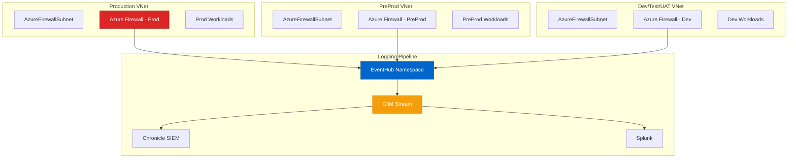

# Azure Firewall - Cloud-Native Firewall Service
{: .no_toc }

Analysis of Azure Firewall and its role in securing Cursor + Azure AI Foundry architecture.
{: .fs-6 .fw-300 }

## Table of contents
{: .no_toc .text-delta }

1. TOC
{:toc}

---

## Overview

**Azure Firewall** is a managed, cloud-based network security service that protects Azure Virtual Network resources. It provides stateful firewall capabilities, threat intelligence-based filtering, and centralized logging for the Cursor environment.

### Service Information

| | |
|---|---|
| **Service** | Azure Firewall |
| **Provider** | Microsoft Azure |
| **Type** | Firewall as a Service (FWaaS) |
| **Launched** | 2018 |
| **Website** | [https://azure.microsoft.com/products/azure-firewall](https://azure.microsoft.com/products/azure-firewall) |
| **Pricing Model** | Hourly + data processed |
| **SLA** | 99.95% uptime guarantee |

---

## Core Capabilities

### 1. Network Filtering

**Stateful Firewall Rules**:
```yaml
# Azure Firewall rules for Cursor environment
network_rules:
  - name: "Allow-Azure-OpenAI"
    priority: 100
    source: "10.0.0.0/16"  # Developer VNet
    destination: "40.112.72.0/24"  # Azure OpenAI service range
    ports: [443]
    protocol: TCP
    action: Allow
    log: true
    
  - name: "Allow-Key-Vault"
    priority: 101
    source: "10.0.0.0/16"
    destination:fqdn: "*.vault.azure.net"
    ports: [443]
    protocol: TCP
    action: Allow
    log: true
    
  - name: "Block-Outbound-RDP"
    priority: 200
    source: "10.0.0.0/16"
    destination: "*"
    ports: [3389]
    protocol: TCP
    action: Deny
    log: true

application_rules:
  - name: "Allow-Azure-Services"
    priority: 100
    source: "10.0.0.0/16"
    target_fqdns:
      - "*.openai.azure.com"
      - "*.vault.azure.net"
      - "login.microsoftonline.com"
      - "github.com"
      - "*.github.com"
    protocols:
      - https:443
    action: Allow
    
  - name: "Block-AI-Competitors"
    priority: 200
    source: "10.0.0.0/16"
    target_fqdns:
      - "api.openai.com"  # Block public OpenAI
      - "api.anthropic.com"  # Block Anthropic
      - "api.cohere.ai"  # Block Cohere
    action: Deny
    log: true
```

### 2. Threat Intelligence Integration

**Microsoft Threat Intelligence Feed**:
```
Azure Firewall Threat Intelligence:
├── Microsoft Cyber Defense Operations Center
├── Azure Security Center integration
├── Known malicious IPs (updated hourly)
├── C2 server domains
├── Malware distribution sites
└── Phishing domains

Automatic Blocking:
Developer workstation tries to connect to known C2 server
  ↓
Azure Firewall checks threat intel feed
  ↓
Match found: IP is known Cobalt Strike C2
  ↓
Action: Block + Alert + Log
  ↓
Security team notified: "Potential compromised workstation"
```

### 3. DNS Proxy

**Centralized DNS Filtering**:
```yaml
dns_proxy:
  enabled: true
  
  custom_dns_servers:
    - 168.63.129.16  # Azure recursive resolver
    
  dns_filtering:
    - block_malicious_domains: true
    - block_newly_registered: true (< 30 days)
    - block_dga_domains: true  # Domain generation algorithms
    - log_all_queries: true
    
  categories_blocked:
    - malware
    - phishing
    - cryptomining
    - c2_servers
    - tor_exit_nodes

Example:
Developer's compromised laptop tries: malicious-site.ru
  ↓
DNS query intercepted by Azure Firewall
  ↓
Threat intel: Domain is known malware distributor
  ↓
Action: Return NXDOMAIN (blocked)
  ↓
Log: DNS block event → EventHub → Cribl → Chronicle
```

### 4. Centralized Logging

**Comprehensive Log Collection**:
```
Azure Firewall Logs (Multi-Environment):
├── Dev Environment Firewall
│   ├── Volume: 100 GB/day
│   ├── Destination: EventHub → Cribl → Chronicle
│   └── Sampling: 5% (Cribl)
│
├── Test Environment Firewall
│   ├── Volume: 150 GB/day
│   ├── Destination: EventHub → Cribl → Chronicle
│   └── Sampling: 5%
│
├── UAT Environment Firewall
│   ├── Volume: 200 GB/day
│   ├── Destination: EventHub → Cribl → Chronicle
│   └── Sampling: 10%
│
├── PreProd Environment Firewall
│   ├── Volume: 400 GB/day
│   ├── Destination: EventHub → Cribl → Chronicle + Splunk
│   └── Sampling: 50%
│
└── Prod Environment Firewall
    ├── Volume: 750 GB/day
    ├── Destination: EventHub → Cribl → Chronicle + Splunk
    └── Sampling: 25% to Splunk, 100% to Chronicle

Total: 1.6 TB/day firewall logs
After Cribl: 300 GB/day (aggregated/sampled)
```

---

## Multi-Environment Architecture

### Firewall Per Environment



**Why Separate Firewalls**:
```
Network Isolation:
✅ Prod traffic never touches dev
✅ Different rule sets per environment
✅ Independent scaling
✅ Blast radius containment
✅ Cost allocation per environment

Alternative (Hub-Spoke):
- Single shared firewall
- More cost-effective
- Less isolation
- Customer chose separate for security
```

---

## Integration with Other Tools

### Azure Firewall + Prisma Access

**Complementary, Not Duplicate**:
```
Network Security Architecture:
├── Prisma Access: Remote user → Azure
│   ├── Use case: Developers working from home
│   ├── Technology: ZTNA, SASE
│   └── Scope: User-to-cloud connectivity
│
└── Azure Firewall: Azure resource → Azure resource / Internet
    ├── Use case: Azure VM → Azure OpenAI
    ├── Technology: Network/Application firewall
    └── Scope: Cloud workload protection

No Overlap:
- Prisma: User access
- Azure Firewall: Workload egress

Both Needed: Comprehensive coverage
```

### Azure Firewall → EventHub → Cribl

**Log Pipeline Configuration**:
```bash
# Configure Azure Firewall diagnostic settings
az monitor diagnostic-settings create \
  --name firewall-to-eventhub \
  --resource /subscriptions/{sub}/resourceGroups/rg-prod/providers/Microsoft.Network/azureFirewalls/azfw-prod \
  --event-hub-name firewall-logs-prod \
  --event-hub-rule /subscriptions/{sub}/resourceGroups/rg-logging/providers/Microsoft.EventHub/namespaces/eh-security-logs/authorizationRules/RootManageSharedAccessKey \
  --logs '[
    {
      "category": "AzureFirewallApplicationRule",
      "enabled": true
    },
    {
      "category": "AzureFirewallNetworkRule",
      "enabled": true
    },
    {
      "category": "AzureFirewallDnsProxy",
      "enabled": true
    }
  ]' \
  --metrics '[
    {
      "category": "AllMetrics",
      "enabled": true
    }
  ]'
```

---

## Pricing Model

```
Azure Firewall Pricing:
├── Deployment: $1.25/hour = $912/month
├── Data Processing: $0.016/GB
└── Total (typical): $1,500-3,000/month per firewall

Customer (5 firewalls - one per environment + shared):
├── Dev: $1,500/month
├── Test: $1,500/month
├── UAT: $1,500/month
├── PreProd: $2,000/month
├── Prod: $3,000/month
└── Total: $9,500/month = $114K/year

Data Processing:
1.6 TB/day = 48 TB/month
48,000 GB × $0.016 = $768/month

Grand Total: $10,268/month = $123K/year

Alternative - Azure Firewall Premium:
├── Base: $0.875/hour = $638/month (cheaper!)
├── But: $0.008/GB processed (half cost)
├── Features: IDPS, TLS inspection, URL filtering
└── Better value for high-volume environments
```

---

## Resources & Links

- **Product Page**: [Azure Firewall](https://azure.microsoft.com/products/azure-firewall)
- **Documentation**: [Azure Firewall Docs](https://learn.microsoft.com/azure/firewall/)
- **Architecture**: [Hub-spoke network topology](https://learn.microsoft.com/azure/architecture/reference-architectures/hybrid-networking/hub-spoke)

---

**Last Updated**: October 10, 2025  
**Review Status**: <span class="badge badge-security">Production Validated</span>

