# Google Chronicle - Cloud-Native SIEM Platform
{: .no_toc }

Comprehensive analysis of Google Chronicle SIEM and its role in the multi-environment logging architecture.
{: .fs-6 .fw-300 }

## Table of contents
{: .no_toc .text-delta }

1. TOC
{:toc}

---

## Overview

**Google Chronicle** (formerly Chronicle Security) is a cloud-native security analytics platform built on Google's infrastructure. It provides SIEM capabilities with the ability to ingest and analyze massive amounts of security telemetry at Google scale.

### Vendor Information

| | |
|---|---|
| **Company** | Google Cloud (Alphabet Inc.) |
| **Founded** | 2018 (as Chronicle, acquired by Google Cloud 2019) |
| **Headquarters** | Mountain View, CA |
| **Founders** | Stephen Gillett (ex-CEO), Mike Wiacek |
| **Website** | [https://chronicle.security](https://chronicle.security) |
| **Status** | Google Cloud service |
| **Notable** | Built on Google's planet-scale infrastructure |

---

## Core Capabilities

### 1. Petabyte-Scale Data Ingestion

**Google-Scale Infrastructure**:
- Ingest terabytes per day without performance degradation
- No data sampling required
- 1-year hot storage (searchable)
- 10+ years cold storage (archival)

**For Multi-Environment Architecture**:
```
Chronicle Ingestion (Customer):
├── Dev Environment: 100 GB/day
├── Test Environment: 150 GB/day
├── UAT Environment: 200 GB/day
├── PreProd Environment: 400 GB/day
└── Prod Environment: 750 GB/day

Total: 1.6 TB/day = 48 TB/month

Chronicle Pricing: Flat rate (not per-GB)
Cost: Predictable monthly fee
Compare to Splunk: $150/GB = $7.2M/month (!!)
```

**Data Sources**:
```yaml
# Chronicle receives data from Cribl Stream
sources:
  - azure_firewall_logs:
      volume: 500 GB/day
      environments: [dev, test, uat, preprod, prod]
      
  - azure_openai_logs:
      volume: 200 GB/day
      environments: [dev, prod]
      
  - key_vault_audit:
      volume: 50 GB/day
      environments: [all]
      
  - crowdstrike_detections:
      volume: 100 GB/day
      environments: [all]
      
  - wiz_findings:
      volume: 20 GB/day
      environments: [all]
      
  - okta_logs:
      volume: 30 GB/day
      environments: [prod]
      
  - cursor_activity:
      volume: 10 GB/day
      environments: [prod]
```

### 2. Unified Data Model (UDM)

**Normalization at Scale**:
- Parses and normalizes all data sources
- Common schema across all logs
- Enrichment with threat intelligence
- Context-aware analytics

**UDM Schema Example**:
```json
{
  "metadata": {
    "event_timestamp": "2024-10-10T14:32:15Z",
    "event_type": "NETWORK_CONNECTION",
    "product_name": "Azure Firewall",
    "vendor_name": "Microsoft"
  },
  "principal": {
    "hostname": "LAPTOP-DEV-042",
    "ip": "10.0.1.5",
    "user": {
      "userid": "john.developer@company.com",
      "email_addresses": ["john.developer@company.com"]
    }
  },
  "target": {
    "hostname": "aoai-cursor-prod.openai.azure.com",
    "ip": "40.112.72.205",
    "port": 443,
    "application": "Azure OpenAI"
  },
  "network": {
    "direction": "OUTBOUND",
    "ip_protocol": "TCP",
    "application_protocol": "HTTPS"
  },
  "security_result": {
    "action": "ALLOW",
    "rule_name": "Allow-Azure-OpenAI"
  },
  "enrichment": {
    "geo_ip": {
      "country": "United States",
      "region": "Washington",
      "city": "Seattle"
    },
    "threat_intel": {
      "severity": "INFORMATIONAL",
      "confidence": "HIGH"
    }
  }
}
```

### 3. Threat Intelligence Integration

**VirusTotal Enterprise Integration**:
- Automatic enrichment with VirusTotal data
- File hash reputation
- Domain/IP reputation
- Malware family identification

**Example Enrichment**:
```
Event: File downloaded from internet
  ↓
Chronicle automatically queries VirusTotal:
  - File hash: abc123def456...
  - VirusTotal verdict: Malicious (45/70 vendors)
  - Malware family: TrickBot
  - First seen: 2024-10-01
  ↓
Chronicle Alert: HIGH severity
  - Malware detected: TrickBot
  - Action: Quarantine file
  - Notify: Security team + user
```

**Threat Intel Sources**:
- VirusTotal (Google-owned)
- Google Threat Analysis Group (TAG)
- Mandiant Threat Intelligence (Google-owned)
- Custom threat feeds
- MITRE ATT&CK framework

### 4. Detection Engineering

**YARA-L Rules**:
Chronicle's custom detection language

```python
# YARA-L 2.0 rule example
rule cursor_suspicious_api_calls {
  meta:
    author = "Security Team"
    description = "Detect suspicious Azure OpenAI API usage patterns"
    severity = "MEDIUM"
    
  events:
    $e1.metadata.event_type = "NETWORK_CONNECTION"
    $e1.target.application = "Azure OpenAI"
    $e1.principal.user.email_addresses = $user
    
    # More than 1000 API calls in 5 minutes
    #count(events) > 1000 over 5m by $user
    
  match:
    $user over 5m
    
  outcome:
    $risk_score = 75
    $user_email = $e1.principal.user.email_addresses
    
  condition:
    #count(events) > 1000
}

# Alert triggers:
# - User exceeds 1000 API calls in 5 minutes
# - Could indicate compromised credentials
# - Could indicate unauthorized script/bot
```

**Pre-Built Rules**:
```
Chronicle Rule Library:
├── MITRE ATT&CK Techniques (300+ rules)
├── Ransomware detection (50+ rules)
├── Credential theft (40+ rules)
├── Data exfiltration (30+ rules)
├── Lateral movement (35+ rules)
└── Custom rules (unlimited)
```

---

## Architecture in Cursor Environment

### Data Flow

```mermaid
graph TB
    subgraph "Azure Sources"
        A[Azure Firewall]
        B[Azure OpenAI]
        C[Key Vault]
        D[Cursor Logs]
    end
    
    subgraph "Security Tools"
        E[CrowdStrike]
        F[Wiz]
        G[Okta]
    end
    
    subgraph "Cribl Stream"
        H[Data Routing]
        I[Enrichment]
        J[Transformation]
    end
    
    subgraph "Chronicle SIEM"
        K[Ingestion API]
        L[UDM Normalization]
        M[Threat Intel Enrichment]
        N[Detection Engine]
        O[Investigation Tools]
        P[Dashboards]
    end
    
    subgraph "Analyst Workflow"
        Q[Security Analyst]
        R[Incident Response]
        S[Threat Hunting]
    end
    
    A --> H
    B --> H
    C --> H
    D --> H
    E --> H
    F --> H
    G --> H
    
    H --> I
    I --> J
    J --> K
    
    K --> L
    L --> M
    M --> N
    
    N --> O
    O --> P
    
    P --> Q
    Q --> R
    Q --> S
    
    style K fill:#0066cc,stroke:#003d7a,color:#fff
    style N fill:#dc2626,stroke:#991b1b,color:#fff
    style Q fill:#10b981,stroke:#059669,color:#fff
```



### Multi-Environment Strategy

**Chronicle Organization**:
```
Company Chronicle Instance
├── Assets (Auto-discovered)
│   ├── Dev: 50 assets
│   ├── Test: 75 assets
│   ├── UAT: 100 assets
│   ├── PreProd: 150 assets
│   └── Prod: 200 assets
│
├── Detection Rules (Environment-specific)
│   ├── All Environments: Critical alerts
│   ├── PreProd + Prod: High priority
│   └── Prod Only: Real-time SOC monitoring
│
└── Dashboards
    ├── Executive Dashboard (all environments)
    ├── SOC Dashboard (preprod + prod)
    └── Engineering Dashboard (dev + test + uat)
```

**Rule Tuning by Environment**:
```yaml
# Production: Low threshold, high sensitivity
rule_prod:
  threshold: 5 failed logins
  action: alert_immediately
  priority: P1

# PreProd: Medium threshold
rule_preprod:
  threshold: 10 failed logins
  action: alert_batch_hourly
  priority: P2

# Dev/Test: High threshold, noise reduction
rule_dev:
  threshold: 50 failed logins
  action: alert_batch_daily
  priority: P3
```

---

## Key Features for Cursor Security

### 1. API Call Monitoring

**Azure OpenAI Usage Tracking**:
```sql
-- Chronicle Query Language (similar to SQL)
SELECT
  principal.user.email_addresses AS user,
  target.application AS api,
  COUNT(*) AS api_calls,
  SUM(CAST(additional.fields['tokens_used'] AS INT64)) AS total_tokens,
  SUM(CAST(additional.fields['tokens_used'] AS INT64)) * 0.00001 AS estimated_cost
FROM
  `chronicle.udm.events`
WHERE
  metadata.event_type = "NETWORK_CONNECTION"
  AND target.hostname LIKE '%openai.azure.com%'
  AND metadata.event_timestamp >= TIMESTAMP_SUB(CURRENT_TIMESTAMP(), INTERVAL 24 HOUR)
GROUP BY
  user, api
ORDER BY
  total_tokens DESC
LIMIT 100
```

**Output**:
```
user                            | api_calls | total_tokens | estimated_cost
--------------------------------|-----------|--------------|---------------
john.developer@company.com      | 1,234     | 1,250,000    | $12.50
jane.engineer@company.com       | 987       | 890,000      | $8.90
bob.senior@company.com          | 756       | 2,100,000    | $21.00
```

### 2. Secret Access Auditing

**Key Vault Access Monitoring**:
```sql
-- Detect unusual Key Vault access patterns
SELECT
  principal.user.email_addresses AS user,
  target.resource.name AS secret_name,
  COUNT(*) AS access_count,
  MIN(metadata.event_timestamp) AS first_access,
  MAX(metadata.event_timestamp) AS last_access
FROM
  `chronicle.udm.events`
WHERE
  metadata.product_name = "Azure Key Vault"
  AND security_result.action = "READ_SECRET"
  AND metadata.event_timestamp >= TIMESTAMP_SUB(CURRENT_TIMESTAMP(), INTERVAL 7 DAY)
GROUP BY
  user, secret_name
HAVING
  COUNT(*) > 100  -- Alert if user accessed secret >100 times in a week
ORDER BY
  access_count DESC
```

### 3. Threat Hunting

**Example Hunt: Compromised Credentials**:
```sql
-- Hunt for credential stuffing attacks
WITH failed_logins AS (
  SELECT
    principal.ip AS source_ip,
    target.user.userid AS target_user,
    COUNT(*) AS failed_attempts,
    ARRAY_AGG(DISTINCT principal.location.country_or_region) AS countries
  FROM
    `chronicle.udm.events`
  WHERE
    metadata.event_type = "USER_LOGIN"
    AND security_result.action = "BLOCK"
    AND security_result.summary = "INVALID_CREDENTIALS"
    AND metadata.event_timestamp >= TIMESTAMP_SUB(CURRENT_TIMESTAMP(), INTERVAL 1 HOUR)
  GROUP BY
    source_ip, target_user
  HAVING
    COUNT(*) >= 5
)

SELECT
  *,
  CASE
    WHEN ARRAY_LENGTH(countries) > 2 THEN "HIGH_RISK"
    WHEN failed_attempts > 20 THEN "HIGH_RISK"
    WHEN failed_attempts > 10 THEN "MEDIUM_RISK"
    ELSE "LOW_RISK"
  END AS risk_level
FROM
  failed_logins
ORDER BY
  failed_attempts DESC
```

### 4. Incident Investigation

**Timeline Reconstruction**:
```
Incident: Suspicious Azure OpenAI API usage

Chronicle Investigation:
1. Identify initial indicator (high API volume)
   ↓
2. Pivot to user's all activities (last 7 days)
   ↓
3. Find anomaly: Login from new country
   ↓
4. Correlate with Okta logs: MFA bypass attempt
   ↓
5. Check CrowdStrike: Malware on user's laptop
   ↓
6. Timeline: Malware → Credential theft → API abuse
   ↓
7. Full attack chain reconstructed in <5 minutes
```

---

## Integration with Other Tools

### Chronicle + Cribl Stream

**Optimized Data Pipeline**:
```yaml
# Cribl routes to Chronicle
cribl_to_chronicle:
  # All environments send to Chronicle
  all_data: true
  
  # But Cribl pre-processes:
  preprocessing:
    - filter_noise: true      # Remove debug logs
    - enrich_context: true    # Add Okta user data
    - normalize_format: true  # Convert to UDM
    - compress: true          # Reduce size by 40%
  
  # Result: Clean, enriched data for Chronicle
  data_quality: "High"
  cost_savings: "60% vs sending raw logs"
```

### Chronicle + CrowdStrike

**Correlated Detection**:
```
Scenario: Ransomware attack

CrowdStrike detects:
├── Suspicious process: suspicious.exe
├── File encryption attempt
└── Lateral movement

Chronicle correlates:
├── Network connections to C2 server (Azure Firewall)
├── Mass file downloads (Azure Storage logs)
├── Multiple failed admin logins (Okta)
├── Key Vault access spike (Azure)
└── Timeline: Initial compromise → lateral movement → encryption

Combined View:
✅ Complete attack path
✅ All affected systems identified
✅ Exfiltrated data quantified
✅ Remediation actions clear
```

### Chronicle + Wiz

**Cloud Posture + Security Events**:
```python
# Chronicle query enriched with Wiz data

# Example: Wiz finds vulnerable VM, Chronicle shows if exploited
wiz_finding = {
    "resource": "vm-cursor-dev-01",
    "vulnerability": "CVE-2024-12345",
    "severity": "CRITICAL",
    "exploitable": true
}

# Chronicle searches for exploitation attempts
chronicle_query = f"""
SELECT * FROM events
WHERE target.hostname = '{wiz_finding['resource']}'
AND metadata.event_timestamp > '{wiz_finding['discovered_date']}'
AND (
  security_result.action = 'EXPLOIT_ATTEMPT'
  OR network.http.response_code IN (500, 503)
  OR process.command_line LIKE '%CVE-2024-12345%'
)
"""

# Result: Know if vulnerability was exploited
```

---

## Pricing Model

### Flat-Rate Pricing

**Chronicle Advantage**:
```
Traditional SIEM (Splunk):
├── Pricing: $150/GB ingested
├── 1.6 TB/day = $240K/day = $7.2M/month
└── Result: Massive cost, forces data sampling

Chronicle:
├── Pricing: Flat monthly/annual fee
├── Based on: User count + feature tier
├── Typical: $50K-150K/year for 50-100 users
└── Result: Unlimited data ingestion
```

**Actual Customer Pricing** (estimated):
```
Chronicle Enterprise:
├── Base Platform: $60K/year
├── 50 Analyst Users: $30K/year
├── Advanced Features: $10K/year
└── Total: $100K/year

Compare to Splunk:
├── Same data volume: $7.2M/year
├── Chronicle savings: $7.1M/year (98.6% reduction!)
└── ROI: Immediate and massive
```

### Licensing Tiers

```
Chronicle Standard:
├── Unlimited data ingestion
├── 1-year hot storage
├── Basic detection rules
├── Standard support
└── ~$50K/year

Chronicle Enterprise:
├── Everything in Standard
├── 10+ years cold storage
├── Advanced detection rules
├── SOAR integration
├── VirusTotal Enterprise
├── Dedicated support
└── ~$100K-200K/year

Chronicle Elite (Custom):
├── Everything in Enterprise
├── Custom retention
├── Dedicated TAM
├── Priority support
├── Custom integrations
└── ~$300K+/year
```

---

## Strengths & Weaknesses

### Strengths ✅

1. **Google-Scale Infrastructure**
   - Petabyte-scale ingestion
   - Sub-second query performance
   - No data sampling required

2. **Flat-Rate Pricing**
   - Predictable costs
   - No per-GB charges
   - Encourages comprehensive logging

3. **Threat Intelligence**
   - VirusTotal integration
   - Mandiant threat intel
   - Google TAG insights

4. **Search Performance**
   - Searches years of data in seconds
   - No pre-aggregation needed
   - Real-time and historical queries

5. **Easy Onboarding**
   - Cloud-native (no hardware)
   - Simple data ingestion
   - Pre-built integrations

### Weaknesses ⚠️

1. **Younger Platform**
   - Less mature than Splunk (founded 2003)
   - Smaller community
   - Fewer third-party integrations

2. **Query Language**
   - YARA-L learning curve
   - Less familiar than SPL (Splunk)
   - Documentation still growing

3. **Dashboarding**
   - Less flexible than Splunk
   - Fewer visualization options
   - More technical (less business-friendly)

4. **On-Prem Option**
   - Cloud-only (no on-prem)
   - Requires internet connectivity
   - Data residency considerations

5. **Enterprise Features**
   - Some advanced features in development
   - SOAR integration less mature
   - Customization limits

---

## Best Practices for Chronicle

### 1. Optimize Ingestion

```yaml
# Send clean, normalized data
best_practices:
  - use_cribl_preprocessing: true
  - normalize_to_udm: true
  - enrich_before_sending: true
  - remove_noise: true
  - compress_data: true
  
# Result: Better performance, lower egress costs
```

### 2. Build Detection Library

```python
# Organize detection rules by MITRE ATT&CK
detection_library:
  initial_access:
    - "Phishing detection"
    - "Brute force login"
    - "Exploit public-facing app"
    
  execution:
    - "Malicious script execution"
    - "Command-line abuse"
    
  persistence:
    - "New scheduled task"
    - "Registry modification"
    
  credential_access:
    - "Password spraying"
    - "Credential dumping"
    - "MFA bypass attempt"
    
  # 200+ rules covering full kill chain
```

### 3. Create Playbooks

```yaml
# Incident response playbook
playbook_credential_compromise:
  trigger: "MFA bypass + unusual location"
  
  steps:
    1: "Chronicle: Identify compromised user"
    2: "Okta: Force password reset"
    3: "Okta: Revoke all sessions"
    4: "CrowdStrike: Isolate user's device"
    5: "Chronicle: Search for data exfiltration"
    6: "Azure: Revoke Azure OpenAI API access"
    7: "Key Vault: Rotate accessed secrets"
    8: "Create incident ticket"
    9: "Notify user and manager"
    10: "Conduct forensic investigation"
```

### 4. Regular Threat Hunting

```sql
-- Weekly threat hunt queries

-- Hunt 1: Unusual Azure OpenAI access times
SELECT * FROM events
WHERE target.application = "Azure OpenAI"
AND EXTRACT(HOUR FROM metadata.event_timestamp) NOT BETWEEN 6 AND 20
AND metadata.event_timestamp >= TIMESTAMP_SUB(CURRENT_TIMESTAMP(), INTERVAL 7 DAY);

-- Hunt 2: Key Vault access from new locations
SELECT * FROM events
WHERE metadata.product_name = "Azure Key Vault"
AND principal.location.country_or_region NOT IN ("United States")
AND metadata.event_timestamp >= TIMESTAMP_SUB(CURRENT_TIMESTAMP(), INTERVAL 30 DAY);

-- Hunt 3: Cursor IDE access from suspicious IPs
SELECT * FROM events
WHERE target.application = "Cursor IDE"
AND principal.ip IN (SELECT ip FROM threat_intel WHERE reputation = "MALICIOUS")
AND metadata.event_timestamp >= TIMESTAMP_SUB(CURRENT_TIMESTAMP(), INTERVAL 24 HOUR);
```

---

## Resources & Links

- **Website**: [https://chronicle.security](https://chronicle.security)
- **Documentation**: [https://cloud.google.com/chronicle/docs](https://cloud.google.com/chronicle/docs)
- **Console**: [https://chronicle.security/console](https://chronicle.security/console)
- **Blog**: [https://cloud.google.com/blog/products/identity-security](https://cloud.google.com/blog/products/identity-security)

### Learning Resources

- **Chronicle Academy**: Free training courses
- **Detection Rules**: [GitHub - Chronicle Detection Rules](https://github.com/chronicle/detection-rules)
- **Community**: Google Cloud Community Forums
- **YouTube**: Chronicle Security Channel

---

## Conclusion

**For Cursor Security Architecture**:

Google Chronicle provides **cost-effective, scalable SIEM** capabilities essential for multi-environment Cursor deployments. Its flat-rate pricing enables comprehensive logging across dev/test/uat/preprod/prod without prohibitive costs.

**Key Value Props for Cursor**:
1. ✅ Unlimited data ingestion (all environments)
2. ✅ Sub-second queries across petabytes
3. ✅ 98% cost savings vs. Splunk
4. ✅ Google-scale infrastructure
5. ✅ Integrated threat intelligence

**Recommendation**: **Essential SIEM** for cost-conscious enterprises with high data volumes.

---

**Last Updated**: October 10, 2025  
**Review Status**: <span class="badge badge-security">Production Validated</span>

