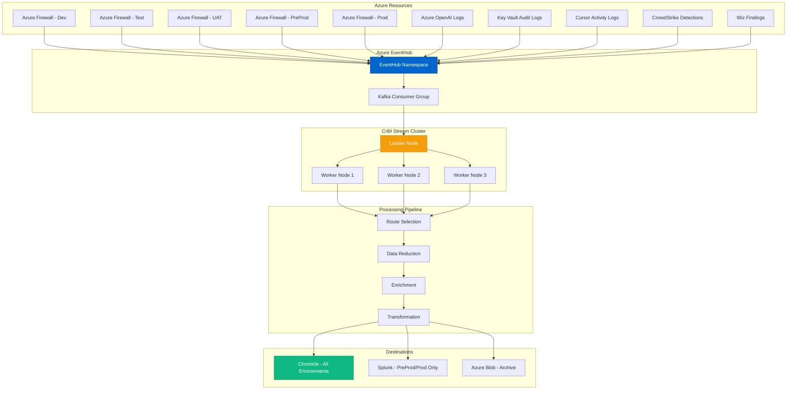

# Cribl Stream - Observability Pipeline Platform
{: .no_toc }

Deep dive into Cribl Stream and its role in optimizing log management for Cursor deployments.
{: .fs-6 .fw-300 }

## Table of contents
{: .no_toc .text-delta }

1. TOC
{:toc}

---

## Overview

**Cribl Stream** is an observability pipeline platform that sits between data sources (Azure EventHub, logs, metrics) and destinations (Chronicle, Splunk). It routes, reduces, enriches, and transforms data in flight, dramatically reducing SIEM costs while improving data quality.

### Vendor Information

| | |
|---|---|
| **Company** | Cribl, Inc. |
| **Founded** | 2017 |
| **Headquarters** | San Francisco, CA |
| **Founders** | Clint Sharp (CEO), Ledion Bitincka, Dritan Bitincka |
| **Website** | [https://cribl.io](https://cribl.io) |
| **Status** | Private (well-funded, $150M+ raised) |
| **Notable** | Founded by Splunk veterans |

---

## The Problem Cribl Solves

### SIEM Cost Explosion

**Traditional Architecture** (without Cribl):
```
All Data Sources → SIEM (Splunk/Chronicle)
├── 10 TB/day of raw logs
├── 80% is low-value data (debug logs, duplicates)
├── SIEM charges per GB ingested
└── Result: $500K-1M annual SIEM cost
```

**With Cribl Stream**:
```
Data Sources → Cribl Stream → Optimized Data → SIEM
├── 10 TB/day input
├── Cribl filters, samples, routes intelligently
├── 2 TB/day to expensive SIEM (Splunk)
├── 8 TB/day to cheaper destinations (Chronicle, S3)
└── Result: 60-80% cost reduction
```

---

## Architecture in Cursor Environment

### Data Flow



### EventHub to Cribl Integration

**Configuration**:
```yaml
# Cribl Stream source configuration
sources:
  azure-eventhub:
    type: azure_event_hubs
    connection_string: "${EVENTHUB_CONNECTION_STRING}"
    consumer_group: "cribl-stream-consumers"
    storage_account: "cribleventhubcheckpoint"
    checkpoint_interval: 60  # seconds
    
    # Multiple event hubs (one per environment)
    event_hubs:
      - name: "firewall-logs-prod"
        partition_count: 32
      - name: "firewall-logs-preprod"
        partition_count: 16
      - name: "firewall-logs-dev"
        partition_count: 4
      - name: "azure-openai-logs"
        partition_count: 16
      - name: "key-vault-audit"
        partition_count: 8
```

---

## Core Capabilities

### 1. Intelligent Routing

**Route by Environment**:
```javascript
// Cribl routing logic
if (__inputId == 'firewall-logs-prod') {
  // Production logs: Send to both Chronicle AND Splunk
  __output = ['chronicle', 'splunk-prod'];
} else if (__inputId == 'firewall-logs-preprod') {
  // PreProd: Chronicle + Splunk, but sample 50%
  if (Math.random() < 0.5) {
    __output = ['chronicle', 'splunk-preprod'];
  } else {
    __output = ['chronicle'];  // Chronicle gets 100%, Splunk gets 50%
  }
} else if (__inputId.startsWith('firewall-logs-dev')) {
  // Dev/Test/UAT: Chronicle only, 5% sample
  if (Math.random() < 0.05) {
    __output = ['chronicle'];
  } else {
    __output = [];  // Drop 95% of dev logs
  }
}
```

**Route by Severity**:
```javascript
// Route high-severity events differently
if (severity == 'critical' || severity == 'high') {
  // All critical/high events: Both SIEMs + PagerDuty webhook
  __output = ['chronicle', 'splunk-prod', 'pagerduty'];
} else if (severity == 'medium') {
  // Medium: Chronicle only
  __output = ['chronicle'];
} else {
  // Low/info: Sample 1%, Chronicle only
  if (Math.random() < 0.01) {
    __output = ['chronicle'];
  }
}
```

### 2. Data Reduction

**Techniques**:

**A. Sampling**:
```javascript
// Sample low-value logs
if (log_type == 'azure_firewall' && action == 'Allow') {
  // Sample 10% of allowed connections (keep all denies)
  if (Math.random() > 0.1) {
    drop();  // Drop 90% of allowed connection logs
  }
}
```

**B. Aggregation**:
```javascript
// Aggregate repetitive events
// Example: Azure Firewall allows 10,000 connections to same destination

// Before Cribl: 10,000 events → SIEM
// After Cribl: 1 aggregated event → SIEM

{
  "source_ip": "10.0.1.5",
  "dest_ip": "40.112.72.205",
  "dest_port": 443,
  "action": "Allow",
  "count": 10000,  // Aggregated count
  "first_seen": "2024-10-10T08:00:00Z",
  "last_seen": "2024-10-10T08:15:00Z",
  "sample_events": [/* 5 example events */]
}
```

**C. Deduplication**:
```javascript
// Remove duplicate events
// Common with distributed systems sending same log multiple times

hash_key = md5(source_ip + dest_ip + timestamp + message);
if (seen_hashes.includes(hash_key)) {
  drop();  // Already processed this event
} else {
  seen_hashes.add(hash_key);
}
```

**D. Field Removal**:
```javascript
// Remove unnecessary fields to reduce size
delete _raw.verbose_stack_trace;  // Removes 5KB per event
delete _raw.full_http_headers;    // Removes 2KB per event
delete _raw.debug_metadata;       // Removes 1KB per event

// Result: 80% size reduction per event
```

### 3. Data Enrichment

**Add Context from External Sources**:

```javascript
// Enrich with Okta user information
async function enrichWithOkta(event) {
  const user_email = event.user_principal_name;
  
  // Lookup in Okta API
  const okta_user = await okta.getUser(user_email);
  
  // Add enrichment
  event.user_full_name = okta_user.displayName;
  event.user_department = okta_user.department;
  event.user_manager = okta_user.manager;
  event.user_risk_score = okta_user.riskScore;
  
  return event;
}

// Enrich with Wiz cloud context
async function enrichWithWiz(event) {
  const resource_id = event.azure_resource_id;
  
  // Lookup in Wiz API
  const wiz_asset = await wiz.getAsset(resource_id);
  
  // Add enrichment
  event.wiz_risk_score = wiz_asset.riskScore;
  event.wiz_critical_findings = wiz_asset.criticalFindings;
  event.wiz_tags = wiz_asset.tags;
  
  return event;
}

// Enrich with GeoIP
function enrichWithGeoIP(event) {
  const ip = event.source_ip;
  const geo = geoip.lookup(ip);
  
  event.geo_country = geo.country;
  event.geo_city = geo.city;
  event.geo_lat = geo.latitude;
  event.geo_long = geo.longitude;
  event.geo_asn = geo.asn;
  
  return event;
}
```

**Enrichment in Action**:
```json
// Before enrichment:
{
  "timestamp": "2024-10-10T14:32:15Z",
  "user_principal_name": "john.developer@company.com",
  "source_ip": "203.0.113.42",
  "action": "AzureOpenAI_APICall",
  "resource_id": "/subscriptions/.../aoai-cursor-prod"
}

// After enrichment:
{
  "timestamp": "2024-10-10T14:32:15Z",
  "user_principal_name": "john.developer@company.com",
  "user_full_name": "John Developer",         // From Okta
  "user_department": "Engineering",            // From Okta
  "user_manager": "Jane Manager",              // From Okta
  "user_risk_score": 35,                       // From Okta
  "source_ip": "203.0.113.42",
  "geo_country": "United States",              // From GeoIP
  "geo_city": "Seattle",                       // From GeoIP
  "geo_asn": "AS8075 (Microsoft)",             // From GeoIP
  "action": "AzureOpenAI_APICall",
  "resource_id": "/subscriptions/.../aoai-cursor-prod",
  "wiz_risk_score": 15,                        // From Wiz
  "wiz_critical_findings": 0,                  // From Wiz
  "wiz_tags": ["production", "ai-services"]    // From Wiz
}
```

### 4. Data Transformation

**Normalization**:
```javascript
// Normalize to common schema (ECS, OCSF, etc.)

// Azure Firewall log (native format)
{
  "category": "AzureFirewallApplicationRule",
  "properties": {
    "msg": "HTTPS request from 10.0.1.5:52341 to api.openai.com:443...",
    "Action": "Allow"
  }
}

// Transform to Elastic Common Schema (ECS)
{
  "event.category": "network",
  "event.type": "connection",
  "event.action": "allow",
  "source.ip": "10.0.1.5",
  "source.port": 52341,
  "destination.domain": "api.openai.com",
  "destination.port": 443,
  "network.protocol": "https",
  "observer.name": "azure-firewall",
  "cloud.provider": "azure"
}
```

---

## Cost Savings Examples

### Before Cribl (Traditional SIEM)

```
Daily Logs:
├── Azure Firewall (all envs): 8 TB/day
├── Azure OpenAI logs: 1 TB/day
├── Key Vault audit: 0.5 TB/day
├── CrowdStrike detections: 0.3 TB/day
└── Wiz findings: 0.2 TB/day

Total: 10 TB/day = 300 TB/month

Splunk Cost:
300 TB/month × $150/GB = $45,000/month = $540,000/year
```

### After Cribl Implementation

```
Cribl Processing:
├── Input: 10 TB/day (300 TB/month)
├── Filtering: 60% reduction (6 TB dropped)
├── Sampling: Additional 20% reduction (2 TB dropped)
├── Compression: 10% reduction (0.4 TB saved)
└── Output: 1.6 TB/day (48 TB/month)

Destination Routing:
├── Chronicle (all data): 1.6 TB/day @ $20/GB = $960/month
├── Splunk (prod only): 0.3 TB/day @ $150/GB = $1,350/month
├── Azure Blob (archive): 8.4 TB/day @ $0.02/GB = $5/month
└── Total: $2,315/month = $27,780/year

Savings:
Old cost: $540,000/year
New cost: $27,780/year
Savings: $512,220/year (95% reduction!)

Cribl License: ~$50,000/year
Net Savings: $462,220/year
```

---

## Deployment Architecture

### Cribl Stream Cluster

**Components**:
```
Cribl Leader Node
├── Configuration management
├── Monitoring dashboard
├── User authentication (Okta SAML)
└── API endpoint

Cribl Worker Nodes (3+)
├── Data processing
├── Pipeline execution
├── Scale horizontally
└── High availability
```

**Infrastructure**:
```yaml
# Azure deployment
resource_group: rg-cribl-stream
location: eastus2

leader_node:
  vm_size: Standard_D4s_v3
  os: Ubuntu 22.04
  managed_disk: 128 GB SSD
  
worker_nodes:
  count: 3  # Scale to 5+ for high volume
  vm_size: Standard_D8s_v3  # 8 vCPU, 32 GB RAM
  os: Ubuntu 22.04
  managed_disk: 256 GB SSD
  auto_scaling:
    min: 3
    max: 10
    cpu_threshold: 70%
```

### High Availability

**Resilience**:
- Multiple worker nodes (N+1 redundancy)
- Leader node failover (secondary leader)
- Persistent queue (disk-based buffering)
- Data replay capability

**Buffering Strategy**:
```yaml
# If Chronicle/Splunk is down, buffer to disk
persistent_queue:
  enabled: true
  max_size: 500 GB  # Per worker node
  max_retention: 24 hours
  
# When destination recovers, replay buffered data
```

---

## Configuration Examples

### Complete Pipeline Configuration

```yaml
# cribl-stream-config.yml

sources:
  azure-eventhub-prod:
    type: azure_event_hubs
    connection_string: "${EVENTHUB_PROD_CONNECTION}"
    consumer_group: "cribl-prod"
    event_hubs:
      - firewall-logs-prod
      - azure-openai-prod
      - keyvault-audit-prod

pipelines:
  production-critical:
    filter: "severity == 'critical' || severity == 'high'"
    functions:
      - enrich_okta_user
      - enrich_wiz_context
      - normalize_to_ecs
    destinations:
      - chronicle
      - splunk-prod
      - pagerduty-webhook
      
  production-standard:
    filter: "severity == 'medium' || severity == 'low'"
    functions:
      - sample_rate: 0.25  # Keep 25%
      - enrich_geoip
      - normalize_to_ecs
    destinations:
      - chronicle
      
  development-environments:
    filter: "environment in ['dev', 'test', 'uat']"
    functions:
      - sample_rate: 0.05  # Keep 5%
      - normalize_to_ecs
    destinations:
      - chronicle

destinations:
  chronicle:
    type: chronicle_siem
    endpoint: "https://malachiteingestion-pa.googleapis.com"
    credentials: "${CHRONICLE_SERVICE_ACCOUNT}"
    
  splunk-prod:
    type: splunk_hec
    url: "https://splunk-prod.company.com:8088"
    token: "${SPLUNK_HEC_TOKEN}"
    
  azure-blob-archive:
    type: azure_blob_storage
    connection_string: "${AZURE_STORAGE_CONNECTION}"
    container: "log-archive"
    compression: gzip
```

---

## Monitoring & Ops

### Cribl Metrics Dashboard

**Key Metrics**:
```
Performance:
├── Events In/Second: 45,000 eps
├── Events Out/Second: 12,000 eps (73% reduction)
├── Data In: 950 MB/s
├── Data Out: 250 MB/s (74% reduction)
├── Worker CPU: 45% average
├── Worker Memory: 18 GB / 32 GB
└── Processing Latency: p99 < 500ms

Cost Savings:
├── Daily Input: 10 TB
├── Daily Output: 2.6 TB
├── Reduction: 74%
├── Daily Savings: $1,480
└── Annual Savings: $540,000
```

### Alerting

```yaml
# Cribl alerts
alerts:
  - name: "High backpressure"
    condition: "output_queue_size > 10000"
    action: "page_on_call"
    
  - name: "Destination unavailable"
    condition: "destination_health == 'down'"
    action: "notify_team"
    
  - name: "Worker node failure"
    condition: "worker_count < min_workers"
    action: "auto_scale_up"
```

---

## Integration with Other Tools

### Cribl + Chronicle

**Optimized Data Flow**:
```
All Logs → Cribl → Enriched/Filtered → Chronicle

Benefits:
✅ 70% cost reduction (less data ingested)
✅ Better data quality (enriched with context)
✅ Normalized format (consistent schema)
✅ Faster queries (less noise)
```

### Cribl + Splunk

**Selective Routing**:
```
Critical/High Events → Cribl → Splunk (expensive but powerful)
Medium/Low Events → Cribl → Chronicle (cheaper)
Debug/Verbose → Cribl → Azure Blob (archive)

Result:
├── Splunk gets only high-value data
├── 80% Splunk cost reduction
└── Still have complete data in cheaper storage
```

---

## Best Practices

### 1. Start Conservative

**Phase 1** (Week 1-2): Observe only
```yaml
# Don't drop or sample anything initially
# Just pass-through and measure
pipelines:
  default:
    functions:
      - eval: "drop_percentage = 0"  # Measure what we COULD drop
    destinations:
      - chronicle
      - splunk  # Send to both initially
```

**Phase 2** (Week 3-4): Sample low-value logs
```yaml
pipelines:
  default:
    functions:
      - sample_rate: 0.5 if severity == 'info' else 1.0
```

**Phase 3** (Month 2+): Aggressive optimization
```yaml
pipelines:
  default:
    functions:
      - sample_rate: 0.05 if environment == 'dev' else 1.0
      - aggregate: true if log_type == 'repetitive' else false
```

### 2. Test Routing Logic

**Validate Before Production**:
```bash
# Cribl preview mode
cribl preview --input sample-events.json --pipeline production-critical

# Output shows:
# - Which events would be dropped
# - Which destinations would receive data
# - Transformations applied
# - Enrichments added
```

### 3. Monitor Data Loss

**Ensure No Critical Data Dropped**:
```yaml
# Always send security events to SIEM
pipelines:
  security-events:
    filter: |
      event_type in ['authentication_failure', 'privilege_escalation', 
                     'secret_access', 'network_intrusion', 'malware_detection']
    functions: []  # No sampling or dropping
    destinations:
      - chronicle
      - splunk
      - security-data-lake  # Separate archive for compliance
```

---

## Pricing Model

### Licensing

**GB Processed Per Day**:
```
Tier 1: 0-1 TB/day: ~$20K/year
Tier 2: 1-5 TB/day: ~$50K/year
Tier 3: 5-10 TB/day: ~$80K/year
Tier 4: 10-20 TB/day: ~$120K/year

For 10 TB/day (customer scenario):
License: ~$80K/year
Savings: ~$460K/year
Net Benefit: ~$380K/year
```

---

## Strengths & Weaknesses

### Strengths ✅

1. **Massive Cost Savings**: 60-90% SIEM cost reduction
2. **Data Quality**: Enrichment improves investigation speed
3. **Flexibility**: Route different data to different destinations
4. **Real-Time**: No batch processing delays
5. **Easy to Deploy**: Up and running in days

### Weaknesses ⚠️

1. **Additional Complexity**: New component to manage
2. **Learning Curve**: JavaScript-based pipelines
3. **Single Point of Failure**: All logs flow through Cribl
4. **Cost**: License fee (but justified by savings)

---

## Resources & Links

- **Website**: [https://cribl.io](https://cribl.io)
- **Documentation**: [https://docs.cribl.io](https://docs.cribl.io)
- **Community**: [https://cribl.io/community](https://cribl.io/community)
- **Sandbox**: [https://sandbox.cribl.io](https://sandbox.cribl.io)

---

## Conclusion

**For Cursor Security Architecture**:

Cribl Stream is **essential for cost optimization** in multi-environment deployments. It enables the customer to send comprehensive logs from dev/test/UAT/preprod/prod to Chronicle while selectively routing high-value data to expensive Splunk.

**Key Value Props**:
1. ✅ 60-90% SIEM cost reduction
2. ✅ Better data quality through enrichment
3. ✅ Flexible routing by environment/severity
4. ✅ No data loss (buffering & replay)
5. ✅ ROI achieved in first quarter

**Recommendation**: **Critical component** for any multi-environment Azure deployment with SIEM costs >$100K/year.

---

**Last Updated**: October 10, 2025  
**Review Status**: <span class="badge badge-security">Production Validated</span>

