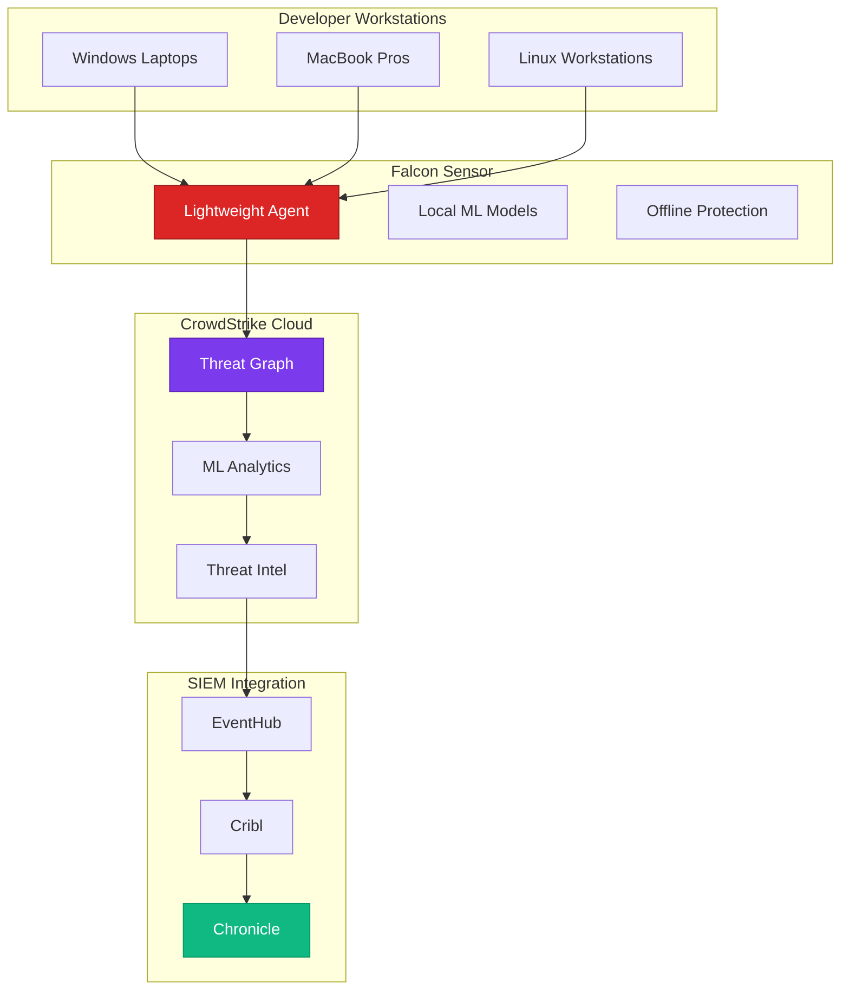

# CrowdStrike Falcon - Cloud-Native Endpoint Protection
{: .no_toc }

Comprehensive analysis of CrowdStrike Falcon EDR platform and its role in Cursor security.
{: .fs-6 .fw-300 }

## Table of contents
{: .no_toc .text-delta }

1. TOC
{:toc}

---

## Overview

**CrowdStrike Falcon** is a cloud-native endpoint detection and response (EDR) platform that provides comprehensive endpoint security for workstations, servers, and cloud workloads.

### Vendor Information

| | |
|---|---|
| **Company** | CrowdStrike Holdings, Inc. |
| **Founded** | 2011 |
| **Headquarters** | Austin, Texas |
| **Founders** | George Kurtz (CEO), Dmitri Alperovitch, Gregg Marston |
| **Website** | [https://www.crowdstrike.com](https://www.crowdstrike.com) |
| **Status** | Public (NASDAQ: CRWD) |
| **Notable** | Largest pure-play cybersecurity company |

---

## Core Capabilities

### 1. Endpoint Detection & Response (EDR)

**Real-Time Threat Detection**:
- Behavioral analysis of endpoint activity
- Machine learning-based threat detection
- Zero-day exploit protection
- Fileless malware detection

**For Cursor Development Workstations**:
```
CrowdStrike monitors:
├── Cursor IDE process behavior
├── File system access patterns
├── Network connections (Azure OpenAI API calls)
├── Process execution (npm, node, python)
├── Registry changes (Windows)
├── Kernel-level activity
└── Memory analysis
```

### 2. Next-Generation Antivirus (NGAV)

**Beyond Signature-Based Detection**:
- Machine learning models
- Behavioral indicators of attack (IOAs)
- Exploit blocking
- Malware prevention

**Protection for Developers**:
- Detects malicious extensions in Cursor
- Blocks malware in downloaded dependencies
- Prevents ransomware encryption
- Stops credential theft attempts

### 3. Threat Intelligence

**CrowdStrike Threat Graph**:
- 1 trillion+ events per day
- Global threat intelligence network
- Attribution to threat actors
- Real-time threat hunting

**Benefits for Cursor Environment**:
```
Example Alert:
  Detection: Suspicious PowerShell activity
  Process: powershell.exe -EncodedCommand <base64>
  Context: Known APT29 (Cozy Bear) technique
  Risk: HIGH - Potential data exfiltration attempt
  Action: Process killed, user notified, security team alerted
```

---

## Architecture & Integration

### Falcon Sensor (Lightweight Agent)

**Agent Characteristics**:
- Single lightweight agent (~50MB)
- < 1% CPU usage
- Cloud-managed (no on-prem infrastructure)
- Automatic updates
- Works offline with local prevention

**Deployment**:
```bash
# Windows (via GPO/Intune)
FalconSensor_Windows_v7.15.exe /install /quiet CID=<customer-id>

# macOS (via Jamf)
sudo installer -pkg FalconSensor-7.15.pkg -target /

# Linux
sudo dpkg -i falcon-sensor_7.15_amd64.deb
sudo /opt/CrowdStrike/falconctl -s --cid=<customer-id>
sudo systemctl start falcon-sensor
```

### Cloud Architecture



---

## Key Features for Cursor Security

### 1. Process Execution Monitoring

**What It Detects**:
- Suspicious child process spawning
- Unusual command-line arguments
- Malicious script execution
- Unauthorized elevation attempts

**Example: Protecting Against Malicious npm Package**:
```
Detection Timeline:
1. Developer runs: npm install malicious-package
2. Package postinstall script executes
3. Script attempts to:
   - Read SSH keys from ~/.ssh
   - Connect to external C2 server
   - Encrypt documents folder
4. CrowdStrike blocks all three actions
5. Alert sent to security team
6. Package quarantined
```

### 2. Network Connection Monitoring

**Capabilities**:
- Track all outbound connections
- Detect C2 (command & control) beacons
- Identify data exfiltration attempts
- Block malicious domains

**For Cursor API Calls**:
```
Allowed Connections:
✅ aoai-cursor-prod.openai.azure.com (Azure OpenAI)
✅ kv-cursor-secrets.vault.azure.net (Key Vault)
✅ github.com (source control)
✅ login.microsoftonline.com (authentication)

Blocked Connections:
❌ suspicious-domain.ru (Known malware C2)
❌ paste.ee/upload (Potential data exfiltration)
❌ cryptominer-pool.com (Cryptojacking)
```

### 3. USB Device Control

**Policy Enforcement**:
- Block unauthorized USB devices
- Allow only company-issued devices
- Monitor file transfers to USB
- Prevent USB-based malware

**Configuration Example**:
```yaml
# Falcon USB policy for Cursor developers
usb_policy:
  default_action: BLOCK
  allowed_devices:
    - vendor_id: "0x046D"  # Logitech (keyboards/mice)
    - vendor_id: "0x05AC"  # Apple (peripherals)
  blocked_device_classes:
    - storage  # Block USB drives
    - network  # Block USB network adapters
  exceptions:
    - user_group: "Security-Team"
      allow_storage: true
      require_encryption: true
```

### 4. Identity Protection

**Features**:
- Credential theft prevention
- Hash dumping detection
- Token theft protection
- Kerberos attack detection

**For Azure/Okta Credentials**:
```
Protected Credentials:
├── Azure CLI tokens (~/.azure)
├── Okta session tokens (browser)
├── SSH private keys (~/.ssh)
├── Git credentials
└── AWS credentials (if multi-cloud)

Detection:
- Mimikatz-like behavior blocked
- LSASS memory dump prevented
- Token replay attacks detected
```

---

## Integration with Cursor Workflow

### Pre-Deployment: Sensor Installation

**Onboarding Checklist**:
```bash
# 1. Install Falcon sensor on all developer workstations
# 2. Verify sensor is running
/Applications/Falcon.app/Contents/Resources/falconctl stats

# 3. Configure prevention policies
# 4. Set up integration with Okta for user context
# 5. Enable SIEM integration (EventHub → Cribl)
```

### During Development

**Continuous Monitoring**:
```
Developer Activity:
├── Opens Cursor IDE → Process monitored
├── Installs npm package → Dependencies scanned
├── Connects to Azure OpenAI → Connection logged
├── Commits to GitHub → Credential usage monitored
└── Downloads file → File analyzed for malware
```

**Example Detection**:
```
Alert: Potential Malicious Activity
User: john.developer@company.com
Workstation: LAPTOP-DEV-042
Process: node.exe
Command: node malicious-script.js
Behavior:
  - Attempted to read Azure CLI credentials
  - Made connection to unknown IP (185.x.x.x)
  - Attempted to encrypt files in Documents folder
Action Taken:
  - Process terminated
  - Network connection blocked
  - User notified
  - Security team alerted
  - Incident ticket created (INC-2024-1234)
```

### Incident Response

**CrowdStrike RTR (Real-Time Response)**:
```bash
# Security analyst can remotely investigate
# No VPN or direct access required

# 1. Connect to affected host
> connect LAPTOP-DEV-042

# 2. Run forensics commands
> ps  # List processes
> netstat  # Check connections
> get ~/.ssh/id_rsa  # Retrieve for analysis

# 3. Remediate
> kill <pid>  # Stop malicious process
> reg delete <registry-key>  # Remove persistence
> network block 185.x.x.x  # Block C2 server

# 4. Collect evidence
> memdump  # Memory capture for forensics
```

---

## Falcon Modules

### Core Modules (Included with Falcon Prevent)

| Module | Capability |
|--------|------------|
| **Falcon Prevent** | NGAV, exploit blocking, IOA prevention |
| **Falcon Insight** | EDR, threat hunting, investigation |
| **Falcon Device Control** | USB control, peripheral management |
| **Falcon Firewall Management** | Host firewall policy control |

### Add-On Modules

| Module | Purpose | Cursor Relevance |
|--------|---------|------------------|
| **Falcon Complete** | Managed detection & response | Optional: 24/7 SOC |
| **Falcon OverWatch** | Managed threat hunting | Optional: Proactive hunting |
| **Falcon X** | Sandbox analysis | Analyze suspicious files |
| **Falcon Discover** | IT hygiene, asset inventory | Track all Cursor installations |
| **Falcon Spotlight** | Vulnerability management | Find vulnerable dependencies |

### Recommended for Cursor

**Minimum**:
- Falcon Prevent (EDR core)
- Falcon Insight (investigations)
- Falcon Device Control (USB protection)

**Ideal**:
- Above + Falcon Spotlight (vulnerability scanning)
- Above + Falcon OverWatch (if highly sensitive environment)

---

## Pricing Model

### Per-Endpoint Licensing

**Typical Pricing** (as of 2024):
```
Tier 1: Falcon Pro ($8-12/endpoint/month)
  - NGAV + basic EDR

Tier 2: Falcon Enterprise ($12-18/endpoint/month)
  - Full EDR + USB control + firewall management
  
Tier 3: Falcon Elite ($18-25/endpoint/month)
  - Enterprise + threat intelligence + advanced features

Add-ons:
  - Falcon OverWatch: +$6-10/endpoint/month
  - Falcon Complete: +$12-20/endpoint/month
```

**Example Cost** (50 developers):
```
50 endpoints × $15/endpoint/month = $750/month
Annual: $9,000

Includes:
- Full EDR protection
- 24/7 threat detection
- Cloud-native architecture
- No infrastructure costs
- Automatic updates
```

### ROI Calculation

**Value Delivered**:
```
Prevented Incidents (Annual):
├── Ransomware attack prevented: $500K+ savings
├── Credential theft blocked: $100K+ savings
├── Data exfiltration stopped: $250K+ savings
└── Malicious insider detected: $150K+ savings

Total Value: $1M+
Cost: $9K
ROI: 111x
```

---

## Strengths & Weaknesses

### Strengths ✅

1. **Cloud-Native Architecture**
   - No on-prem infrastructure
   - Automatic updates
   - Global scale

2. **Lightweight Agent**
   - Minimal performance impact
   - Single agent for all OS
   - Works offline

3. **Threat Intelligence**
   - Industry-leading intel
   - Attribution to actors
   - Proactive threat hunting

4. **Ease of Deployment**
   - Deploy in hours
   - Central management
   - Works with existing tools

5. **Real-Time Response**
   - Remote investigation
   - Instant remediation
   - No VPN required

### Weaknesses ⚠️

1. **Cost for Large Deployments**
   - Can be expensive at scale
   - Per-endpoint pricing adds up

2. **Alert Tuning Required**
   - Initial high volume of alerts
   - Requires tuning for dev workflows

3. **False Positives**
   - Development tools (npm, python) can trigger alerts
   - Requires exclusion policies

4. **macOS Limitations**
   - Some features limited on macOS
   - Requires system extensions approval

---

## Best Practices for CrowdStrike with Cursor

### 1. Create Developer-Specific Policies

**Exclusions for Development Tools**:
```yaml
# Falcon policy: Developer Workstations
prevention_policy:
  name: "Cursor-Developer-Policy"
  exclusions:
    processes:
      - path: "/Applications/Cursor.app"
      - path: "*/node_modules/*"
      - path: "*/npm-cache/*"
    directories:
      - "~/workspace/*"  # Monitored but not blocked
      - "~/dev/*"
  monitoring:
    log_all: true  # Still log everything
    block_suspicious: true  # But don't block normal dev activity
```

### 2. Enable SIEM Integration

**Send Detections to Chronicle**:
```bash
# Configure CrowdStrike Event Stream API
curl -X POST "https://api.crowdstrike.com/sensors/entities/datafeed/v2" \
  -H "Authorization: Bearer $FALCON_API_TOKEN" \
  -d '{
    "appId": "cribl-integration",
    "eventType": "DetectionSummaryEvent",
    "endpoint": "https://eventhub.azure.com/falcon-detections"
  }'

# Cribl routes to Chronicle for correlation
```

### 3. Configure USB Control

**Balance Security & Usability**:
```
Allow: Company-issued USB-C hubs, keyboards, mice
Block: USB storage devices
Require: Manager approval for exceptions
Audit: All USB device connections logged
```

### 4. Set Up Response Playbooks

**Automated Response**:
```python
# Example: Auto-response to credential theft attempt

def handle_credential_theft_alert(alert):
    user_id = alert['user_id']
    hostname = alert['hostname']
    
    # 1. Isolate host from network (via Falcon API)
    falcon.isolate_host(hostname)
    
    # 2. Force Azure/Okta session logout
    okta.revoke_user_sessions(user_id)
    azure.revoke_refresh_tokens(user_id)
    
    # 3. Notify security team
    teams.send_alert(channel='security-incidents', alert=alert)
    
    # 4. Create incident ticket
    jira.create_incident(alert)
    
    # 5. Require password reset
    okta.require_password_reset(user_id)
```

---

## Integration with Other Tools

### CrowdStrike + Wiz

**Complementary Coverage**:
- **CrowdStrike**: Endpoint/workstation security
- **Wiz**: Cloud infrastructure security

**Shared Intelligence**:
```
Threat Scenario:
1. Wiz detects misconfigured Azure OpenAI (public access)
2. Attacker exploits misconfiguration
3. CrowdStrike detects unusual API activity from developer workstation
4. Correlation in Chronicle: Same attack campaign
5. Unified response: Fix cloud config + isolate endpoint
```

### CrowdStrike + Okta

**Identity Context**:
```
CrowdStrike sends to SIEM:
├── Hostname: LAPTOP-DEV-042
├── Local User: john.developer
├── Process: suspicious-script.exe
└── Okta enrichment:
    ├── Email: john.developer@company.com
    ├── Manager: jane.manager@company.com
    ├── Department: Engineering
    ├── Last Login: 2 hours ago
    └── Risk Score: 85/100 (recent password change)
```

---

## Why Not Palo Alto Cortex XDR?

As mentioned in the [overview](index.md#palo-alto-cortex-xdr---not-deployed), the customer chose CrowdStrike over Cortex XDR:

**CrowdStrike Advantages**:
1. **Better endpoint protection**: More mature EDR platform
2. **Lighter agent**: Lower performance impact
3. **Cloud-native**: No on-prem infrastructure
4. **Threat intelligence**: Industry-leading intel from CrowdStrike team
5. **Established deployment**: Already in use, proven at scale

**Cortex XDR Would Add**:
- ❌ Duplicate endpoint protection (overlaps CrowdStrike)
- ❌ Additional agent overhead
- ❌ Migration cost and risk
- ❌ Team retraining required

---

## Resources & Links

### Official Resources

- **Website**: [https://www.crowdstrike.com](https://www.crowdstrike.com)
- **Documentation**: [https://falcon.crowdstrike.com/documentation](https://falcon.crowdstrike.com/documentation)
- **Blog**: [https://www.crowdstrike.com/blog](https://www.crowdstrike.com/blog)
- **Trust Portal**: [https://www.crowdstrike.com/trust](https://www.crowdstrike.com/trust)

### Learning Resources

- **CrowdStrike University**: Free training and certifications
- **Adversary Wisdom**: Threat intelligence reports
- **Falcon Friday**: Weekly technical blogs
- **Global Threat Report**: Annual threat landscape report

### API & Integration

- **API Documentation**: [https://falcon.crowdstrike.com/documentation/apis](https://falcon.crowdstrike.com/documentation/apis)
- **GitHub**: [https://github.com/CrowdStrike](https://github.com/CrowdStrike)
- **Event Streams API**: Real-time detection streaming
- **Falcon Toolkit**: PowerShell module for automation

---

## Conclusion

**For Cursor Security Architecture**:

CrowdStrike Falcon provides **comprehensive endpoint protection** for developer workstations running Cursor IDE. Its cloud-native architecture, lightweight agent, and industry-leading threat intelligence make it an essential component of the security stack.

**Key Value Props for Cursor**:
1. ✅ Protects developer workstations from malware
2. ✅ Detects credential theft attempts
3. ✅ Monitors Cursor IDE for suspicious behavior
4. ✅ Blocks malicious dependencies and extensions
5. ✅ Enables rapid incident response

**Recommendation**: **Essential tool** for protecting Cursor development environments.

---

**Last Updated**: October 10, 2025  
**Review Status**: <span class="badge badge-security">Production Validated</span>

