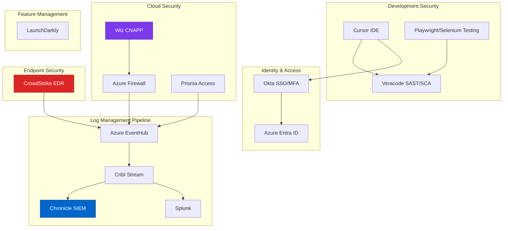
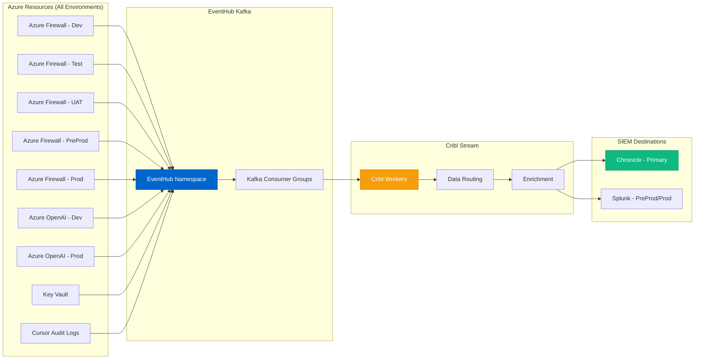

# Enterprise Security Tools Stack
{: .no_toc }

Analysis of security tools discovered and assessed in enterprise Azure environments.
{: .fs-6 .fw-300 }

{: .note }
This section documents the security tooling ecosystem assessed during real-world SecAI Framework execution with a confidential insurance services customer.

## Table of contents
{: .no_toc .text-delta }

1. TOC
{:toc}

---

## Overview

Modern enterprise security requires a defense-in-depth approach with multiple specialized tools. During our Azure security assessment, we discovered and analyzed a comprehensive security stack deployed across 34+ subscriptions.

**SecAI Framework assesses these tools as part of Dimension 1 (Configuration Assessment):**
- How are they configured?
- Are they deployed consistently across environments?
- What is the logging and monitoring coverage?
- How do they integrate with Azure-native controls?

This section provides detailed analysis of each tool category and specific vendors.

### Security Stack Architecture



---

## Tool Categories

### 1. Cloud Security Posture Management (CSPM)
- **[Wiz](wiz.md)** - Agentless cloud security platform

### 2. Application Security Testing
- **[Veracode](veracode.md)** - SAST, DAST, and SCA platform

### 3. Identity & Access Management
- **[Okta](okta.md)** - Enterprise identity and SSO platform

### 4. Network Security
- **[Prisma Access](prisma-access.md)** - Palo Alto Networks SASE platform
- **[Azure Firewall](azure-firewall.md)** - Cloud-native firewall service

### 5. Endpoint Detection & Response
- **[CrowdStrike](crowdstrike.md)** - Cloud-native endpoint protection

### 6. Testing & Quality Assurance
- **[Playwright](playwright.md)** - Modern end-to-end testing framework
- **[Selenium](selenium.md)** - Browser automation and testing

### 7. Feature Management
- **[LaunchDarkly](launchdarkly.md)** - Feature flag and experimentation platform

### 8. Log Management & SIEM
- **[Cribl](cribl.md)** - Observability pipeline platform
- **[Chronicle](chronicle.md)** - Google Cloud security analytics
- **[Splunk](splunk.md)** - Data analytics and SIEM platform

---

## Multi-Environment Architecture

### Environment Structure

The customer operates with environment isolation:

| Environment | Purpose | Log Destination | Monitoring Level |
|-------------|---------|-----------------|------------------|
| **Development (dev)** | Feature development | Chronicle (Cribl) | Standard |
| **Test** | Integration testing | Chronicle (Cribl) | Standard |
| **UAT** | User acceptance testing | Chronicle (Cribl) | Enhanced |
| **Pre-Production (preprod)** | Production validation | Chronicle + Splunk | Enhanced |
| **Production (prod)** | Live customer workloads | Chronicle + Splunk | Maximum |

### Log Pipeline Architecture



### Why Cribl in the Pipeline?

**Cribl Stream Benefits**:
1. **Data Reduction**: Filter and sample logs to reduce SIEM costs
2. **Routing**: Send different data to different destinations
3. **Enrichment**: Add context to logs before SIEM ingestion
4. **Transformation**: Normalize data from multiple sources
5. **Cost Optimization**: Significant reduction in SIEM licensing costs

**Example Configuration**:
```yaml
# Cribl Stream routing configuration
routes:
  - name: production-critical
    filter: env == "prod" && severity >= "high"
    destination: [chronicle, splunk]
    
  - name: production-standard
    filter: env == "prod" && severity < "high"
    destination: [chronicle]
    sample_rate: 0.1  # 10% sampling
    
  - name: preprod
    filter: env == "preprod"
    destination: [chronicle, splunk]
    sample_rate: 0.5  # 50% sampling
    
  - name: lower-environments
    filter: env in ["dev", "test", "uat"]
    destination: [chronicle]
    sample_rate: 0.05  # 5% sampling
```

---

## Palo Alto Cortex XDR - Not Deployed

### Why Cortex XDR Was Not Selected

**Decision Rationale**:
The customer chose **not** to deploy Palo Alto Cortex XDR despite using Prisma Access. Key reasons:

1. **Feature Overlap with CrowdStrike**
   - CrowdStrike Falcon already provides comprehensive EDR
   - Cortex XDR's endpoint capabilities duplicate CrowdStrike
   - No benefit to running two EDR agents

2. **Feature Overlap with Wiz**
   - Wiz provides cloud security posture management
   - Cortex XDR's cloud security features overlap
   - Wiz's agentless approach preferred for cloud

3. **SIEM Strategy**
   - Chronicle + Splunk already established
   - Cortex XDR's SIEM-like features not needed
   - Existing SIEM investment too large to migrate

4. **Cost Considerations**
   - Additional licensing cost not justified
   - ROI analysis favored existing tools
   - Consolidation preferred over expansion

5. **Operational Complexity**
   - Already managing multiple security tools
   - Adding Cortex XDR increases operational burden
   - Team expertise in existing tools

**Capabilities Comparison**:

| Capability | Cortex XDR | Current Solution | Winner |
|------------|------------|------------------|--------|
| Endpoint Detection | ✅ | CrowdStrike ✅ | CrowdStrike (established) |
| Cloud Security | ✅ | Wiz ✅ | Wiz (agentless) |
| Network Visibility | ✅ | Prisma Access + Azure Firewall ✅ | Existing (integrated) |
| SIEM/Analytics | ✅ | Chronicle + Splunk ✅ | Existing (established) |
| Threat Intelligence | ✅ | CrowdStrike + Chronicle ✅ | Existing (adequate) |

{: .note }
This decision may be revisited if the customer's security requirements change or if significant feature gaps are identified in the current stack.

---

## Tool Integration Architecture

### Identity Integration

All tools integrate with **Okta** for SSO:

```
Developer Login → Okta → SAML/OIDC → Tools
  ├── Cursor Enterprise (OIDC)
  ├── Wiz (SAML)
  ├── Veracode (SAML)
  ├── LaunchDarkly (SAML)
  ├── CrowdStrike Falcon (SAML)
  └── Azure Portal (Entra ID federation)
```

### Data Flow Integration

**Security Event Flow**:
```
1. Event occurs (e.g., Cursor API call to Azure OpenAI)
2. Azure Firewall logs to EventHub
3. EventHub Kafka group consumed by Cribl
4. Cribl enriches with:
   - Okta user identity
   - Wiz cloud context
   - CrowdStrike endpoint data
5. Routed to Chronicle/Splunk
6. Security analyst investigates in SIEM
```

---

## Tool Selection Criteria

### Evaluation Framework

When evaluating security tools for Cursor deployments:

| Criterion | Weight | Considerations |
|-----------|--------|---------------|
| **Security Efficacy** | 30% | Detection capabilities, false positive rate |
| **Integration** | 20% | API quality, SIEM integration, Okta support |
| **Cost** | 20% | Licensing model, ROI, total cost of ownership |
| **Operational Impact** | 15% | Agent overhead, maintenance burden |
| **Vendor Viability** | 10% | Financial stability, roadmap, support |
| **Compliance** | 5% | SOC 2, ISO certifications, audit support |

### Best-of-Breed vs. Platform Approach

**Customer's Approach**: Best-of-breed

**Rationale**:
- Choose best tool for each category
- Avoid vendor lock-in
- Flexibility to replace underperforming tools
- Integrate via standards (SAML, SIEM, APIs)

**Trade-offs**:
- ✅ Best capabilities in each category
- ✅ Negotiating leverage with vendors
- ❌ Higher integration complexity
- ❌ More tools to manage

---

## Cost Optimization Strategies

### SIEM Cost Reduction

**Problem**: Traditional SIEM pricing based on data volume

**Solution**: Cribl Stream for intelligent data routing

**Savings Example**:
```
Before Cribl:
  - 10 TB/day ingested to Splunk
  - $X per GB = $Y/month

After Cribl:
  - 2 TB/day to Splunk (critical data only)
  - 8 TB/day to Chronicle (lower cost)
  - 50% overall cost reduction
```

### Tool Consolidation

**Avoided Costs**:
- Not deploying Cortex XDR saved ~$250K/year
- CrowdStrike covers endpoint needs
- Wiz covers cloud security needs

---

## Vendor Quick Reference

| Vendor | Category | Website | Founded | HQ |
|--------|----------|---------|---------|-----|
| Wiz | Cloud Security | [wiz.io](https://www.wiz.io) | 2020 | New York, NY |
| Veracode | AppSec | [veracode.com](https://www.veracode.com) | 2006 | Burlington, MA |
| Okta | Identity | [okta.com](https://www.okta.com) | 2009 | San Francisco, CA |
| Palo Alto Networks | Network Security | [paloaltonetworks.com](https://www.paloaltonetworks.com) | 2005 | Santa Clara, CA |
| CrowdStrike | Endpoint Security | [crowdstrike.com](https://www.crowdstrike.com) | 2011 | Austin, TX |
| Playwright | Testing | [playwright.dev](https://playwright.dev) | 2020 | Microsoft |
| Selenium | Testing | [selenium.dev](https://www.selenium.dev) | 2004 | Open Source |
| LaunchDarkly | Feature Flags | [launchdarkly.com](https://launchdarkly.com) | 2014 | Oakland, CA |
| Cribl | Observability | [cribl.io](https://cribl.io) | 2017 | San Francisco, CA |
| Chronicle | SIEM | [chronicle.security](https://chronicle.security) | 2018 | Google Cloud |
| Splunk | SIEM/Analytics | [splunk.com](https://www.splunk.com) | 2003 | San Francisco, CA |

---

## Deep Dive Pages

Explore detailed analysis of each tool:

### Cloud Security
- **[Wiz - Cloud Security Platform](wiz.md)** - Agentless cloud security, container security, CSPM

### Application Security
- **[Veracode - Application Security](veracode.md)** - SAST, DAST, SCA, and container scanning

### Identity & Access
- **[Okta - Identity Platform](okta.md)** - SSO, MFA, lifecycle management, adaptive authentication

### Network Security
- **[Prisma Access - SASE Platform](prisma-access.md)** - Secure access service edge, zero trust
- **[Azure Firewall - Cloud Firewall](azure-firewall.md)** - Managed firewall as a service

### Endpoint Security
- **[CrowdStrike - Endpoint Protection](crowdstrike.md)** - EDR, threat intelligence, incident response

### Testing Frameworks
- **[Playwright - Modern Testing](playwright.md)** - Cross-browser testing, auto-wait, mobile emulation
- **[Selenium - Browser Automation](selenium.md)** - Industry standard web testing

### Feature Management
- **[LaunchDarkly - Feature Flags](launchdarkly.md)** - Progressive delivery, experimentation, targeting

### Observability & SIEM
- **[Cribl - Observability Pipeline](cribl.md)** - Data routing, enrichment, cost optimization
- **[Chronicle - Security Analytics](chronicle.md)** - Google-scale SIEM, threat intelligence
- **[Splunk - Data Platform](splunk.md)** - SIEM, log management, analytics

---

## Integration Patterns

### Common Integration Architecture

Most tools follow similar integration patterns:

**Authentication**: Okta SAML/OIDC → Tool
**Logging**: Tool → EventHub → Cribl → SIEM
**Alerting**: Tool → Webhook → Teams/PagerDuty
**API Access**: Service Principal → Azure AD → Tool API

### Security Tool API Integration

Example: Querying security posture from multiple tools

```python
# Python example: Unified security dashboard
import requests
from okta_auth import get_token

# Get Wiz cloud security findings
wiz_token = get_token('wiz')
wiz_findings = requests.get(
    'https://api.wiz.io/findings',
    headers={'Authorization': f'Bearer {wiz_token}'},
    params={'severity': 'high', 'status': 'open'}
).json()

# Get CrowdStrike endpoint detections
cs_token = get_token('crowdstrike')
cs_detections = requests.get(
    'https://api.crowdstrike.com/detects/queries/detects/v1',
    headers={'Authorization': f'Bearer {cs_token}'},
    params={'filter': 'status:"new"+severity:["high","critical"]'}
).json()

# Get Veracode application vulnerabilities
vc_token = get_token('veracode')
vc_vulns = requests.get(
    'https://api.veracode.com/appsec/v2/applications',
    headers={'Authorization': f'Bearer {vc_token}'}
).json()

# Unified dashboard
print(f"Open High-Severity Issues:")
print(f"  Cloud (Wiz): {len(wiz_findings)}")
print(f"  Endpoints (CrowdStrike): {len(cs_detections)}")
print(f"  Applications (Veracode): {len(vc_vulns)}")
```

---

## Next Steps

Explore detailed vendor analysis:

1. **Start with CSPM**: [Wiz Overview](wiz.md) - Understand cloud security posture
2. **Review Identity**: [Okta Overview](okta.md) - Foundation of zero-trust
3. **Understand Logging**: [Cribl Overview](cribl.md) - How logs flow to SIEM
4. **Explore Full Stack**: Review all vendor pages for comprehensive understanding

---

**Last Updated**: October 10, 2025  
**Status**: <span class="badge badge-research">Production Validated</span>

