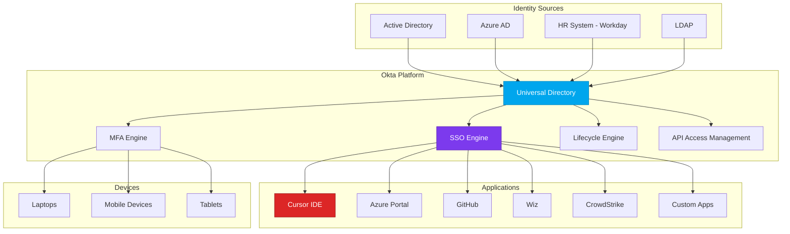

# Okta - Enterprise Identity and Access Management
{: .no_toc }

Comprehensive analysis of Okta identity platform and its role as the authentication foundation for Cursor deployments.
{: .fs-6 .fw-300 }

## Table of contents
{: .no_toc .text-delta }

1. TOC
{:toc}

---

## Overview

**Okta** is a cloud-native identity and access management (IAM) platform that provides single sign-on (SSO), multi-factor authentication (MFA), lifecycle management, and API access management for enterprises.

### Vendor Information

| | |
|---|---|
| **Company** | Okta, Inc. |
| **Founded** | 2009 |
| **Headquarters** | San Francisco, CA |
| **Founders** | Todd McKinnon (CEO), Frederic Kerrest |
| **Website** | [https://www.okta.com](https://www.okta.com) |
| **Status** | Public (NASDAQ: OKTA) |
| **Notable** | Leader in Gartner Magic Quadrant for Access Management |

---

## Core Capabilities

### 1. Single Sign-On (SSO)

**Universal SSO Platform**:
- 7,000+ pre-built integrations
- SAML 2.0, OpenID Connect, WS-Federation support
- Custom app integrations via APIs
- Seamless user experience across all applications

**For Cursor Environment**:
```
Okta SSO Integration:
├── Cursor IDE (OIDC)
├── Azure Portal (SAML federation with Entra ID)
├── Wiz (SAML)
├── CrowdStrike Falcon (SAML)
├── Veracode (SAML)
├── LaunchDarkly (SAML)
├── GitHub (SAML)
└── AWS Console (SAML)

Result:
✅ One password for all applications
✅ Centralized access management
✅ Reduced password reset tickets
✅ Improved security (no password reuse)
```

### 2. Multi-Factor Authentication (MFA)

**Adaptive MFA**:
- Multiple factors: Push notifications, SMS, voice, email, hardware tokens, biometrics
- Risk-based authentication
- Passwordless authentication options
- Integration with device trust

**MFA Factors Available**:
```
Strong Factors:
├── Okta Verify (push notifications)
├── WebAuthn (hardware keys like YubiKey)
├── FIDO2 tokens
├── Biometrics (TouchID, FaceID)
└── Okta FastPass (passwordless)

Medium Factors:
├── SMS
├── Voice call
└── Email

Weak Factors:
├── Security questions (not recommended)
└── TOTP apps (Google Authenticator, Authy)
```

**For Developers**:
```yaml
# Okta MFA policy for Cursor users
policy:
  name: "Cursor-Developer-MFA"
  conditions:
    - resource: "Cursor IDE"
    - user_group: "Engineering"
  requirements:
    - any_2_factors: true
    - allowed_factors:
        - "okta_verify_push"
        - "webauthn"
        - "fido2"
    - deny_factors:
        - "sms"  # Not secure enough for dev access
        - "security_questions"
  adaptive:
    - condition: "new_device"
      action: "require_2fa"
    - condition: "new_location"
      action: "require_2fa"
    - condition: "risky_ip"
      action: "deny"
```

### 3. Lifecycle Management

**Automated User Provisioning**:
- SCIM-based provisioning to applications
- Integration with HR systems (Workday, BambooHR)
- Automated onboarding/offboarding
- Group-based access control

**Developer Onboarding Flow**:
```
Day 1:
├── HR system creates user (Workday)
│   ↓
├── Okta receives user via API/SCIM
│   ↓
├── Okta creates user account
│   ↓
├── Okta assigns to "Engineering" group
│   ↓
├── Okta auto-provisions to applications:
│   ├── Azure AD (SCIM)
│   ├── GitHub (SCIM)
│   ├── Cursor Enterprise (OIDC)
│   ├── Wiz (SAML)
│   └── Slack (SCIM)
│   ↓
├── Okta sends welcome email
│   ↓
└── User sets up MFA

Result: Fully provisioned in 15 minutes vs. 3 days manually
```

**Offboarding Flow**:
```
Employee Termination:
├── HR marks terminated in Workday
│   ↓
├── Okta receives termination event
│   ↓
├── Okta immediately:
│   ├── Suspends user account
│   ├── Revokes all active sessions
│   ├── De-provisions from all apps
│   └── Notifies security team
│   ↓
└── User locked out within 5 minutes

Security Benefit: No orphaned accounts
```

### 4. Adaptive Authentication

**Risk-Based Access Control**:
- Device posture analysis
- Network context (IP reputation)
- User behavior analytics
- Anomaly detection

**Example Policy**:
```javascript
// Okta Adaptive MFA policy
if (user.location.country != "United States") {
  require("step_up_mfa");
}

if (device.trusted == false) {
  require("step_up_mfa");
}

if (user.risk_score > 80) {
  deny_access();
  alert_security_team();
}

if (application == "Azure Portal" && user.group == "Admin") {
  require("webauthn");  // Hardware key required for admins
}

if (time.is_business_hours() == false && application.sensitivity == "high") {
  require("manager_approval");
}
```

---

## Architecture & Integration

### Okta as Identity Hub



### Okta Universal Directory

**Centralized User Store**:
- Master user database
- Custom attributes per application
- Group management
- Profile mastering (choose authoritative source)

**Example User Profile**:
```json
{
  "id": "00u1a2b3c4d5e6f7g8h9",
  "status": "ACTIVE",
  "profile": {
    "firstName": "John",
    "lastName": "Developer",
    "email": "john.developer@company.com",
    "login": "john.developer@company.com",
    "mobilePhone": "+1-555-123-4567",
    "department": "Engineering",
    "manager": "jane.manager@company.com",
    "employeeNumber": "EMP-12345",
    "costCenter": "ENG-001",
    "customAttributes": {
      "cursorLicenseType": "Enterprise",
      "azureSubscriptionId": "xxxx-xxxx-xxxx",
      "githubUsername": "jdeveloper",
      "securityClearance": "Confidential"
    }
  },
  "credentials": {
    "password": {},
    "provider": {
      "type": "OKTA",
      "name": "OKTA"
    }
  },
  "groups": [
    "Engineering",
    "Cursor-Users",
    "Azure-Contributors",
    "GitHub-Developers"
  ]
}
```

---

## Key Features for Cursor Security

### 1. Cursor IDE Integration

**OIDC Configuration**:
```yaml
# Cursor IDE SSO Configuration
okta_integration:
  client_id: "0oa1b2c3d4e5f6g7h8i9"
  client_secret: "${OKTA_CLIENT_SECRET}"
  issuer: "https://company.okta.com/oauth2/default"
  scopes:
    - "openid"
    - "profile"
    - "email"
    - "groups"
  redirect_uri: "https://cursor.com/auth/callback"
  
  # Token settings
  access_token_lifetime: 3600  # 1 hour
  refresh_token_lifetime: 86400  # 24 hours
  
  # Claims mapping
  claims:
    - name: "email"
      value: "user.email"
    - name: "groups"
      value: "user.groups"
    - name: "department"
      value: "user.department"
```

**Login Flow**:
```
1. User opens Cursor IDE
   ↓
2. Cursor redirects to Okta (OIDC)
   ↓
3. User enters credentials
   ↓
4. Okta evaluates adaptive auth policy
   ↓
5. If risky: Require MFA
   ↓
6. Okta validates MFA
   ↓
7. Okta issues ID token + access token
   ↓
8. Cursor validates token
   ↓
9. User authenticated in Cursor
   ↓
10. Cursor requests Azure OpenAI API key (using Okta token)
```

### 2. Conditional Access Policies

**Example Policies**:

**Policy 1: Block risky sign-ins**
```yaml
policy_name: "Block-Risky-Signin"
conditions:
  - user_risk_level: "high"
  - or:
      - ip_reputation: "malicious"
      - impossible_travel: true
      - anonymous_proxy: true
action: "deny"
notification: "security-team@company.com"
```

**Policy 2: Require hardware key for admin access**
```yaml
policy_name: "Admin-Hardware-Key-Required"
conditions:
  - user_group: "Admins"
  - application_name: ["Azure Portal", "Cursor Enterprise Admin", "AWS Console"]
action: "require_factor"
required_factor: "webauthn"
fallback_denied: true
```

**Policy 3: Step-up authentication for sensitive actions**
```yaml
policy_name: "Step-Up-For-Secrets"
conditions:
  - application: "Azure Key Vault"
  - or:
      - action: "read_secret"
      - action: "write_secret"
action: "require_reauthentication"
max_session_age: 900  # 15 minutes
```

### 3. Session Management

**Session Policies**:
```yaml
# Cursor Developer Session Policy
session_policy:
  max_session_lifetime: 43200  # 12 hours
  max_idle_time: 3600  # 1 hour
  
  # Prompt for MFA again after
  mfa_lifetime: 28800  # 8 hours
  
  # Require re-auth for sensitive apps
  sensitive_apps:
    - "Azure Key Vault": 900  # 15 min
    - "AWS Console": 3600  # 1 hour
    - "Production Database": 1800  # 30 min
```

**Session Hijacking Prevention**:
- Device fingerprinting
- IP address consistency checking
- User-agent validation
- Token binding

---

## Integration with Other Tools

### Okta + Azure Entra ID (Azure AD)

**Federation Setup**:
```
Okta ←→ Azure AD (SAML Federation)

Flow:
1. User authenticates to Okta
2. Okta acts as IdP for Azure AD
3. User gets Azure AD token
4. User accesses Azure resources with SSO

Benefits:
✅ Single password (Okta)
✅ Okta MFA for Azure resources
✅ Centralized lifecycle management
✅ Okta Adaptive Auth for Azure
```

**Configuration**:
```bash
# Azure AD Enterprise Application for Okta
az ad sp create --id 0000002-0000-0000-c000-000000000000

# Configure SAML
# Identifier (Entity ID): https://company.okta.com
# Reply URL: https://login.microsoftonline.com/login/slo
# Sign on URL: https://login.microsoftonline.com/{tenant-id}/saml2
```

### Okta + CrowdStrike

**User Context Enrichment**:
```python
# CrowdStrike gets user context from Okta

# When CrowdStrike detects suspicious activity:
crowdstrike_alert = {
    "hostname": "LAPTOP-DEV-042",
    "local_user": "john.developer",
    "process": "suspicious.exe"
}

# Enrich with Okta data
okta_user = okta.get_user_by_email("john.developer@company.com")

enriched_alert = {
    **crowdstrike_alert,
    "user_full_name": okta_user.full_name,
    "department": okta_user.department,
    "manager": okta_user.manager,
    "risk_score": okta_user.risk_score,
    "last_login": okta_user.last_login,
    "account_status": okta_user.status
}

# Now security team has full context
```

### Okta + Wiz

**Identity Correlation**:
```
Wiz Cloud Asset + Okta User = Complete Picture

Example:
Wiz finds: "Azure VM with public IP has critical vulnerability"
Wiz identifies: "VM owned by john.developer@company.com"
Okta provides:
  - Full name: John Developer
  - Manager: Jane Manager
  - Department: Engineering
  - Last login: 2 hours ago
  - Risk score: 35/100 (low risk)
  
Automated remediation:
1. Create ticket assigned to John Developer
2. CC manager (Jane Manager)
3. Set priority based on Okta risk score
4. If user inactive >30 days: Auto-remediate
```

---

## Pricing Model

### Licensing Tiers

**Workforce Identity Cloud**:
```
Okta Workforce Identity:
├── Free: Up to 15 monthly active users
│   └── Limited features
│
├── Single Sign-On: $2-5/user/month
│   ├── Unlimited apps
│   ├── SAML, OIDC, WS-Fed
│   └── Basic reporting
│
├── Multi-Factor Authentication: +$3-6/user/month
│   ├── All MFA factors
│   ├── Adaptive MFA
│   └── Device Trust
│
├── Lifecycle Management: +$4-8/user/month
│   ├── SCIM provisioning
│   ├── HR integrations
│   └── Workflows automation
│
├── Universal Directory: +$2-4/user/month
│   ├── Custom attributes
│   ├── Profile mastering
│   └── Advanced groups
│
└── Advanced Server Access: +$15-25/user/month
    ├── SSH/RDP gateway
    ├── Just-in-time access
    └── Session recording
```

**Example Cost** (50 developers, full stack):
```
Base: SSO + MFA + Lifecycle + UD
50 users × $15/user/month = $750/month
Annual: $9,000

ROI:
├── Reduced help desk tickets: $30K/year saved
├── Faster onboarding: $20K/year saved
├── Improved security: Priceless
└── Net Benefit: ~$40K/year saved
```

---

## Strengths & Weaknesses

### Strengths ✅

1. **Ease of Use**: Intuitive interface for admins and users
2. **Integration Breadth**: 7,000+ pre-built app integrations
3. **Reliability**: 99.99% uptime SLA
4. **Security**: Industry-leading adaptive authentication
5. **API-First**: Comprehensive REST APIs for automation
6. **Compliance**: SOC 2, ISO 27001, HIPAA, FedRAMP

### Weaknesses ⚠️

1. **Cost**: Can get expensive at scale
2. **Complexity**: Advanced features have learning curve
3. **On-Prem Integration**: Works best with cloud apps
4. **Reporting**: Could be more comprehensive
5. **Customer Support**: Variable quality

---

## Best Practices for Okta with Cursor

### 1. Group-Based Access Control

```yaml
# Organize users into logical groups
groups:
  - name: "Cursor-Users-Free"
    description: "Developers with free Cursor"
    applications:
      - "Cursor Free"
      - "GitHub"
      
  - name: "Cursor-Users-Enterprise"
    description: "Developers with Cursor Enterprise"
    applications:
      - "Cursor Enterprise"
      - "Azure Portal"
      - "GitHub"
      - "Wiz"
    policies:
      - "MFA-Required"
      - "Device-Trust-Required"
      
  - name: "Cursor-Admins"
    description: "Cursor administrators"
    applications:
      - "Cursor Admin Console"
      - "Okta Admin"
    policies:
      - "Hardware-Key-Required"
      - "IP-Restriction"
```

### 2. Implement Least Privilege

```python
# Grant only necessary access
def assign_user_apps(user):
    # Base apps for everyone
    apps = ["Email", "Slack", "Internal Wiki"]
    
    # Add apps based on department
    if user.department == "Engineering":
        apps += ["Cursor IDE", "GitHub", "Azure Portal"]
        
    if user.title.contains("Senior"):
        apps += ["Wiz", "CrowdStrike Admin"]
        
    # Add apps based on explicit approval only
    if user.has_approval_for("Production Database"):
        apps += ["Prod DB Console"]
        
    return apps
```

### 3. Monitor and Alert

```yaml
# Okta System Log API for security monitoring
alerts:
  - event: "user.session.start"
    condition: "location.country != 'US'"
    action: "alert_security_team"
    
  - event: "user.authentication.failed"
    condition: "count > 5 in 10 minutes"
    action: "suspend_user"
    
  - event: "user.account.privilege.grant"
    condition: "any"
    action: "alert_security_team"
```

### 4. Regular Access Reviews

```bash
# Quarterly access review script
#!/bin/bash

# Export all user-app assignments
okta users list-app-links --all > user_apps.json

# Identify inactive users
okta users list --filter 'status eq "ACTIVE" and lastLogin lt "2024-07-01"' > inactive_users.json

# Send to managers for review
python send_access_review.py \
  --users user_apps.json \
  --inactive inactive_users.json \
  --recipients managers@company.com
```

---

## Okta + Cursor Integration Example

### Complete Setup

**Step 1: Create Okta App**
```bash
# Via Okta Admin Console
1. Applications → Create App Integration
2. Sign-in method: OIDC - OpenID Connect
3. Application type: Web Application
4. App name: "Cursor IDE Enterprise"
5. Grant type: Authorization Code, Refresh Token
6. Sign-in redirect URIs: https://cursor.com/auth/callback
7. Sign-out redirect URIs: https://cursor.com/auth/logout
8. Assignments: Group - "Cursor-Users-Enterprise"
```

**Step 2: Configure Cursor**
```json
// Cursor Enterprise Admin Console
{
  "sso": {
    "enabled": true,
    "provider": "okta",
    "config": {
      "issuer": "https://company.okta.com/oauth2/default",
      "clientId": "0oa1b2c3d4e5f6g7h8i9",
      "clientSecret": "${OKTA_CLIENT_SECRET}",
      "scopes": ["openid", "profile", "email", "groups"]
    }
  },
  "mfa": {
    "enforced": true,
    "providers": ["okta_verify"]
  }
}
```

**Step 3: Test**
```bash
# Test SSO flow
curl -X GET "https://cursor.com/auth/login" \
  -H "Accept: application/json"

# Should redirect to:
# https://company.okta.com/oauth2/v1/authorize?client_id=...
```

---

## Resources & Links

- **Website**: [https://www.okta.com](https://www.okta.com)
- **Documentation**: [https://developer.okta.com](https://developer.okta.com)
- **Admin Console**: [https://company-admin.okta.com](https://company-admin.okta.com)
- **System Status**: [https://status.okta.com](https://status.okta.com)
- **Trust Portal**: [https://trust.okta.com](https://trust.okta.com)

### Learning Resources

- **Okta University**: Free training and certifications
- **Developer Blog**: [https://developer.okta.com/blog](https://developer.okta.com/blog)
- **Community**: [https://support.okta.com/help/s/community](https://support.okta.com/help/s/community)
- **GitHub**: [https://github.com/okta](https://github.com/okta)

---

## Conclusion

**For Cursor Security Architecture**:

Okta provides the **identity foundation** for the entire security stack. As the central authentication and authorization platform, it enables SSO, MFA, and lifecycle management across all tools including Cursor, Azure, Wiz, CrowdStrike, and more.

**Key Value Props for Cursor**:
1. ✅ Single sign-on across all development tools
2. ✅ Strong MFA with adaptive authentication
3. ✅ Automated user provisioning and deprovisioning
4. ✅ Centralized access management
5. ✅ Rich integration ecosystem

**Recommendation**: **Essential foundational tool** for any enterprise Cursor deployment.

---

**Last Updated**: October 10, 2025  
**Review Status**: <span class="badge badge-security">Production Validated</span>

