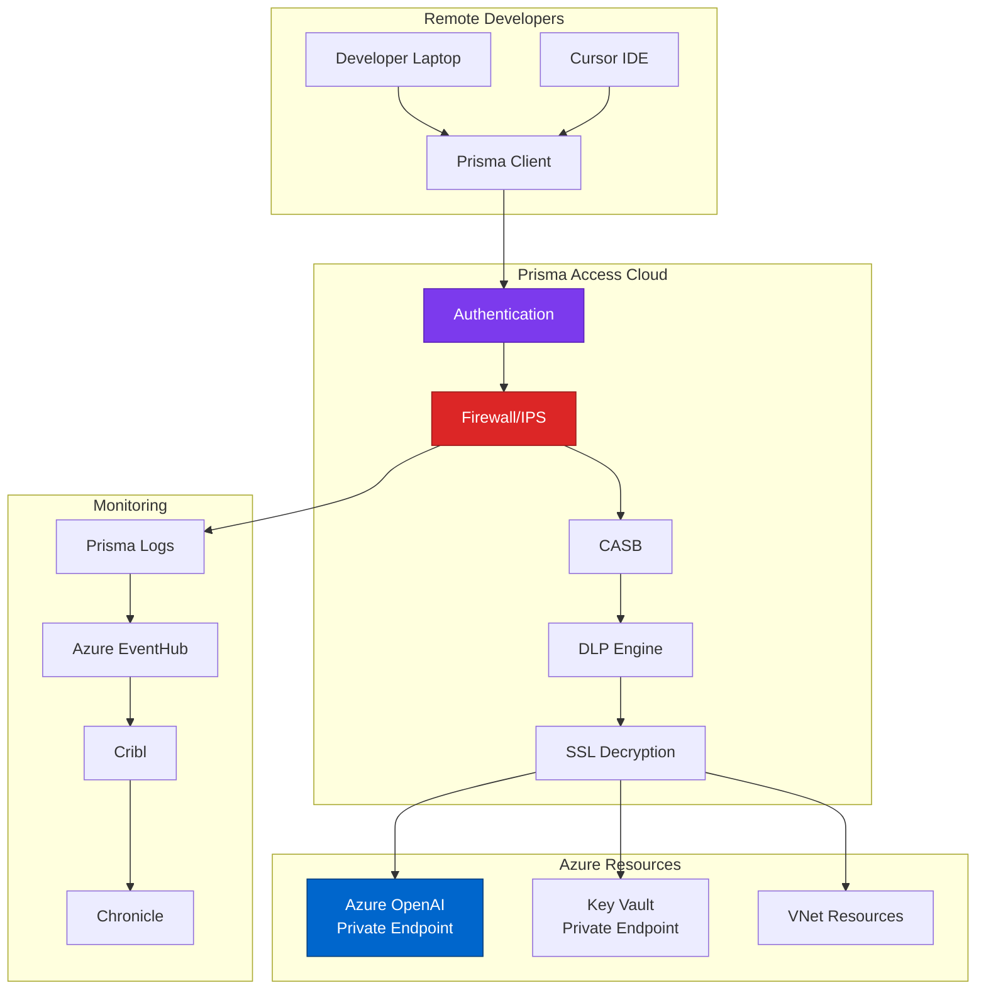

# Palo Alto Prisma Access - SASE Platform
{: .no_toc }

Analysis of Palo Alto Prisma Access SASE platform for secure remote access and zero trust networking.
{: .fs-6 .fw-300 }

## Table of contents
{: .no_toc .text-delta }

1. TOC
{:toc}

---

## Overview

**Prisma Access** (formerly GlobalProtect Cloud Service) is Palo Alto Networks' Secure Access Service Edge (SASE) platform that delivers network security and connectivity for remote users, branch offices, and cloud resources.

### Vendor Information

| | |
|---|---|
| **Company** | Palo Alto Networks, Inc. |
| **Founded** | 2005 |
| **Headquarters** | Santa Clara, CA |
| **Product Launch** | 2019 (as Prisma Access) |
| **Website** | [https://www.paloaltonetworks.com/prisma/access](https://www.paloaltonetworks.com/prisma/access) |
| **Status** | Public (NASDAQ: PANW) |
| **Notable** | Leader in Gartner Magic Quadrant for SASE |

---

## Core Capabilities

### 1. Secure Remote Access

**Zero Trust Network Access (ZTNA)**:
```
Remote Developer Connectivity:
├── User authenticates (Okta SAML)
├── Device posture check (CrowdStrike integration)
├── Prisma Access validates:
│   ├── User identity (Okta)
│   ├── Device health (CrowdStrike)
│   ├── Location (geofencing)
│   └── Time of day
├── Grants access to specific resources:
│   ├── Azure OpenAI (private endpoint)
│   ├── Key Vault (private endpoint)
│   ├── Internal git repositories
│   └── Development environments
└── Continuous monitoring during session

Traditional VPN:
❌ All-or-nothing access
❌ No device posture checking
❌ Lateral movement once connected

Prisma Access ZTNA:
✅ Granular resource access
✅ Continuous trust evaluation
✅ Segmentation enforced
```

### 2. Cloud-Delivered Firewall

**Next-Generation Firewall as a Service**:
```yaml
prisma_firewall_capabilities:
  threat_prevention:
    - ips_ids: true
    - anti_malware: true
    - anti_spyware: true
    - dns_security: true
    
  url_filtering:
    - category_based: 85+ categories
    - custom_urls: company blocklist
    - safe_search_enforcement: true
    
  ssl_decryption:
    - inspect_encrypted_traffic: true
    - exclude_medical_financial: true  # Privacy
    - trust_corporate_cert: true
    
  application_control:
    - 6000_plus_applications: identified
    - block_high_risk_apps: true
    - allow_business_apps: true
```

### 3. Cloud Access Security Broker (CASB)

**SaaS Security**:
```
Prisma Access CASB monitors:
├── Sanctioned Apps (approved)
│   ├── Microsoft 365
│   ├── GitHub
│   ├── Slack (company instance)
│   └── Approved SaaS tools
│
├── Unsanctioned Apps (shadow IT)
│   ├── Personal Dropbox
│   ├── Personal Gmail
│   ├── Unauthorized cloud storage
│   └── High-risk apps
│
└── Enforces policies:
    ├── Block high-risk apps
    ├── Allow read-only for medium-risk
    ├── DLP for approved apps
    └── Alert on policy violations

Example:
Developer tries to upload code to personal Dropbox
  ↓
Prisma Access CASB intercepts
  ↓
Checks: Is Dropbox approved? No
  ↓
Checks: Does upload contain sensitive data? Yes (API keys detected)
  ↓
Action: Block upload + Alert security team
  ↓
User sees: "Upload blocked by security policy"
```

### 4. Data Loss Prevention (DLP)

**In-Line DLP**:
```yaml
# Prisma Access DLP for developer traffic
dlp_policy:
  name: "Block API Key Uploads"
  
  match_criteria:
    - data_pattern: "Azure API Key"
    - data_pattern: "AWS Secret Key"
    - data_pattern: "GitHub Token"
    - direction: "upload"
    - destination: "cloud_storage_apps"
  
  actions:
    - block_transaction
    - capture_pcap: true  # For forensics
    - alert_severity: "high"
    - notify_user: true
    - log_to_siem: true
```

---

## Architecture for Cursor Environment



---

## Why Prisma Access (But Not Cortex XDR)?

### Customer's Decision

```
Palo Alto Products Used:
✅ Prisma Access (SASE/Network Security)
❌ Cortex XDR (Endpoint/Cloud Security)

Rationale:
Prisma Access:
├── Unique value: Secure remote access for developers
├── No overlap: Azure Firewall is for Azure-to-Azure only
├── ZTNA: Required for zero-trust architecture
├── CASB: Needed for SaaS security
└── Decision: Deploy

Cortex XDR:
├── Endpoint protection: Duplicates CrowdStrike
├── Cloud security: Duplicates Wiz
├── SIEM features: Have Chronicle + Splunk
├── Cost: Not justified given overlap
└── Decision: Don't deploy

Result: Use Palo Alto where they're best (networking)
        Use CrowdStrike/Wiz where they're best (endpoint/cloud)
```

---

## Pricing Model

```
Prisma Access Pricing:
├── Per unique user per month
├── Bandwidth included (typically 2-5 GB/user/month)
├── Overage: $X per GB

Tiers:
├── Business: $8-12/user/month
├── Enterprise: $15-25/user/month
└── Elite: $25-35/user/month

Customer (50 remote developers):
50 users × $20/month = $1,000/month = $12K/year

Add-ons:
├── DLP: +$3-5/user/month
├── CASB: +$2-4/user/month
├── SaaS Security: +$2-3/user/month
└── Total with add-ons: ~$30/user = $18K/year

Compare to:
- Traditional VPN: $5K/year (less secure)
- Zscaler: Similar pricing ($25-35/user)
- Cisco Umbrella/SASE: $20-30/user
```

---

## Resources & Links

- **Website**: [https://www.paloaltonetworks.com/prisma/access](https://www.paloaltonetworks.com/prisma/access)
- **Documentation**: [Prisma Access Docs](https://docs.paloaltonetworks.com/prisma/prisma-access)
- **Live Community**: [Palo Alto Networks Community](https://live.paloaltonetworks.com)

---

**Last Updated**: October 10, 2025  
**Review Status**: <span class="badge badge-security">Production Validated</span>

