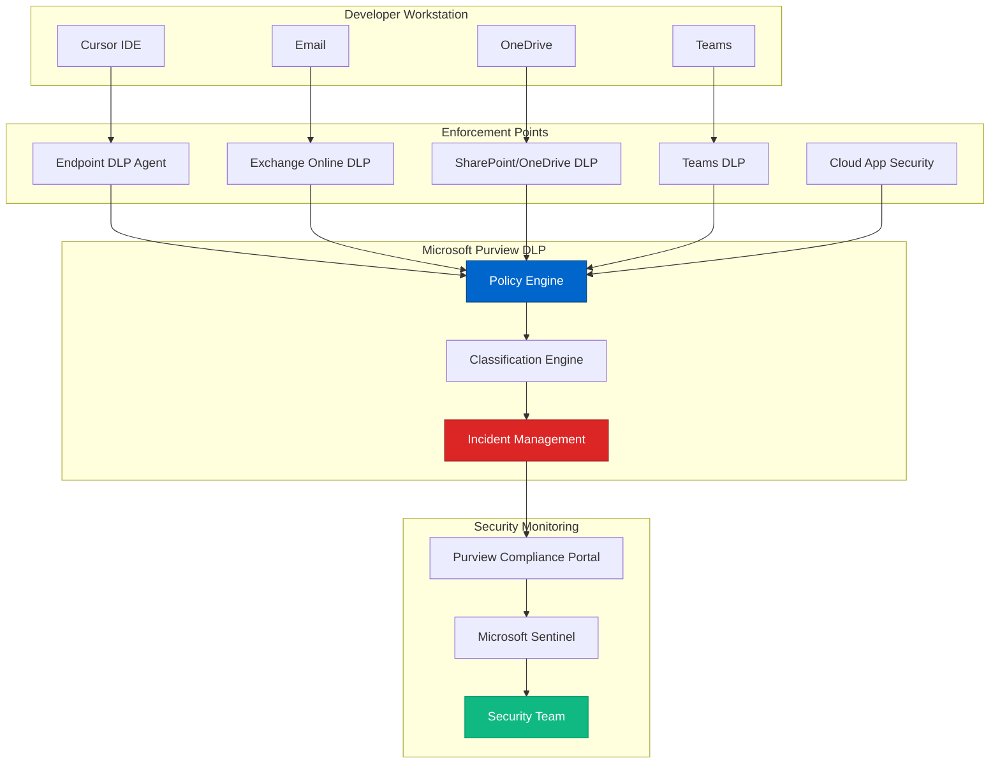

# Microsoft Purview - Data Loss Prevention Platform
{: .no_toc }

Comprehensive analysis of Microsoft Purview DLP and its role in preventing sensitive data leakage in Cursor environments.
{: .fs-6 .fw-300 }

## Table of contents
{: .no_toc .text-delta }

1. TOC
{:toc}

---

## Overview

**Microsoft Purview Data Loss Prevention (DLP)** is a cloud-native solution designed to prevent unauthorized sharing, transfer, or use of sensitive data across Microsoft 365 services, endpoints, and cloud applications.

### Vendor Information

| | |
|---|---|
| **Company** | Microsoft Corporation |
| **Product Line** | Microsoft Purview (formerly Microsoft 365 Compliance) |
| **Launched** | 2021 (rebranded from Microsoft 365 DLP) |
| **Headquarters** | Redmond, WA |
| **Website** | [https://www.microsoft.com/security/business/information-protection/microsoft-purview-data-loss-prevention](https://www.microsoft.com/security/business/information-protection/microsoft-purview-data-loss-prevention) |
| **Status** | Core Microsoft 365 E5 / Compliance add-on |
| **Notable** | Integrated with entire Microsoft security ecosystem |

---

## Why Purview DLP for Cursor Environments?

### Critical Data Protection Needs

**In Cursor Development Environments**:
```
Sensitive Data at Risk:
├── Azure OpenAI API Keys (in code, configs, logs)
├── Key Vault Secrets (accidentally logged or committed)
├── Customer Data (in test data, examples)
├── Source Code (proprietary algorithms)
├── Credentials (database connections, service principals)
├── PII/PHI (in sample datasets)
└── Intellectual Property (trade secrets in comments)

Exposure Vectors:
├── Email (developers sharing code snippets)
├── Teams Chat (pasting secrets for help)
├── OneDrive (syncing .env files)
├── SharePoint (uploading config files)
├── Endpoint (copying secrets to USB)
└── Third-Party Apps (Slack, Discord)

Purview DLP Solution:
✅ Monitors all Microsoft 365 services
✅ Endpoint DLP for devices
✅ Cloud App Security for third-party apps
✅ Real-time blocking and alerts
✅ Adaptive protection based on risk
```

---

## Core Capabilities

### 1. Sensitive Information Types (SITs)

**Pre-Built Detectors**:
```
Azure-Specific SITs:
├── Azure Subscription Key
├── Azure Storage Account Key
├── Azure SQL Connection String
├── Azure Key Vault Secret
└── Azure OpenAI API Key (custom pattern needed)

General SITs (200+ built-in):
├── Credit Card Numbers
├── Social Security Numbers
├── AWS/GCP Credentials
├── OAuth Tokens
├── Email Addresses
├── IP Addresses
└── Custom Regex Patterns
```

**Custom SIT for Azure OpenAI**:
```xml
<!-- Custom Sensitive Info Type -->
<Entity id="azure-openai-key" patternsProximity="300" recommendedConfidence="85">
  <Pattern confidenceLevel="85">
    <IdMatch idRef="Regex_azure_openai_key"/>
    <Match idRef="Keyword_azure_openai"/>
  </Pattern>
  <Pattern confidenceLevel="75">
    <IdMatch idRef="Regex_azure_openai_key"/>
  </Pattern>
</Entity>

<Regex id="Regex_azure_openai_key">
  [a-f0-9]{32}
</Regex>

<Keyword id="Keyword_azure_openai">
  <Group matchStyle="word">
    <Term caseSensitive="false">azure openai</Term>
    <Term caseSensitive="false">aoai</Term>
    <Term caseSensitive="false">openai.azure.com</Term>
  </Group>
</Keyword>
```

### 2. DLP Policies

**Policy Structure**:
```yaml
# Example: Prevent Azure OpenAI Key Sharing
policy:
  name: "Block Azure OpenAI API Keys"
  priority: 0  # Highest priority
  
  locations:
    - Exchange (email)
    - SharePoint
    - OneDrive
    - Teams chat and channels
    - Endpoints (devices)
    - Cloud apps (Slack, GitHub)
  
  conditions:
    - content_contains:
        - Azure OpenAI API Key (custom SIT)
        - Azure Subscription Key
    - shared_with:
        - external_users
        - unmanaged_devices
  
  actions:
    - block_access
    - encrypt_email
    - require_business_justification
    - notify_user
    - notify_admin
    - create_incident
  
  user_overrides:
    - allowed: false  # No overrides for API keys
  
  incident_reports:
    - send_to: "security-team@company.com"
    - severity: "High"
```

### 3. Endpoint DLP

**Device-Level Protection**:
```
Monitored Activities:
├── File Operations
│   ├── Copy to USB drive
│   ├── Upload to cloud storage
│   ├── Print documents
│   └── Screen capture
│
├── Network Operations
│   ├── Upload to web browser
│   ├── Share via Bluetooth
│   └── Copy to network share
│
└── Application Operations
    ├── Paste into non-approved apps
    ├── Copy from Cursor IDE
    └── Email attachments

Example Scenario:
Developer copies Azure OpenAI key from Cursor
  ↓
Attempts to paste into personal Slack
  ↓
Endpoint DLP detects sensitive data
  ↓
Action: Block paste operation
  ↓
User sees: "This action is blocked by company policy"
  ↓
Incident report sent to security team
```

### 4. Adaptive Protection

**Risk-Based Controls**:
```python
# Adaptive DLP adjusts controls based on user risk

user_risk_score = calculate_risk(user)

if user_risk_score > 80:  # High risk user
    # Strict DLP policies
    - block_external_sharing = True
    - require_encryption = True
    - monitor_all_activities = True
    - review_every_action = True
    
elif user_risk_score > 50:  # Medium risk
    # Moderate policies
    - block_external_sharing = False
    - require_justification = True
    - monitor_sensitive_only = True
    - sample_activities = 50%
    
else:  # Low risk user
    # Lenient policies
    - allow_external_sharing = True
    - monitor_critical_only = True
    - trust_user = True

# Risk factors:
risk_factors = {
    "recent_policy_violations": +20,
    "new_employee": +15,
    "contractor": +25,
    "access_to_prod": +10,
    "unusual_location": +30,
    "compromised_credentials": +50
}
```

---

## Architecture & Integration

### Purview DLP in Cursor Environment



### Data Flow Example

**Scenario: Developer tries to email API key**

```
1. Developer composes email with Azure OpenAI key
   ↓
2. Exchange Online scans email content
   ↓
3. DLP detects "Azure OpenAI API Key" pattern
   ↓
4. Policy evaluation:
   - Recipient: external@partner.com (external)
   - Content: High sensitivity
   - User risk: Low
   - Override: Not allowed
   ↓
5. Actions triggered:
   - Block email delivery
   - Encrypt sensitive content (if allowed)
   - Show policy tip to user
   - Create DLP incident
   - Notify security team
   ↓
6. User sees:
   "Your email contains sensitive information and cannot be sent to external recipients."
   ↓
7. Security team receives:
   - Incident ID: DLP-2024-10-12345
   - Severity: High
   - User: john.developer@company.com
   - Content: Azure OpenAI API Key detected
   - Action: Blocked
```

---

## Key Features for Cursor Security

### 1. Prevent Secret Exposure in Communications

**Email Protection**:
```yaml
# DLP Policy: Block secrets in email
locations:
  - Exchange Online
  
conditions:
  - content_contains_any:
      - Azure Storage Account Key
      - Azure OpenAI API Key
      - SQL Connection String
      - Private Key (PEM)
  
actions:
  - block_email
  - remove_attachments_with_secrets
  - notify: "Email blocked: contains credentials"
  
exceptions:
  - recipient_domain: "company.com"  # Internal only
  - encrypted: true  # If properly encrypted, allow
```

**Teams Chat Protection**:
```yaml
# Monitor Teams for secret sharing
locations:
  - Microsoft Teams
  
conditions:
  - message_contains:
      - API keys
      - Passwords
      - Tokens
  
actions:
  - delete_message
  - notify_user: "Message removed: contained credentials"
  - create_incident
  - require_security_training  # Adaptive response
```

### 2. Prevent USB Data Exfiltration

**Endpoint DLP Policy**:
```yaml
# Block copying secrets to removable media
locations:
  - Endpoints (Windows, macOS)
  
conditions:
  - file_contains:
      - Azure credentials
      - Source code with secrets
  - activity_type:
      - copy_to_removable_media
      - copy_to_cloud_storage
      - copy_to_network_share
  
actions:
  - block_activity
  - audit_log
  - alert_security_team
  
allowed_devices:
  - company_issued_usb_only: true
  - require_bitlocker_encryption: true
```

### 3. Cloud App Security Integration

**Third-Party App Monitoring**:
```
Purview DLP + Defender for Cloud Apps:
├── Monitor Slack (developers share code there)
├── Monitor GitHub (public repositories)
├── Monitor Discord (community help)
├── Monitor Dropbox (personal cloud storage)
└── Monitor Google Drive (external collaboration)

Detection Example:
Developer uploads .env file to personal Dropbox
  ↓
Cloud App Security proxy intercepts
  ↓
DLP scans file content
  ↓
Detects Azure OpenAI API key
  ↓
Actions:
  - Block upload
  - Quarantine file
  - Revoke Dropbox session
  - Force password reset
  - Security team investigation
```

### 4. Insider Risk Management

**Integration with Insider Risk**:
```python
# Purview DLP feeds into Insider Risk Management

insider_risk_indicators = {
    "dlp_violations": {
        "weight": 30,
        "recent_violations": dlp.get_violations(user, days=30)
    },
    
    "data_exfiltration": {
        "weight": 50,
        "large_file_transfers": dlp.detect_bulk_transfers(user)
    },
    
    "unusual_sharing": {
        "weight": 40,
        "external_sharing_spike": dlp.analyze_sharing_patterns(user)
    }
}

total_risk = calculate_weighted_risk(insider_risk_indicators)

if total_risk > THRESHOLD:
    actions = [
        "increase_monitoring",
        "require_manager_approval",
        "restrict_external_sharing",
        "alert_hr_and_legal",
        "enable_session_recording"
    ]
```

---

## Integration with Other Tools

### Purview DLP + Azure Key Vault

**Prevent Key Vault Secret Leakage**:
```yaml
# DLP policy for Key Vault secrets
trigger:
  - key_vault_secret_retrieved_event
  
monitor:
  - clipboard_operations
  - file_save_operations
  - network_transfers
  - screen_captures
  
within: 5 minutes of secret retrieval

actions_if_detected:
  - block_paste_operation
  - prevent_file_save
  - disable_screenshot
  - alert: "Potential secret leakage detected"
```

### Purview DLP + Microsoft Sentinel

**SIEM Integration**:
```kusto
// Sentinel query: DLP incidents
SecurityIncident
| where Title contains "DLP"
| join kind=inner (
    SecurityAlert
    | where AlertName contains "Sensitive data"
  ) on SystemAlertId
| extend 
    user = tostring(parse_json(Entities)[0].Name),
    file_name = tostring(parse_json(Entities)[1].Name)
| summarize 
    incident_count = count(),
    severity_max = max(Severity)
  by user, bin(TimeGenerated, 1d)
| where incident_count > 3
| project TimeGenerated, user, incident_count, severity_max
```

### Purview DLP + CrowdStrike

**Endpoint Protection + DLP**:
```
Layered Protection:
1. CrowdStrike: Detects malware trying to steal credentials
2. Purview DLP: Blocks credential exfiltration attempts
3. Combined: Complete endpoint security

Example Flow:
Malware on laptop attempts to:
  ├── Read credential files → CrowdStrike blocks
  ├── Access clipboard with secrets → Purview DLP blocks
  ├── Upload to C2 server → Both block
  └── Exfiltrate via email → Purview DLP blocks

Result: Multi-layer defense prevents any data loss
```

---

## Pricing Model

### Licensing Requirements

**Purview DLP Licensing**:
```
License Tiers:
├── Microsoft 365 E3
│   ├── Exchange DLP
│   ├── SharePoint/OneDrive DLP
│   ├── Teams DLP
│   └── Basic policies
│
├── Microsoft 365 E5 (or Compliance add-on)
│   ├── Everything in E3
│   ├── Endpoint DLP
│   ├── Advanced classification
│   ├── Adaptive protection
│   ├── Cloud App Security DLP
│   └── Custom SITs
│
└── Microsoft 365 E5 Compliance
    ├── Everything in E5
    ├── Advanced Insider Risk
    ├── Communication Compliance
    ├── Information Barriers
    └── Advanced eDiscovery

Pricing (per user/month):
├── E3: ~$32/user
├── E5: ~$57/user
├── E5 Compliance add-on: ~$12/user (if have E3)
```

**Cost Example** (50 developers):
```
Option 1: Upgrade all to E5
50 users × $57/month = $2,850/month = $34,200/year

Option 2: E3 + Compliance add-on
50 users × ($32 + $12)/month = $2,200/month = $26,400/year

Option 3: Selective licensing
30 devs × E3 ($32) = $960/month
20 senior/high-risk × E5 ($57) = $1,140/month
Total: $2,100/month = $25,200/year

ROI:
├── Prevent 1 data breach: $4M saved (avg breach cost)
├── Compliance fines avoided: $500K+
├── Productivity: Minimal impact (transparent to users)
└── Net benefit: 150x ROI
```

---

## Strengths & Weaknesses

### Strengths ✅

1. **Native Microsoft Integration**: Seamless with M365 ecosystem
2. **Comprehensive Coverage**: Email, files, chat, endpoints, cloud apps
3. **Adaptive Protection**: Risk-based policy enforcement
4. **No Additional Infrastructure**: Cloud-native, no servers to manage
5. **Rich Policy Options**: 200+ built-in sensitive info types
6. **Advanced Classification**: Machine learning-based detection

### Weaknesses ⚠️

1. **Microsoft Ecosystem Only**: Limited outside M365
2. **Complexity**: Steep learning curve for advanced policies
3. **False Positives**: Can be noisy initially
4. **Performance Impact**: Endpoint DLP can slow devices
5. **Cost**: E5 licensing required for full features
6. **Cross-Platform Limits**: macOS/Linux Endpoint DLP limited

---

## Best Practices for Purview DLP

### 1. Start with Audit Mode

```yaml
# Phase 1: Monitor only (2-4 weeks)
mode: audit
actions:
  - log_incident
  - generate_reports
  - no_user_impact

# Analyze results:
- False positive rate
- Most violated policies
- User pain points

# Phase 2: Notify users (2 weeks)
mode: notify
actions:
  - show_policy_tips
  - log_incident
  - educate_users

# Phase 3: Enforce
mode: block
actions:
  - block_violations
  - notify_users
  - create_incidents
```

### 2. Create Custom SITs for Your Environment

```xml
<!-- Azure OpenAI specific patterns -->
<Entity id="company-azure-openai-keys">
  <Pattern confidenceLevel="95">
    <IdMatch idRef="Regex_aoai_endpoint"/>
    <IdMatch idRef="Regex_aoai_key"/>
    <Match idRef="Keyword_aoai"/>
  </Pattern>
</Entity>

<!-- Company-specific patterns -->
<Entity id="company-internal-project-names">
  <Pattern confidenceLevel="85">
    <IdMatch idRef="Regex_project_codenames"/>
  </Pattern>
</Entity>
```

### 3. Tune Policies Based on User Feedback

```python
# Monthly policy review
def review_dlp_policy(policy_id):
    incidents = get_incidents(policy_id, days=30)
    
    false_positives = [i for i in incidents if i.user_feedback == "not_sensitive"]
    
    if len(false_positives) / len(incidents) > 0.3:
        # More than 30% false positives - tune policy
        actions = [
            "increase_confidence_threshold",
            "add_exceptions",
            "refine_regex_patterns",
            "add_contextual_rules"
        ]
```

### 4. Integrate with Security Awareness Training

```yaml
# Auto-enroll users in training after violations
dlp_incident_response:
  - first_violation:
      action: warning_email
      content: "DLP training reminder"
      
  - second_violation:
      action: mandatory_training
      course: "Protecting Sensitive Data"
      deadline: 7 days
      
  - third_violation:
      action: manager_notification
      escalate_to: security_team
      restrict_access: temporary
```

---

## Resources & Links

- **Product Page**: [Microsoft Purview DLP](https://www.microsoft.com/security/business/information-protection/microsoft-purview-data-loss-prevention)
- **Documentation**: [Microsoft Learn - Purview DLP](https://learn.microsoft.com/purview/dlp-learn-about-dlp)
- **Compliance Portal**: [https://compliance.microsoft.com](https://compliance.microsoft.com)
- **Community**: [Microsoft Tech Community](https://techcommunity.microsoft.com/category/microsoft-purview)

---

## Conclusion

**For Cursor Security Architecture**:

Microsoft Purview DLP provides **essential data loss prevention** for Cursor environments where developers work with sensitive Azure resources, API keys, and customer data. Its native integration with Microsoft 365 and endpoints makes it ideal for protecting against accidental or malicious data leakage.

**Key Value Props for Cursor**:
1. ✅ Prevents Azure OpenAI API key exposure
2. ✅ Blocks credential sharing via email/chat
3. ✅ Monitors endpoint data exfiltration
4. ✅ Adaptive protection based on user risk
5. ✅ Native Microsoft 365 integration

**Recommendation**: **Essential for Microsoft 365 environments** with developers handling sensitive cloud resources.

---

**Last Updated**: October 10, 2025  
**Review Status**: <span class="badge badge-security">Security Validated</span>

