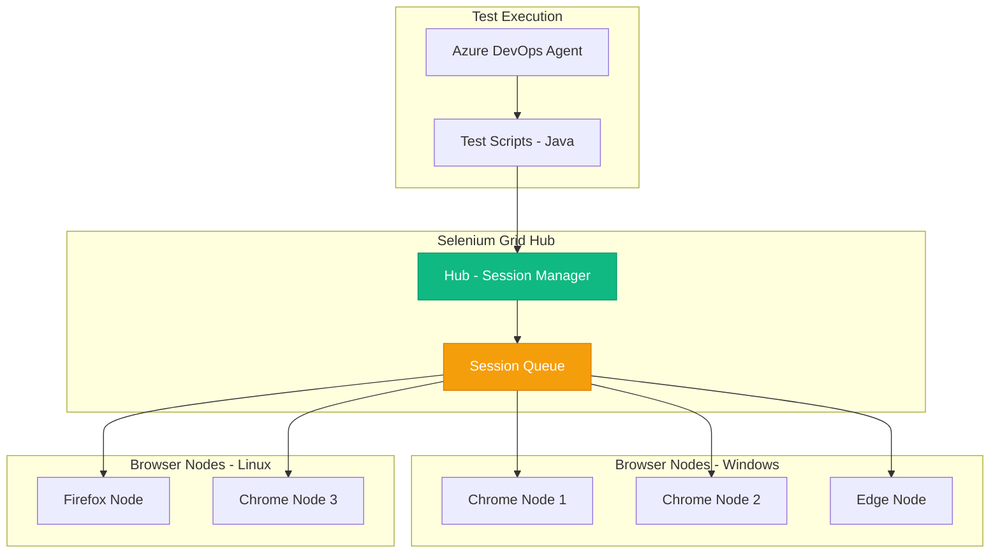

# Selenium - Industry Standard Browser Automation
{: .no_toc }

Overview of Selenium WebDriver and its role in legacy system security testing for Cursor deployments.
{: .fs-6 .fw-300 }

## Table of contents
{: .no_toc .text-delta }

1. TOC
{:toc}

---

## Overview

**Selenium WebDriver** is the industry-standard open-source framework for browser automation and web application testing. First released in 2004, it remains widely used in enterprise environments despite newer alternatives like Playwright, particularly for legacy system testing.

### Framework Information

| | |
|---|---|
| **Framework** | Selenium WebDriver |
| **Maintainer** | Selenium Project (Open Source) |
| **First Release** | 2004 |
| **Current Version** | 4.x |
| **Website** | [https://www.selenium.dev](https://www.selenium.dev) |
| **License** | Apache 2.0 (Open Source) |
| **Notable** | Most widely adopted test automation framework |

---

## Why Still Use Selenium?

### Selenium vs. Playwright

| Factor | Selenium | Playwright |
|--------|----------|------------|
| **Maturity** | 20 years | 4 years |
| **Ecosystem** | Massive | Growing |
| **Language Support** | Java, Python, C#, Ruby, JS | TypeScript, Python, .NET, Java |
| **Performance** | Slower | Faster |
| **Auto-Wait** | Manual waits | Automatic |
| **Best Use Case** | Legacy systems, existing tests | New projects |

### Enterprise Customer Strategy

**Customer Uses Both Frameworks**:
```
Selenium for:
├── Legacy insurance systems (20 years old)
├── Existing test suites (5,000+ tests)
├── Java-based applications
├── Selenium Grid infrastructure (already invested)
└── Team expertise (10+ years)

Playwright for:
├── New Cursor integrations
├── Modern web apps
├── Azure portal testing
├── API testing
└── Faster test development

Why Not Migrate?
- 5,000 Selenium tests = 6 months to rewrite
- Cost: $500K (labor + opportunity cost)
- Benefit: Marginal (existing tests work fine)
- Risk: Regression issues during migration
- Decision: Keep Selenium for legacy, add Playwright for new tests
```

---

## Selenium Grid Architecture

### Distributed Testing Infrastructure



### Grid Configuration

```yaml
# docker-compose.yml for Selenium Grid
version: '3.8'
services:
  selenium-hub:
    image: selenium/hub:4.15.0
    ports:
      - "4444:4444"
      - "4442:4442"
      - "4443:4443"
    environment:
      - GRID_MAX_SESSION=10
      - GRID_BROWSER_TIMEOUT=300
      - GRID_TIMEOUT=300
    networks:
      - selenium-grid

  chrome-node:
    image: selenium/node-chrome:4.15.0
    depends_on:
      - selenium-hub
    environment:
      - SE_EVENT_BUS_HOST=selenium-hub
      - SE_EVENT_BUS_PUBLISH_PORT=4442
      - SE_EVENT_BUS_SUBSCRIBE_PORT=4443
      - SE_NODE_MAX_SESSIONS=5
    shm_size: 2gb
    networks:
      - selenium-grid
    deploy:
      replicas: 3

  firefox-node:
    image: selenium/node-firefox:4.15.0
    depends_on:
      - selenium-hub
    environment:
      - SE_EVENT_BUS_HOST=selenium-hub
      - SE_EVENT_BUS_PUBLISH_PORT=4442
      - SE_EVENT_BUS_SUBSCRIBE_PORT=4443
      - SE_NODE_MAX_SESSIONS=5
    shm_size: 2gb
    networks:
      - selenium-grid
    deploy:
      replicas: 2

  edge-node:
    image: selenium/node-edge:4.15.0
    depends_on:
      - selenium-hub
    environment:
      - SE_EVENT_BUS_HOST=selenium-hub
      - SE_EVENT_BUS_PUBLISH_PORT=4442
      - SE_EVENT_BUS_SUBSCRIBE_PORT=4443
      - SE_NODE_MAX_SESSIONS=5
    shm_size: 2gb
    networks:
      - selenium-grid

networks:
  selenium-grid:
    driver: bridge
```

---

## Security Testing Examples

### Test Azure Key Vault Access Controls

```java
package com.company.security.tests;

import org.junit.jupiter.api.Test;
import org.openqa.selenium.By;
import org.openqa.selenium.WebDriver;
import org.openqa.selenium.WebElement;
import org.openqa.selenium.chrome.ChromeDriver;
import org.openqa.selenium.support.ui.ExpectedConditions;
import org.openqa.selenium.support.ui.WebDriverWait;
import java.time.Duration;

import static org.junit.jupiter.api.Assertions.*;

public class KeyVaultSecurityTest {
    
    @Test
    public void testKeyVaultRequiresMFA() {
        WebDriver driver = new ChromeDriver();
        
        try {
            // Navigate to Azure Portal
            driver.get("https://portal.azure.com");
            
            // Login with test account
            WebElement emailInput = driver.findElement(By.id("i0116"));
            emailInput.sendKeys(System.getenv("TEST_USER"));
            driver.findElement(By.id("idSIButton9")).click();
            
            // Enter password
            WebDriverWait wait = new WebDriverWait(driver, Duration.ofSeconds(10));
            WebElement passwordInput = wait.until(
                ExpectedConditions.presenceOfElementLocated(By.id("i0118"))
            );
            passwordInput.sendKeys(System.getenv("TEST_PASSWORD"));
            driver.findElement(By.id("idSIButton9")).click();
            
            // MFA challenge should appear
            WebElement mfaPrompt = wait.until(
                ExpectedConditions.presenceOfElementLocated(By.id("idDiv_SAOTCAS_Title"))
            );
            
            assertTrue(mfaPrompt.isDisplayed(), "MFA prompt should be displayed");
            String mfaText = mfaPrompt.getText();
            assertTrue(
                mfaText.contains("Verify") || mfaText.contains("Authenticate"),
                "MFA verification prompt should be shown"
            );
            
            System.out.println("✅ MFA enforcement verified for Key Vault access");
            
        } finally {
            driver.quit();
        }
    }
    
    @Test
    public void testDeveloperCannotAccessProductionSecrets() {
        WebDriver driver = new ChromeDriver();
        
        try {
            // Login as developer
            loginAsUser(driver, "developer@company.com", "DevPassword123!");
            
            // Navigate to production Key Vault
            driver.get("https://portal.azure.com/#@company.com/resource/subscriptions/xxx/resourceGroups/prod-rg/providers/Microsoft.KeyVault/vaults/keyvault-prod-001/secrets");
            
            WebDriverWait wait = new WebDriverWait(driver, Duration.ofSeconds(15));
            
            // Should see access denied message
            WebElement accessDenied = wait.until(
                ExpectedConditions.presenceOfElementLocated(
                    By.xpath("//*[contains(text(), 'Access denied') or contains(text(), 'You do not have permission')]")
                )
            );
            
            assertTrue(accessDenied.isDisplayed(), "Access should be denied for developers");
            
            // Verify no secrets are visible
            boolean secretsVisible = driver.findElements(By.cssSelector(".secret-list-item")).size() > 0;
            assertFalse(secretsVisible, "Developer should not see any secrets");
            
            System.out.println("✅ RBAC properly blocks developer from production secrets");
            
        } finally {
            driver.quit();
        }
    }
    
    @Test
    public void testSecurityAdminCanAccessProductionSecrets() {
        WebDriver driver = new ChromeDriver();
        
        try {
            // Login as security admin
            loginAsUser(driver, "secadmin@company.com", "SecAdminPassword123!");
            
            // Navigate to production Key Vault
            driver.get("https://portal.azure.com/#@company.com/resource/subscriptions/xxx/resourceGroups/prod-rg/providers/Microsoft.KeyVault/vaults/keyvault-prod-001/secrets");
            
            WebDriverWait wait = new WebDriverWait(driver, Duration.ofSeconds(15));
            
            // Should see secret list
            WebElement secretList = wait.until(
                ExpectedConditions.presenceOfElementLocated(By.cssSelector(".secret-list"))
            );
            
            assertTrue(secretList.isDisplayed(), "Security admin should see secret list");
            
            // Count accessible secrets
            int secretCount = driver.findElements(By.cssSelector(".secret-list-item")).size();
            assertTrue(secretCount > 0, "Security admin should see secrets");
            
            System.out.println("✅ Security admin has proper access to " + secretCount + " secrets");
            
            // Log access for audit
            logSecurityAccess(driver, "secadmin@company.com", "keyvault-prod-001", secretCount);
            
        } finally {
            driver.quit();
        }
    }
    
    private void loginAsUser(WebDriver driver, String username, String password) {
        driver.get("https://portal.azure.com");
        
        WebDriverWait wait = new WebDriverWait(driver, Duration.ofSeconds(10));
        
        // Enter username
        WebElement emailInput = wait.until(
            ExpectedConditions.presenceOfElementLocated(By.id("i0116"))
        );
        emailInput.sendKeys(username);
        driver.findElement(By.id("idSIButton9")).click();
        
        // Enter password
        WebElement passwordInput = wait.until(
            ExpectedConditions.presenceOfElementLocated(By.id("i0118"))
        );
        passwordInput.sendKeys(password);
        driver.findElement(By.id("idSIButton9")).click();
        
        // Handle MFA (in test environment, auto-approved)
        try {
            WebElement mfaApprove = wait.until(
                ExpectedConditions.presenceOfElementLocated(By.id("idBtn_Back"))
            );
            mfaApprove.click();
        } catch (Exception e) {
            // MFA may auto-approve in test environment
        }
        
        // Wait for portal to load
        wait.until(ExpectedConditions.urlContains("portal.azure.com"));
    }
    
    private void logSecurityAccess(WebDriver driver, String user, String resource, int itemCount) {
        // Log to SIEM via API
        System.out.println("AUDIT: User " + user + " accessed " + resource + " with " + itemCount + " items visible");
    }
}
```

### Test Okta SSO Integration

```java
public class OktaSSOSecurityTest {
    
    @Test
    public void testOktaSSOMFAEnforcement() {
        WebDriver driver = new ChromeDriver();
        
        try {
            // Navigate to Cursor enterprise portal
            driver.get("https://cursor.company.com");
            
            WebDriverWait wait = new WebDriverWait(driver, Duration.ofSeconds(10));
            
            // Click SSO login
            WebElement ssoButton = wait.until(
                ExpectedConditions.elementToBeClickable(By.xpath("//button[contains(text(), 'Sign in with SSO')]"))
            );
            ssoButton.click();
            
            // Enter company domain
            WebElement domainInput = wait.until(
                ExpectedConditions.presenceOfElementLocated(By.id("domain"))
            );
            domainInput.sendKeys("company.com");
            driver.findElement(By.id("next")).click();
            
            // Should redirect to Okta
            wait.until(ExpectedConditions.urlContains("okta.com"));
            assertTrue(driver.getCurrentUrl().contains("okta.com"), "Should redirect to Okta");
            
            // Enter credentials
            WebElement username = wait.until(
                ExpectedConditions.presenceOfElementLocated(By.id("okta-signin-username"))
            );
            username.sendKeys(System.getenv("TEST_USER"));
            
            WebElement password = driver.findElement(By.id("okta-signin-password"));
            password.sendKeys(System.getenv("TEST_PASSWORD"));
            
            driver.findElement(By.id("okta-signin-submit")).click();
            
            // MFA challenge must appear
            WebElement mfaChallenge = wait.until(
                ExpectedConditions.presenceOfElementLocated(
                    By.xpath("//*[contains(text(), 'Verify') or contains(text(), 'Multi-Factor')]")
                )
            );
            
            assertTrue(mfaChallenge.isDisplayed(), "MFA challenge must be presented");
            
            System.out.println("✅ Okta SSO properly enforces MFA");
            
        } finally {
            driver.quit();
        }
    }
    
    @Test
    public void testCannotBypassOktaMFA() {
        WebDriver driver = new ChromeDriver();
        
        try {
            // Attempt to access dashboard directly
            driver.get("https://cursor.company.com/dashboard");
            
            WebDriverWait wait = new WebDriverWait(driver, Duration.ofSeconds(10));
            
            // Should redirect to Okta login
            wait.until(ExpectedConditions.urlContains("okta.com"));
            assertTrue(driver.getCurrentUrl().contains("okta.com"), "Should redirect to Okta login");
            
            // Attempt cookie manipulation
            driver.manage().addCookie(
                new org.openqa.selenium.Cookie("session", "fake-session-token-12345")
            );
            driver.manage().addCookie(
                new org.openqa.selenium.Cookie("auth", "bypassed-auth-token")
            );
            
            // Try to access dashboard again
            driver.get("https://cursor.company.com/dashboard");
            
            // Should still redirect to Okta (MFA required)
            wait.until(ExpectedConditions.urlContains("okta.com"));
            assertTrue(
                driver.getCurrentUrl().contains("okta.com"),
                "Cookie manipulation should not bypass Okta MFA"
            );
            
            System.out.println("✅ Cannot bypass Okta MFA with cookie manipulation");
            
        } finally {
            driver.quit();
        }
    }
}
```

### Test Data Loss Prevention (DLP)

```java
public class DLPSecurityTest {
    
    @Test
    public void testPurviewBlocksAPIKeyInTeams() {
        WebDriver driver = new ChromeDriver();
        
        try {
            // Login to Teams
            loginToTeams(driver);
            
            WebDriverWait wait = new WebDriverWait(driver, Duration.ofSeconds(10));
            
            // Navigate to test channel
            driver.get("https://teams.microsoft.com/_#/conversations/Test%20Channel");
            
            // Try to send Azure OpenAI API key
            String fakeApiKey = "sk-proj-test1234567890abcdef1234567890abcdef1234567890";
            WebElement messageInput = wait.until(
                ExpectedConditions.presenceOfElementLocated(By.cssSelector("[data-tid='messageComposerInput']"))
            );
            messageInput.sendKeys("Here's the API key: " + fakeApiKey);
            
            WebElement sendButton = driver.findElement(By.cssSelector("[data-tid='send-message']"));
            sendButton.click();
            
            // Should see DLP block message
            WebElement dlpBlock = wait.until(
                ExpectedConditions.presenceOfElementLocated(
                    By.xpath("//*[contains(text(), 'blocked by policy') or contains(text(), 'DLP')]")
                )
            );
            
            assertTrue(dlpBlock.isDisplayed(), "Purview DLP should block API key");
            
            // Verify message was not sent
            boolean messageExists = driver.findElements(
                By.xpath("//*[contains(text(), '" + fakeApiKey + "')]")
            ).stream().anyMatch(e -> e.isDisplayed());
            
            assertFalse(messageExists, "API key should not appear in chat history");
            
            System.out.println("✅ Purview DLP successfully blocked API key in Teams");
            
        } finally {
            driver.quit();
        }
    }
    
    private void loginToTeams(WebDriver driver) {
        driver.get("https://teams.microsoft.com");
        // Login implementation...
    }
}
```

---

## Integration with CI/CD

### Azure DevOps Pipeline

```yaml
# azure-pipelines.yml
trigger:
  - main
  - release/*

pool:
  vmImage: 'ubuntu-latest'

variables:
  SELENIUM_HUB_URL: 'http://selenium-grid.company.com:4444'

stages:
- stage: SecurityTests
  displayName: 'Security Test Suite'
  jobs:
  - job: SeleniumSecurityTests
    displayName: 'Run Selenium Security Tests'
    steps:
    - task: Maven@3
      displayName: 'Run Maven Tests'
      inputs:
        mavenPomFile: 'pom.xml'
        goals: 'clean test'
        options: '-Dselenium.hub.url=$(SELENIUM_HUB_URL) -Dtest.suite=security'
        testResultsFiles: '**/surefire-reports/TEST-*.xml'
        javaHomeOption: 'JDKVersion'
        jdkVersionOption: '17'
    
    - task: PublishTestResults@2
      condition: always()
      displayName: 'Publish Test Results'
      inputs:
        testResultsFormat: 'JUnit'
        testResultsFiles: '**/surefire-reports/TEST-*.xml'
        failTaskOnFailedTests: true
        testRunTitle: 'Selenium Security Tests'
    
    - task: PublishCodeCoverageResults@1
      condition: always()
      displayName: 'Publish Coverage'
      inputs:
        codeCoverageTool: 'JaCoCo'
        summaryFileLocation: '$(System.DefaultWorkingDirectory)/**/jacoco.xml'
    
    - task: PowerShell@2
      condition: failed()
      displayName: 'Notify Security Team'
      inputs:
        targetType: 'inline'
        script: |
          $body = @{
            title = "🚨 Security Tests Failed"
            text = "Selenium security tests failed in pipeline $(Build.BuildNumber)"
            themeColor = "FF0000"
          } | ConvertTo-Json
          
          Invoke-RestMethod -Method Post -Uri "$(TEAMS_WEBHOOK_URL)" -Body $body -ContentType "application/json"
```

### Maven Configuration

```xml
<!-- pom.xml -->
<project>
  <dependencies>
    <!-- Selenium -->
    <dependency>
      <groupId>org.seleniumhq.selenium</groupId>
      <artifactId>selenium-java</artifactId>
      <version>4.15.0</version>
      <scope>test</scope>
    </dependency>
    
    <!-- JUnit 5 -->
    <dependency>
      <groupId>org.junit.jupiter</groupId>
      <artifactId>junit-jupiter</artifactId>
      <version>5.10.0</version>
      <scope>test</scope>
    </dependency>
    
    <!-- WebDriverManager -->
    <dependency>
      <groupId>io.github.bonigarcia</groupId>
      <artifactId>webdrivermanager</artifactId>
      <version>5.6.0</version>
      <scope>test</scope>
    </dependency>
  </dependencies>
  
  <build>
    <plugins>
      <plugin>
        <groupId>org.apache.maven.plugins</groupId>
        <artifactId>maven-surefire-plugin</artifactId>
        <version>3.0.0</version>
        <configuration>
          <includes>
            <include>**/*Test.java</include>
            <include>**/*SecurityTest.java</include>
          </includes>
          <systemPropertyVariables>
            <selenium.hub.url>${selenium.hub.url}</selenium.hub.url>
          </systemPropertyVariables>
        </configuration>
      </plugin>
    </plugins>
  </build>
</project>
```

---

## Best Practices for Selenium Security Testing

### 1. Use Explicit Waits

**Avoid implicit waits in security tests**:
```java
// ❌ BAD: Implicit wait (masks timing issues)
driver.manage().timeouts().implicitlyWait(Duration.ofSeconds(10));

// ✅ GOOD: Explicit wait (control when to wait)
WebDriverWait wait = new WebDriverWait(driver, Duration.ofSeconds(10));
WebElement element = wait.until(
    ExpectedConditions.presenceOfElementLocated(By.id("mfa-prompt"))
);
```

### 2. Secure Credential Management

**Use environment variables and Azure Key Vault**:
```java
// ❌ BAD: Hardcoded credentials
String password = "MyPassword123!";

// ✅ GOOD: Environment variables
String password = System.getenv("TEST_PASSWORD");

// ✅ BETTER: Azure Key Vault
String password = getSecretFromKeyVault("test-user-password");
```

### 3. Test Cleanup

**Always clean up sessions**:
```java
@AfterEach
public void cleanup() {
    if (driver != null) {
        // Logout
        try {
            driver.get("https://cursor.company.com/logout");
        } catch (Exception e) {
            // Ignore
        }
        
        // Clear cookies
        driver.manage().deleteAllCookies();
        
        // Close browser
        driver.quit();
    }
}
```

### 4. Parallel Execution

**Leverage Selenium Grid for speed**:
```java
@Execution(ExecutionMode.CONCURRENT)
public class ParallelSecurityTests {
    
    @Test
    public void testOktaMFA() {
        // Test implementation
    }
    
    @Test
    public void testAzureFirewall() {
        // Test implementation
    }
    
    // Both tests run in parallel on different Grid nodes
}
```

---

## Comparison: Selenium vs Playwright

| Feature | Selenium | Playwright | Winner |
|---------|----------|------------|--------|
| **Maturity** | 20 years | 4 years | Selenium |
| **Speed** | Moderate | Fast | Playwright |
| **Auto-wait** | Manual | Automatic | Playwright |
| **Browser Support** | All major | Chromium, Firefox, WebKit | Selenium |
| **Grid Infrastructure** | Selenium Grid | Built-in clustering | Selenium (established) |
| **Language Support** | Java, C#, Python, Ruby, JS | TypeScript, Python, .NET, Java | Selenium |
| **Community** | Massive | Growing | Selenium |
| **Best For** | Legacy systems | Modern apps | Depends |

### Migration Decision Matrix

| Scenario | Recommendation |
|----------|---------------|
| **5,000+ existing Selenium tests** | Keep Selenium, add Playwright for new tests |
| **Starting fresh project** | Use Playwright |
| **Java shop with Maven** | Selenium (better Java support) |
| **Modern TypeScript app** | Playwright |
| **Existing Selenium Grid** | Keep Selenium (infrastructure investment) |
| **Need fastest execution** | Playwright |

---

## Advanced Patterns

### Page Object Model for Security Tests

```java
// LoginPage.java
public class LoginPage {
    private WebDriver driver;
    private WebDriverWait wait;
    
    @FindBy(id = "username")
    private WebElement usernameInput;
    
    @FindBy(id = "password")
    private WebElement passwordInput;
    
    @FindBy(id = "login-button")
    private WebElement loginButton;
    
    @FindBy(xpath = "//*[contains(text(), 'MFA') or contains(text(), 'Multi-Factor')]")
    private WebElement mfaPrompt;
    
    public LoginPage(WebDriver driver) {
        this.driver = driver;
        this.wait = new WebDriverWait(driver, Duration.ofSeconds(10));
        PageFactory.initElements(driver, this);
    }
    
    public void login(String username, String password) {
        usernameInput.sendKeys(username);
        passwordInput.sendKeys(password);
        loginButton.click();
    }
    
    public boolean isMFAPromptDisplayed() {
        try {
            wait.until(ExpectedConditions.visibilityOf(mfaPrompt));
            return mfaPrompt.isDisplayed();
        } catch (TimeoutException e) {
            return false;
        }
    }
}

// Usage in tests
@Test
public void testMFAEnforcement() {
    driver.get("https://cursor.company.com");
    
    LoginPage loginPage = new LoginPage(driver);
    loginPage.login("testuser@company.com", "TestPassword123!");
    
    assertTrue(loginPage.isMFAPromptDisplayed(), "MFA should be enforced");
}
```

---

## Monitoring and Alerting

### Test Result Reporting

```java
public class SecurityTestListener implements TestWatcher {
    
    @Override
    public void testFailed(ExtensionContext context, Throwable cause) {
        String testName = context.getDisplayName();
        
        // Take screenshot
        WebDriver driver = getDriverFromContext(context);
        File screenshot = ((TakesScreenshot) driver).getScreenshotAs(OutputType.FILE);
        
        // Log to file
        System.err.println("❌ Security test failed: " + testName);
        System.err.println("Error: " + cause.getMessage());
        
        // Alert security team
        alertSecurityTeam(testName, cause.getMessage(), screenshot);
        
        // Log to Chronicle SIEM
        logToSIEM(testName, "failed", cause.getMessage());
    }
    
    @Override
    public void testSuccessful(ExtensionContext context) {
        String testName = context.getDisplayName();
        System.out.println("✅ Security test passed: " + testName);
        
        // Log to Chronicle SIEM
        logToSIEM(testName, "passed", null);
    }
    
    private void alertSecurityTeam(String test, String error, File screenshot) {
        // Send to Teams webhook
        // Implementation details...
    }
    
    private void logToSIEM(String test, String status, String error) {
        // Send to Chronicle via EventHub
        // Implementation details...
    }
}
```

---

## Resources

### Official Documentation
- **Website**: [https://www.selenium.dev](https://www.selenium.dev)
- **Documentation**: [https://www.selenium.dev/documentation](https://www.selenium.dev/documentation)
- **GitHub**: [https://github.com/SeleniumHQ/selenium](https://github.com/SeleniumHQ/selenium)
- **Community**: [https://www.selenium.dev/support](https://www.selenium.dev/support)

### Security Testing Resources
- **OWASP Testing Guide**: [https://owasp.org/www-project-web-security-testing-guide/](https://owasp.org/www-project-web-security-testing-guide/)
- **Azure Security Testing**: [https://docs.microsoft.com/azure/security/test](https://docs.microsoft.com/azure/security/test)

### Related Pages
- **[Playwright](playwright.md)** - Modern testing framework alternative
- **[Okta](okta.md)** - SSO platform security
- **[Azure Firewall](azure-firewall.md)** - Network security testing

---

**Last Updated**: October 11, 2025  
**Status**: <span class="badge badge-production">Production Validated</span>

