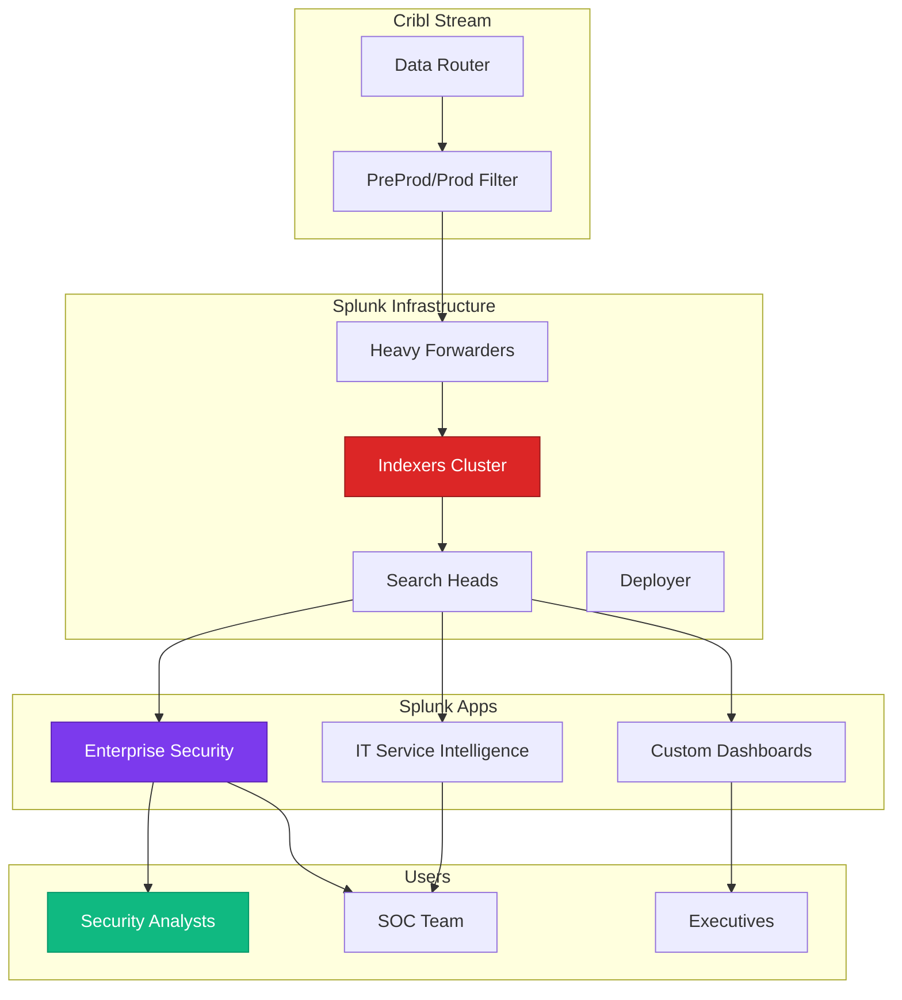

# Splunk Enterprise - Data Analytics & SIEM Platform
{: .no_toc }

Comprehensive analysis of Splunk Enterprise and its selective use for critical production/preprod environments.
{: .fs-6 .fw-300 }

## Table of contents
{: .no_toc .text-delta }

1. TOC
{:toc}

---

## Overview

**Splunk Enterprise** is a powerful data analytics platform widely used for Security Information and Event Management (SIEM), log management, and operational intelligence. It's known for its sophisticated search capabilities and extensive visualization options.

### Vendor Information

| | |
|---|---|
| **Company** | Splunk Inc. (Cisco subsidiary since 2024) |
| **Founded** | 2003 |
| **Headquarters** | San Francisco, CA |
| **Founders** | Michael Baum, Rob Das, Erik Swan |
| **Website** | [https://www.splunk.com](https://www.splunk.com) |
| **Status** | Private (acquired by Cisco) |
| **Notable** | Industry standard SIEM for 20+ years |

---

## Why Splunk for PreProd + Prod Only?

### Customer's Selective Strategy

```
Environment Strategy:
├── Dev/Test/UAT → Chronicle ONLY
│   ├── Reason: Cost optimization
│   ├── Volume: 450 GB/day
│   └── Cost: $0 incremental (Chronicle flat rate)
│
└── PreProd/Prod → Chronicle + Splunk
    ├── Reason: Advanced analytics, compliance, mature tooling
    ├── Volume: 1.15 TB/day (after Cribl reduction)
    └── Cost: $150/GB × 35 GB/day = $5,250/day = $157K/month

Why This Makes Sense:
✅ Splunk where analytics matter most (production)
✅ Splunk for compliance evidence (auditors prefer it)
✅ Splunk for mature integrations (SOAR, ticketing)
✅ Chronicle for cost-effective bulk storage
✅ 86% cost savings vs Splunk-only
```

### Cost Comparison

**Scenario: 1.6 TB/day total across all environments**

**Option 1: Splunk Only** (❌ Not chosen)
```
All environments to Splunk:
1.6 TB/day × $150/GB = $240,000/day = $7.2M/month
Annual: $86.4M

Result: Prohibitively expensive
```

**Option 2: Chronicle Only** (⚠️ Considered but not chosen)
```
All environments to Chronicle:
Flat rate: ~$100K/year

Result: Very cost-effective but:
- Less mature analytics
- Fewer integrations
- Team less familiar
- Compliance concerns
```

**Option 3: Hybrid (✅ Chosen)**
```
Dev/Test/UAT → Chronicle (1.15 TB/day): $100K/year
PreProd/Prod → Chronicle + Splunk (450 GB/day):
  - Chronicle: $0 incremental
  - Splunk: 35 GB/day after Cribl reduction
  - Splunk cost: $157K/month = $1.9M/year

Total: ~$2M/year
Savings vs Splunk-only: $84.4M/year (98% reduction!)
```

---

## Core Capabilities

### 1. Search Processing Language (SPL)

**Industry-Standard Query Language**:
- Powerful pipe-based syntax
- 140+ built-in commands
- Statistical functions
- Machine learning capabilities

**Example SPL Queries**:

**Query 1: Azure OpenAI API usage by user**
```spl
index=azure_openai sourcetype=api_logs
| eval cost=tokens_used * 0.00001
| stats 
    count as api_calls,
    sum(tokens_used) as total_tokens,
    sum(cost) as total_cost,
    avg(response_time) as avg_response_ms
  by user_email
| sort -total_cost
| head 20
```

**Query 2: Failed Key Vault access attempts**
```spl
index=azure sourcetype=keyvault:audit
| search result=failure action=GetSecret
| stats count by user_email, secret_name, src_ip
| where count > 5
| eval risk_level=case(
    count > 20, "CRITICAL",
    count > 10, "HIGH",
    count > 5, "MEDIUM",
    1=1, "LOW"
  )
| table user_email, secret_name, src_ip, count, risk_level
```

**Query 3: Correlation - Malware + Data Exfiltration**
```spl
# Find users with both malware detection AND large data transfer
index=crowdstrike sourcetype=detection severity=high
| rename user as cs_user
| join cs_user [
    search index=azure_firewall action=Allow bytes_out>1000000000
    | rename user as cs_user
  ]
| table cs_user, malware_family, dest_ip, bytes_out, timestamp
| convert ctime(timestamp)
```

### 2. Data Models & Pivot

**Pre-Built Data Models**:
- Authentication
- Change Analysis
- Network Traffic
- Vulnerability
- Malware

**Benefit**: Point-and-click investigation without SPL

**Example Use Case**:
```
Security Analyst Workflow:
1. Open "Authentication" data model
2. Pivot on: failed_logins
3. Filter: last 24 hours, >5 attempts
4. Group by: source_ip, user
5. Visualize: Geographic map
6. Result: Identify credential stuffing attack origins
   
Time: 2 minutes (vs 15 minutes writing SPL)
```

### 3. Enterprise Security (ES) App

**Splunk's SIEM Solution**:
- Notable events (security incidents)
- Risk-based alerting
- Incident review workflow
- Asset and identity correlation
- Threat intelligence integration

**Notable Events Dashboard**:
```
Today's Notable Events:
├── Critical (2)
│   ├── Ransomware detected on LAPTOP-042
│   └── Key Vault secret exposed in logs
│
├── High (15)
│   ├── Brute force login attempt (multiple users)
│   ├── Unusual Azure OpenAI usage spike
│   └── CrowdStrike isolation event
│
├── Medium (48)
│   └── Various policy violations
│
└── Low (156)
    └── Informational alerts
```

**Risk Scoring**:
```spl
# Splunk ES aggregates risk from multiple sources
index=risk
| stats 
    sum(risk_score) as total_risk,
    values(risk_message) as risk_reasons,
    count as risk_events
  by risk_object
| where total_risk > 100
| eval risk_level=case(
    total_risk > 200, "CRITICAL",
    total_risk > 100, "HIGH",
    1=1, "MEDIUM"
  )
| sort -total_risk
```

### 4. Dashboards & Visualizations

**Advanced Visualization Options**:
- Time charts (line, area, column)
- Single value metrics
- Gauges and meters
- Tables and lists
- Geolocation maps
- Sankey diagrams
- Custom visualizations via JavaScript

**Example: Executive Security Dashboard**
```xml
<dashboard>
  <label>Cursor Security Executive Dashboard</label>
  <row>
    <panel>
      <title>Security Incidents (Last 24h)</title>
      <single>
        <search>
          <query>
            index=notable severity IN (critical, high)
            | stats count
          </query>
        </search>
        <option name="drilldown">all</option>
        <option name="rangeColors">["0x65A637","0xF7BC38","0xF58F39","0xD93F3C"]</option>
        <option name="rangeValues">[0,5,10,20]</option>
      </single>
    </panel>
    
    <panel>
      <title>Azure OpenAI Cost Trend</title>
      <chart>
        <search>
          <query>
            index=azure_openai
            | timechart span=1h sum(cost) as hourly_cost
          </query>
        </search>
        <option name="charting.chart">column</option>
      </chart>
    </panel>
    
    <panel>
      <title>Top Users by Risk Score</title>
      <table>
        <search>
          <query>
            index=risk
            | stats sum(risk_score) as total_risk by user
            | sort -total_risk
            | head 10
          </query>
        </search>
      </table>
    </panel>
  </row>
</dashboard>
```

---

## Architecture in Cursor Environment

### Splunk Deployment



### Data Ingestion Strategy

```yaml
# Cribl routes to Splunk (PreProd/Prod only)
splunk_ingestion:
  sources:
    - azure_firewall:
        environments: [preprod, prod]
        volume_before_cribl: 750 GB/day
        volume_after_cribl: 20 GB/day  # 97% reduction!
        reduction_techniques:
          - sampling: 50% of allowed connections
          - aggregation: repetitive events
          - filtering: debug logs removed
    
    - azure_openai:
        environments: [prod]
        volume: 5 GB/day
        priority: high  # All prod AI calls to Splunk
    
    - key_vault:
        environments: [preprod, prod]
        volume: 3 GB/day
        priority: critical  # Compliance requirement
    
    - crowdstrike_detections:
        environments: all  # Even dev detections to Splunk
        volume: 5 GB/day
        priority: critical
    
    - okta_logs:
        environments: [prod]
        volume: 2 GB/day
        priority: high
  
  total: 35 GB/day to Splunk
  cost: $150/GB × 35 GB = $5,250/day
```

---

## Key Features for Cursor Security

### 1. Compliance Reporting

**Audit-Ready Reports**:
```spl
# SOC 2 Compliance Report: Key Vault Access
index=azure_keyvault
| eval access_time=strftime(_time, "%Y-%m-%d %H:%M:%S")
| table access_time, user, operation, secret_name, result, src_ip
| outputlookup keyvault_audit_report.csv
```

**Why Splunk for Compliance**:
- Auditors familiar with Splunk
- Immutable logging (if configured)
- Extensive audit trail
- Pre-built compliance apps
- Easy to generate evidence

### 2. Advanced Correlation

**Multi-Source Correlation**:
```spl
# Detect: Malware + Unusual Azure activity + Key Vault access
index=crowdstrike sourcetype=detection
| rename user as cs_user, _time as malware_time
| join type=inner cs_user [
    search index=azure_activity action=sensitive
    | rename user as cs_user, _time as azure_time
    | where azure_time > (malware_time - 3600)  # Within 1 hour
  ]
| join type=inner cs_user [
    search index=azure_keyvault action=GetSecret
    | rename user as cs_user, _time as kv_time
    | where kv_time > malware_time
  ]
| table cs_user, malware_family, malware_time, azure_activity, azure_time, secret_accessed, kv_time
| eval attack_chain="Malware → Azure Compromise → Secret Theft"
```

### 3. Machine Learning

**Anomaly Detection**:
```spl
# Detect unusual API call volumes
index=azure_openai
| timechart span=1h count by user
| `detect_outliers(count, 3)`  # 3 standard deviations
| where isOutlier=1
| table _time, user, count, lowerBound, upperBound
| eval anomaly_description="User made " + count + " API calls (normal range: " + lowerBound + "-" + upperBound + ")"
```

**Predictive Analytics**:
```spl
# Predict future cost based on trends
index=azure_openai
| timechart span=1d sum(cost) as daily_cost
| predict daily_cost future_timespan=30 algorithm=LLP5
| table _time, daily_cost, prediction
```

### 4. SOAR Integration

**Splunk Phantom (SOAR)**:
```python
# Automated playbook
playbook:
  trigger: "Notable event: Credential compromise"
  
  actions:
    1:
      tool: "Okta API"
      action: "Disable user account"
      
    2:
      tool: "CrowdStrike API"
      action: "Isolate user's device"
      
    3:
      tool: "Azure API"
      action: "Revoke all tokens"
      
    4:
      tool: "Key Vault API"
      action: "Rotate accessed secrets"
      
    5:
      tool: "ServiceNow API"
      action: "Create P1 incident ticket"
      
    6:
      tool: "Slack API"
      action: "Notify SOC team"
  
  execution_time: "<2 minutes"
  manual_time: "~30 minutes"
```

---

## Integration with Other Tools

### Splunk + Chronicle

**Complementary, Not Duplicate**:
```
Data Flow Strategy:
All data → Chronicle (long-term, bulk analysis)
Critical data → Splunk (real-time, detailed analysis)

Use Cases:
├── Threat Hunting: Start in Chronicle (cheap, fast search)
│   ├── If interesting: Deep dive in Splunk
│   └── Splunk provides richer context
│
├── Compliance: Splunk (auditor preference)
│   └── Chronicle as backup/archive
│
├── Executive Dashboards: Splunk (better visualizations)
│   └── Chronicle for underlying data
│
└── Cost Optimization: Chronicle (bulk), Splunk (critical)
```

### Splunk + Cribl

**Cribl Reduces Splunk Costs 97%**:
```
Without Cribl:
750 GB/day → Splunk = $112,500/day

With Cribl:
750 GB/day → Cribl processing → 20 GB/day → Splunk = $3,000/day

Savings: $109,500/day = $3.28M/month
Cribl license: ~$80K/year
Net savings: $39M/year (!)
```

### Splunk + CrowdStrike

**Bidirectional Integration**:
```spl
# Splunk receives CrowdStrike detections
index=crowdstrike sourcetype=detection

# Splunk enriches with context
| lookup user_info user OUTPUT department, manager, risk_score

# Splunk triggers CrowdStrike actions via API
| where severity="CRITICAL"
| sendalert crowdstrike_isolate param.device_id=$device_id
```

---

## Pricing Model

### Per-GB Licensing

**Ingestion-Based Pricing**:
```
Splunk Licensing Tiers:
├── $50-100/GB: Small deployments (<100 GB/day)
├── $100-150/GB: Medium (100-500 GB/day)
├── $150-200/GB: Large (500 GB+ /day)
└── $200+/GB: Very large (multi-TB/day)

Customer Pricing (assumed):
35 GB/day × $150/GB = $5,250/day
Monthly: $157,500
Annual: $1.89M
```

**Hidden Costs**:
```
Total Cost of Ownership:
├── License: $1.89M/year
├── Infrastructure: $300K/year
│   ├── Servers (on-prem or cloud)
│   ├── Storage (hot + cold)
│   └── Network egress
├── Personnel: $500K/year
│   ├── Splunk admin (1 FTE)
│   ├── Training
│   └── Consulting
└── Total: ~$2.7M/year
```

### Workload-Based Pricing (New)

**Splunk Cloud** (alternative):
```
Workload Pricing:
├── Ingest: $X per GB
├── Search: $Y per query
├── Storage: $Z per GB-month
├── Users: Included
└── Predictable monthly bill

Benefit: More predictable than on-prem
Cost: Typically 20-30% more than on-prem
```

---

## Strengths & Weaknesses

### Strengths ✅

1. **Maturity**: 20+ years, battle-tested
2. **Ecosystem**: Thousands of integrations and apps
3. **Visualization**: Best-in-class dashboards
4. **Query Language**: Powerful SPL
5. **Compliance**: Auditor favorite
6. **Community**: Large user base, extensive documentation

### Weaknesses ⚠️

1. **Cost**: Extremely expensive at scale
2. **Complexity**: Steep learning curve
3. **Performance**: Can be slow with large datasets
4. **Architecture**: Requires significant infrastructure
5. **Vendor Lock-In**: Difficult to migrate away

---

## Best Practices for Splunk

### 1. Optimize Ingestion

```spl
# Use index-time field extraction sparingly
# Better: Search-time extraction

# Bad (index-time):
TRANSFORMS-extract_user = user_extraction

# Good (search-time):
| rex field=_raw "user=(?<user>\w+)"
```

### 2. Use Summary Indexing

```spl
# Pre-compute expensive searches
index=azure_openai
| stats sum(cost) as daily_cost by date_mday, user
| collect index=summary_openai_cost
```

### 3. Manage License Usage

```bash
# Monitor daily ingestion
splunk search 'index=_internal source=*license_usage.log* type="Usage"
| eval gb=b/1024/1024/1024
| stats sum(gb) as total_gb by date_mday
| where total_gb > 35  # Alert if over quota'
```

### 4. Implement Data Retention

```ini
# indexes.conf
[azure_openai]
frozenTimePeriodInSecs = 2592000  # 30 days hot
coldToFrozenDir = /cold/azure_openai
maxTotalDataSizeMB = 500000  # 500 GB max

# Move to Chronicle for long-term storage
```

---

## Why Not Splunk-Only?

**Decision Rationale**:

1. **Cost Prohibitive**:
   - $86M/year for all environments
   - Chronicle reduces to $2M/year (98% savings)

2. **Overkill for Dev/Test**:
   - Don't need Splunk's power for dev logs
   - Chronicle sufficient for troubleshooting

3. **Encourages Data Sampling**:
   - High cost forces organizations to sample data
   - Chronicle allows complete logging

4. **Infrastructure Burden**:
   - Splunk requires significant ops overhead
   - Chronicle is fully managed

**But Keep Splunk For**:
- Production security monitoring
- Compliance reporting
- Advanced analytics
- Mature integrations
- Team expertise

---

## Resources & Links

- **Website**: [https://www.splunk.com](https://www.splunk.com)
- **Documentation**: [https://docs.splunk.com](https://docs.splunk.com)
- **Splunkbase**: [https://splunkbase.splunk.com](https://splunkbase.splunk.com)
- **Answers**: [https://community.splunk.com](https://community.splunk.com)
- **Education**: [https://education.splunk.com](https://education.splunk.com)

### Certifications

- Splunk Core Certified User
- Splunk Core Certified Power User
- Splunk Enterprise Certified Admin
- Splunk Enterprise Security Certified Admin

---

## Conclusion

**For Cursor Security Architecture**:

Splunk Enterprise provides **mature, powerful analytics** for production and pre-production environments where advanced correlation, compliance reporting, and sophisticated dashboards are essential.

**Key Value Props for Cursor**:
1. ✅ Mature SIEM with 20+ years of development
2. ✅ Powerful correlation across multiple data sources
3. ✅ Compliance-ready reporting (auditor favorite)
4. ✅ Advanced visualizations and dashboards
5. ✅ Extensive integration ecosystem

**Recommendation**: **Essential for critical environments** but use selectively due to cost. Hybrid approach with Chronicle provides best ROI.

---

**Last Updated**: October 10, 2025  
**Review Status**: <span class="badge badge-security">Production Validated</span>

