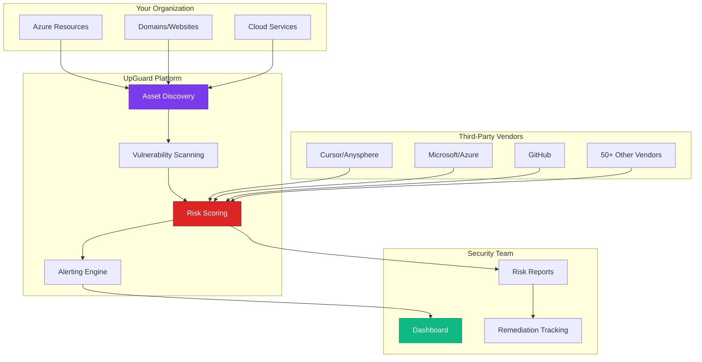

# UpGuard - Attack Surface Management & Third-Party Risk
{: .no_toc }

Comprehensive analysis of UpGuard's external attack surface monitoring and vendor risk platform.
{: .fs-6 .fw-300 }

## Table of contents
{: .no_toc .text-delta }

1. TOC
{:toc}

---

## Overview

**UpGuard** is a cybersecurity platform that provides continuous monitoring of external attack surfaces and third-party vendor risk. It discovers internet-facing assets, identifies security issues, and monitors supply chain security posture.

### Vendor Information

| | |
|---|---|
| **Company** | UpGuard, Inc. |
| **Founded** | 2012 |
| **Headquarters** | Mountain View, CA |
| **Founders** | Mike Baukes, Alan Sharp-Paul |
| **Website** | [https://www.upguard.com](https://www.upguard.com) |
| **Status** | Private (backed by prominent VCs) |
| **Notable** | Discovered major data leaks (Facebook, Verizon, RNC) |

---

## Core Capabilities

### 1. External Attack Surface Monitoring

**What UpGuard Discovers**:
```
Your Organization's External Footprint:
├── Domains & Subdomains
│   ├── company.com
│   ├── dev.company.com
│   ├── api.company.com
│   ├── *.azurewebsites.net (orphaned apps)
│   └── aoai-cursor-prod.openai.azure.com (if public)
│
├── IP Addresses
│   ├── Cloud IPs (Azure, AWS, GCP)
│   ├── On-prem IPs
│   └── Third-party IPs
│
├── Cloud Resources
│   ├── Azure Storage accounts (public access?)
│   ├── Azure OpenAI endpoints (public?)
│   ├── Key Vaults (public access disabled?)
│   └── Azure Functions (authentication required?)
│
├── Certificates
│   ├── Expiring soon
│   ├── Self-signed
│   ├── Weak encryption
│   └── Certificate transparency logs
│
├── Ports & Services
│   ├── Open ports (SSH, RDP, databases)
│   ├── Services running
│   ├── Version information
│   └── Known vulnerabilities
│
└── Email Security
    ├── SPF records
    ├── DKIM configuration
    ├── DMARC policies
    └── MX records
```

**How It Works**:
```
UpGuard Scanning (Agentless, External Only):
1. DNS enumeration (find all your domains)
2. Certificate transparency logs
3. Port scanning (ethical, non-intrusive)
4. Service fingerprinting
5. Cloud resource discovery (Azure, AWS, GCP)
6. Continuous monitoring (daily scans)
7. Change detection & alerting

Result: Complete map of external attack surface
```

### 2. Vendor Risk Management

**Third-Party Security Monitoring**:
```
For Cursor Environment:
Monitor critical vendors:
├── Cursor (Anysphere, Inc.)
│   ├── Security posture score
│   ├── Data breach history
│   ├── Exposed services
│   └── Security questionnaire
│
├── Microsoft (Azure provider)
│   ├── Azure outages
│   ├── Security incidents
│   └── Compliance status
│
├── GitHub (code hosting)
│   ├── Service health
│   ├── Security advisories
│   └── Data breaches
│
├── Wiz (security vendor)
├── CrowdStrike (security vendor)
├── Okta (identity provider)
└── Other SaaS vendors (50-100 typically)

Alert When:
⚠️ Vendor suffers data breach
⚠️ Vendor security score drops
⚠️ Vendor exposes data publicly
⚠️ Vendor has SSL issues
⚠️ Vendor compliance expires
```

**Security Questionnaire Automation**:
```yaml
# UpGuard automates vendor assessments
vendor_assessment:
  - Send security questionnaire
  - Track response status
  - Score responses automatically
  - Flag high-risk answers
  - Monitor continuous posture
  
  # Example vendors for Cursor environment:
  vendors:
    - name: "Cursor IDE"
      tier: "Critical"
      questionnaire: "SIG Lite"
      score: 850/1000  # UpGuard score
      status: "Low Risk"
      last_assessment: "2024-09-01"
      next_assessment: "2025-03-01"
```

### 3. Data Leak Detection

**Exposed Data Monitoring**:
```
UpGuard Monitors for:
├── S3 buckets (public read access)
├── Azure Storage (anonymous access)
├── GitHub repositories (accidentally public)
├── Rsync servers (open to internet)
├── Database backups (exposed)
├── API keys (in public code)
├── Customer data (in public places)
└── Credentials (in paste sites)

Example Alert:
🚨 Data Exposure Detected
Resource: Azure Storage Account "cursorbckups"
Issue: Container "developers" has public read access
Exposed: 2,847 files (including .env files with API keys)
Impact: CRITICAL
Discovered: 2024-10-10 08:32 UTC
Action Required: IMMEDIATE - Disable public access

Remediation:
$ az storage container set-permission \
  --name developers \
  --account-name cursorbckups \
  --public-access off
```

### 4. Security Ratings

**UpGuard Cyber Risk Score**:
```python
# UpGuard calculates security score (0-950)

scoring_factors = {
    "website_security": {
        "weight": 20,
        "checks": [
            "ssl_configuration",
            "http_security_headers",
            "cookie_security",
            "csp_policy"
        ]
    },
    
    "email_security": {
        "weight": 15,
        "checks": [
            "spf_record",
            "dkim_configuration",
            "dmarc_policy",
            "mx_security"
        ]
    },
    
    "network_security": {
        "weight": 25,
        "checks": [
            "open_ports",
            "exposed_services",
            "firewall_configuration",
            "intrusion_prevention"
        ]
    },
    
    "application_security": {
        "weight": 20,
        "checks": [
            "known_vulnerabilities",
            "patch_level",
            "software_versions",
            "authentication_strength"
        ]
    },
    
    "brand_reputation": {
        "weight": 10,
        "checks": [
            "phishing_sites",
            "typosquatting",
            "brand_abuse",
            "data_breaches"
        ]
    },
    
    "compliance": {
        "weight": 10,
        "checks": [
            "privacy_policy",
            "terms_of_service",
            "gdpr_compliance",
            "security_documentation"
        ]
    }
}

company_score = calculate_score(scoring_factors)

# Example scores:
your_company: 850/950 (A rating)
cursor_com: 825/950 (A- rating)
average_company: 650/950 (C+ rating)
```

---

## Architecture & Integration

### UpGuard in Cursor Security Stack



### Integration with Other Tools

**UpGuard + Wiz**:
```
Complementary Coverage:
├── UpGuard: External view (how attackers see you)
├── Wiz: Internal view (cloud misconfigurations)
└── Together: Complete attack surface visibility

Example:
UpGuard finds: "Azure Storage account publicly accessible"
Wiz finds: "Same storage account has customer PII"
Combined alert: CRITICAL - Customer data exposed to internet
```

**UpGuard + Chronicle**:
```python
# UpGuard alerts feed into Chronicle SIEM

upguard_alert = {
    "type": "data_exposure",
    "asset": "cursorbckups.blob.core.windows.net",
    "severity": "critical",
    "discovered": "2024-10-10T08:32:00Z"
}

# Send to Chronicle via webhook
chronicle.ingest_alert(upguard_alert)

# Chronicle correlates with:
- Recent Azure storage access logs
- Who configured public access
- When it was changed
- What data was accessed (if any)

# Full investigation timeline in Chronicle
```

---

## Key Features for Cursor Security

### 1. Forgotten Asset Discovery

**Shadow IT Detection**:
```
Common Discoveries:
├── Orphaned Azure Resources
│   ├── Old dev Azure OpenAI instances (still billing!)
│   ├── Forgotten storage accounts
│   ├── Unused app services
│   └── Old Key Vaults
│
├── Forgotten Subdomains
│   ├── dev-cursor-api.company.com (vulnerable WordPress)
│   ├── old-test.company.com (admin:admin login)
│   └── staging.company.com (no authentication)
│
└── Expired Resources
    ├── SSL certificates expired
    ├── Domains about to expire
    └── Cloud resources (still running)

Value: Reduce attack surface, cut costs
```

### 2. Continuous Monitoring

**Daily Scanning**:
```yaml
upguard_monitoring:
  scan_frequency: daily
  
  notifications:
    - type: "New subdomain detected"
      severity: MEDIUM
      example: "cursor-dev-new.company.com appeared"
      
    - type: "Service newly exposed"
      severity: HIGH
      example: "Port 22 (SSH) now open on cursor-api.com"
      
    - type: "SSL certificate expiring"
      severity: MEDIUM
      example: "*.company.com cert expires in 14 days"
      
    - type: "Public S3 bucket detected"
      severity: CRITICAL
      example: "s3://cursor-backups now publicly readable"
```

### 3. Vendor Breach Monitoring

**Third-Party Breach Alerts**:
```
Real Example:
Date: 2024-03-15
Vendor: LastPass (password manager)
Incident: Data breach disclosed
UpGuard Alert: "Vendor LastPass experienced security incident"

Your Actions:
1. Check: Do we use LastPass? (Yes, 12 employees)
2. Impact: Potential credential exposure
3. Remediate:
   - Force password resets for LastPass users
   - Rotate any Azure API keys stored in LastPass
   - Review access logs for suspicious activity
   - Consider switching to Azure Key Vault
4. Timeline: 4 hours from UpGuard alert to complete mitigation

Value: Proactive response to supply chain risks
```

---

## Pricing Model

### Tiered Licensing

```
UpGuard Licensing:
├── Starter ($10K-20K/year)
│   ├── 1 primary domain
│   ├── Basic attack surface monitoring
│   ├── Email alerts
│   └── Up to 25 vendors
│
├── Professional ($30K-60K/year)
│   ├── Multiple domains
│   ├── Advanced scanning
│   ├── API access
│   ├── Up to 100 vendors
│   └── SIEM integration
│
└── Enterprise ($75K-150K/year)
    ├── Unlimited domains
    ├── Continuous monitoring
    ├── Dedicated CSM
    ├── Unlimited vendors
    ├── Custom integrations
    └── White-glove support

Customer Likely: Professional tier
Cost: ~$45K/year
```

---

## Strengths & Weaknesses

### Strengths ✅

1. **Comprehensive Discovery**: Finds assets you forgot about
2. **Easy to Deploy**: No agents, start monitoring immediately
3. **Vendor Risk**: Only solution monitoring third-party security
4. **Data Leak Detection**: Proactive data exposure alerts
5. **Good UI**: Executive-friendly dashboards

### Weaknesses ⚠️

1. **External Only**: Can't see internal misconfigurations
2. **Passive Scanning**: Not as deep as active pentesting
3. **Cost**: Can be expensive for many vendors
4. **False Positives**: Sometimes flags non-issues

---

## Resources & Links

- **Website**: [https://www.upguard.com](https://www.upguard.com)
- **Platform**: [https://app.upguard.com](https://app.upguard.com)
- **Blog**: [https://www.upguard.com/blog](https://www.upguard.com/blog)
- **Trust**: [https://trust.upguard.com](https://trust.upguard.com)

---

## Conclusion

**For Cursor Security Architecture**:

UpGuard provides **external attack surface visibility** that internal tools like Wiz cannot provide. It discovers forgotten assets, monitors vendor security, and detects data exposures before attackers exploit them.

**Key Value Props**:
1. ✅ Discovers forgotten Azure resources
2. ✅ Monitors third-party vendor security
3. ✅ Detects data exposure immediately
4. ✅ Provides attacker's view
5. ✅ Continuous, automated monitoring

**Recommendation**: **Highly valuable** for organizations with complex Azure environments and many third-party integrations.

---

**Last Updated**: October 10, 2025  
**Review Status**: <span class="badge badge-security">Validated</span>

